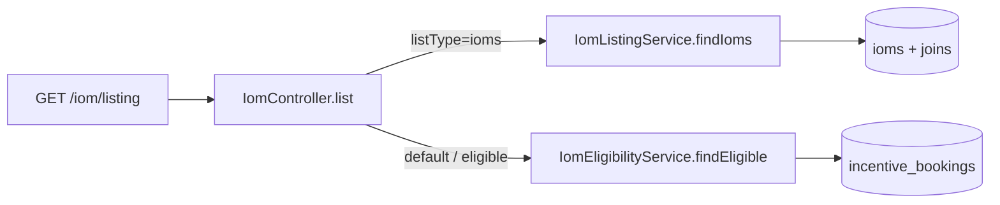

# PM-23 Final Review Summary

## Verdict

**Approve with minor follow-ups.** The implementation satisfies the approved scope change (no `GET /iom/ioms`; reuse `GET /iom/listing` with `listType` discriminator), matches [implementation-plan.md](docs/ai/stories/PM-23/implementation-plan.md), and passes validation (`20/20` unit tests, `npm run lint`, `npm run build`).

---

## Scope Compliance

| Requirement | Status |
|-------------|--------|
| Single route `GET /iom/listing` with `listType=eligible` (default) or `ioms` | Met — [iom.controller.ts](src/modules/iom/iom.controller.ts) branches on `listType === 'ioms'` |
| No new `GET /iom/ioms` route | Met — no static `ioms` handler |
| `IomListingService.findIoms` with pagination, search, status, dates, sort | Met — [iom-listing.service.ts](src/modules/iom/services/iom-listing.service.ts) |
| CRM guards/roles unchanged | Met — same `@UseGuards` / `@Roles(CRM)` on `listing` |
| `ListIomListingDto` + deprecated re-export | Met — [list-iom-listing.dto.ts](src/modules/iom/dto/list-iom-listing.dto.ts), [list-eligible-bookings.dto.ts](src/modules/iom/dto/list-eligible-bookings.dto.ts) |
| Module wiring (`IomListingService`, `Projects`) | Met — [iom.module.ts](src/modules/iom/iom.module.ts) |
| Eligible path unchanged when `listType` omitted | Met — delegates to `IomEligibilityService.findEligible` |
| Unit tests (DTO, service, controller) | Partial — 20 tests pass; two test-plan cases missing (see R2, R3) |

---

## What Was Reviewed

- Budgeted diff and full [iom-listing.service.ts](src/modules/iom/services/iom-listing.service.ts), [iom-listing.service.spec.ts](src/modules/iom/services/iom-listing.service.spec.ts), [iom.controller.ts](src/modules/iom/iom.controller.ts), [list-iom-listing.dto.ts](src/modules/iom/dto/list-iom-listing.dto.ts)
- Cross-check against [implementation-plan.md](docs/ai/stories/PM-23/implementation-plan.md) and [test-plan.md](docs/ai/stories/PM-23/test-plan.md)
- `Iom` entity `@DeleteDateColumn` behavior vs plan’s `deleted_at IS NULL` requirement
- Validation commands: targeted Jest, lint, build

---

## Findings

### R1 — Unrelated file in working tree (exclude from PR)

**`.cursor/mcp.json`** is local lean-ctx MCP configuration, unrelated to PM-23. It appears in changed files and implementer handoff outputs. Remove from the commit/PR to avoid leaking local tooling paths.

### R2 — Missing soft-delete exclusion test (test plan S3)

[test-plan.md](docs/ai/stories/PM-23/test-plan.md) requires a service test asserting soft-deleted IOMs are excluded (`deleted_at IS NULL`). [iom-listing.service.spec.ts](src/modules/iom/services/iom-listing.service.spec.ts) has no S3 case.

**Note:** [iom-listing.service.ts](src/modules/iom/services/iom-listing.service.ts) does not add an explicit `.andWhere('i.deletedAt IS NULL')` (unlike [iom-crm.service.ts](src/modules/iom/services/iom-crm.service.ts)), but `Iom` uses `@DeleteDateColumn` so TypeORM query builders exclude soft-deleted rows by default. Behavior is likely correct; coverage and explicitness are the gaps.

**Suggested fix:** Add a spec asserting the query builder applies soft-delete filtering (either explicit `andWhere` call or TypeORM’s generated condition). Optionally add explicit `.andWhere('i.deletedAt IS NULL')` for consistency with `iom-crm.service`.

### R3 — Missing pagination skip/take test (test plan S4)

[test-plan.md](docs/ai/stories/PM-23/test-plan.md) S4 requires verifying `skip` / `take` for non-default `page` / `limit`. The service spec only checks `totalPages` on page 1 via mapping test; it never asserts `qb.skip(10)` / `qb.take(20)` for e.g. `page=2, limit=10`.

**Suggested fix:** Add one test calling `findIoms(CRM_USER, { page: 2, limit: 10 })` and assert `skip`/`take` mock calls.

---

## Non-Issues (confirmed OK)

- **Approved scope change preserved** — no `GET /iom/ioms`; unified listing endpoint only.
- **Response shape split** — eligible returns `IncentiveBooking[]`, ioms returns `IomListItem[]`; documented risk in plan; controller routing is correct.
- **Status/date filters in eligible mode** — `IomEligibilityService` ignores `status`, `startDate`, `endDate` (unchanged); only applies in ioms mode.
- **Invalid `sortBy` field** — unknown fields skip `orderBy` (no default fallback when `sortBy` is present but invalid); matches eligibility service pattern per plan.
- **Customer name fallback** — `resolveCustomerName` handles `customer_details` JSON; covered by spec.
- **Guards** — not unit-tested per repo convention; wiring unchanged on handler.

---

## Validation Results

| Command | Result |
|---------|--------|
| `npm test -- --testPathPatterns="list-iom-listing\|iom.controller.spec\|iom-listing.service"` | 3 suites, 20 tests passed |
| `npm run lint` | Exit 0 (3 pre-existing warnings elsewhere) |
| `npm run build` | Exit 0 |

---

## Recommended Actions Before Merge

1. Drop `.cursor/mcp.json` from the changeset.
2. Add service spec cases for S3 (soft-delete) and S4 (pagination skip/take) per test plan.
3. Optional: add explicit `i.deletedAt IS NULL` in query builder for parity with `iom-crm.service`.

No production-code changes are required for correctness; findings R2/R3 are test-coverage gaps and R1 is hygiene.
