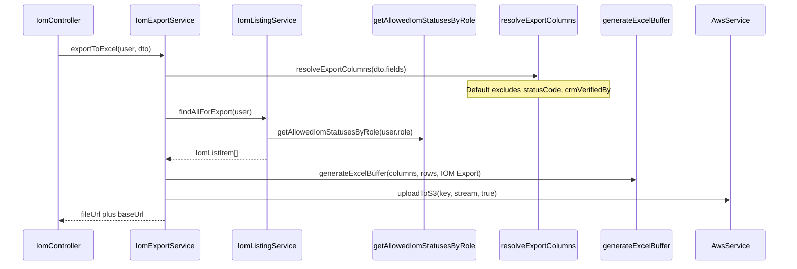

# PN-49 Final Review Summary

## Verdict

**Approve with fixes.** The IOM export feature is functionally complete and matches [docs/ai/stories/PN-49/spec.md](docs/ai/stories/PN-49/spec.md) including the final-review change request. All targeted unit tests pass (67 tests, 6 suites) and `npm run build` succeeds. Merge is blocked by **unstaged/untracked PN-49 files** (R6), not by feature gaps.

---

## Active Change Request — Status

**Request:** Exclude **Status Code** (`statusCode`) and **CRM Verified By ID** (`crmVerifiedBy`) from the default export column set.

**Implementation:** Satisfied in [src/constants/iom-export.columns.ts](src/constants/iom-export.columns.ts):

```9:12:src/constants/iom-export.columns.ts
export const DEFAULT_EXPORT_EXCLUDED_KEYS = new Set([
  'statusCode',
  'crmVerifiedBy',
]);
```

`resolveExportColumns()` filters these keys when `fields` is undefined or empty; selective export still allows them when explicitly requested. Covered by [src/constants/iom-export.columns.spec.ts](src/constants/iom-export.columns.spec.ts) and [src/modules/iom/services/iom-export.service.spec.ts](src/modules/iom/services/iom-export.service.spec.ts). Spec AC-2, AC-3, AC-8, and AC-12 updated accordingly.

---

## Prior Findings Resolution

| ID | Cycle | Status | Notes |
|----|-------|--------|-------|
| R1 | 1 | **Resolved** | `generateExcelBuffer` third arg `'Team Availability'` wired in service + spec |
| R2 | 1 | **Resolved** | `id` column added to `IOM_EXPORT_COLUMNS` |
| R1 | 2 | **Resolved** | `user-availability.service.spec.ts` compiles; uses `awsService.uploadToS3`; 67 tests pass |
| R2 | 2 | Open (advisory) | User Availability behavioral changes beyond Excel helper still bundled |
| R3 | 1/2 | Open (advisory) | No test for disallowed `iomStatus` intersection |
| R4 | 1/2 | Open (advisory) | Eligibility routing controller tests removed |
| R5 | 2 | Open (advisory) | Extra enum values not in seed migration sequences |

---

## Requirements Coverage

| AC | Status | Notes |
|----|--------|-------|
| AC-1 | Pass | `POST /iom/export/excel` with same guards/roles as listing |
| AC-2 | Pass | Default export excludes `statusCode` and `crmVerifiedBy`; includes `id`, `statusLabel` |
| AC-3 | Pass | Selective `fields` includes excluded columns when explicitly requested |
| AC-4 | Pass | `getAllowedIomStatusesByRole` shared in `findIoms` and `findAllForExport` |
| AC-5 | Pass | Generic `generateExcelBuffer(columns, data, worksheetName?)` |
| AC-6 | Pass | `awsService.uploadToS3` in export service |
| AC-7 | Pass | Returns `{ data: { fileUrl, baseUrl } }` |
| AC-8 | Pass | `IOM_EXPORT_COLUMNS` + `DEFAULT_EXPORT_EXCLUDED_KEYS` in constants file |
| AC-9 | Pass | Orchestration in `IomExportService` |
| AC-10 | Pass | No role logic in controller |
| AC-11 | Pass | Helper remains module-agnostic |
| AC-12 | Pass | Human-readable `statusLabel` and `crmVerifiedByName` remain in default set |

---

## What Looks Good

- **Change request** — Default exclusion centralized in `DEFAULT_EXPORT_EXCLUDED_KEYS`; selective override works; tests assert both paths.
- **Listing refactor** — [src/modules/iom/services/iom-listing.service.ts](src/modules/iom/services/iom-listing.service.ts) extracts `createBaseQueryBuilder`, `applyListingFilters`, `resolveEffectiveStatuses`, `findAllForExport`; debug `console.log` removed.
- **Shared role util** — [src/modules/iom/utils/iom-role-status.util.ts](src/modules/iom/utils/iom-role-status.util.ts) anchors to seed migration sequences.
- **Export orchestration** — [src/modules/iom/services/iom-export.service.ts](src/modules/iom/services/iom-export.service.ts) mirrors Team Availability S3 pattern with date formatting, empty-set upload, and error handling.
- **Excel helper** — [src/common/helpers/excel.helper.ts](src/common/helpers/excel.helper.ts) optional `worksheetName` is backward-compatible.

---

## Findings

### R6 (Must-fix): PN-49 files largely unstaged or untracked

**Issue:** `git status` shows only [src/common/helpers/excel.helper.ts](src/common/helpers/excel.helper.ts) staged. Core PN-49 deliverables are **unstaged** (`iom.controller.ts`, `iom-listing.service.ts`, etc.) or **untracked** (`src/constants/iom-export.columns.ts`, `iom-export.service.ts`, `iom-role-status.util.ts`, DTO, specs). Committing as-is would ship a partial feature (helper param only).

**Fix:** Stage all PN-49-related source files and resolve `MM` conflict state on user-availability files before merge.

---

### R2 (Advisory, carried): User Availability collateral changes exceed PN-49 scope

Behavioral edits in [src/modules/users/services/user-availability.service.ts](src/modules/users/services/user-availability.service.ts) (overlap detection, `ILIKE` search, `loadActiveWindowsForUsers`) remain bundled with the Excel helper change. Tests pass, but these belong in a separate PR or need explicit plan/PR documentation.

---

### R3 (Advisory, carried): No test for disallowed `iomStatus` intersection

`resolveEffectiveStatuses()` throws when a restricted role requests statuses outside their bucket; no spec covers this path.

---

### R4 (Advisory, carried): Controller spec removed eligibility routing tests

`GET /iom/listing` eligibility delegation tests removed; reduces coverage of documented `listType` contract (pre-existing behavior).

---

### R5 (Advisory, carried): Enum additions not used by role buckets

Added values in [src/modules/iom/enums/iom-status-code.enum.ts](src/modules/iom/enums/iom-status-code.enum.ts) (`FINANCE_APPROVED`, `POINTS_ALLOTTED`, `COMPLETED`, etc.) are not in seed migration sequences used by role buckets.

---

## Validation Results

```bash
# PASS — 67 tests, 6 suites
npm run test -- --testPathPatterns="iom-export|iom-listing|iom-role-status|iom-export.columns|user-availability" --no-coverage

# PASS
npm run build
```

Recommended before merge:

```bash
git add src/constants/ src/modules/iom/ src/common/helpers/excel.helper.ts
# Resolve MM state on user-availability files intentionally
npm run lint
npm run test -- --testPathPatterns="iom-export|iom-listing|iom-role-status|user-availability|iom-export.columns" --no-coverage
```

---

## Architecture


