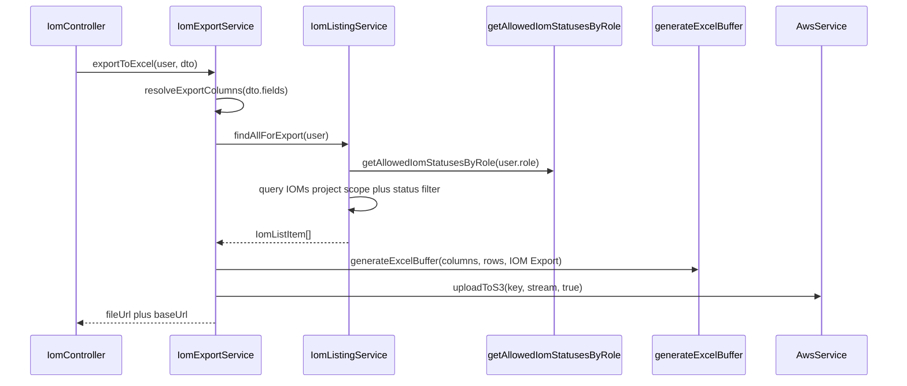

# PN-49 AI Review — Cycle 1

## Verdict

**Approve with fixes.** The export endpoint, role-scoped listing refactor, shared status utility, Excel helper generalization, and S3 upload flow match [docs/ai/stories/PN-49/implementation-plan.md](docs/ai/stories/PN-49/implementation-plan.md) and [docs/ai/stories/PN-49/spec.md](docs/ai/stories/PN-49/spec.md). Architecture is clean (controller → `IomExportService` → `IomListingService` → helper/S3). One cross-module test regression must be fixed before merge.

## Requirements Coverage

| AC | Status | Notes |
|----|--------|-------|
| AC-1 | Pass | `POST /iom/export/excel` added with same guards/roles as listing |
| AC-2 | Partial | Default export covers nearly all `IomListItem` fields; `id` omitted (see R2) |
| AC-3 | Pass | `resolveExportColumns()` filters by flat keys; unknown fields → 400 |
| AC-4 | Pass | Role buckets applied in both `findIoms` and `findAllForExport` via shared util |
| AC-5 | Pass | `generateExcelBuffer(columns, data, worksheetName?)` stays module-agnostic |
| AC-6 | Pass | `awsService.uploadToS3(key, stream, true)` |
| AC-7 | Pass | Returns `{ data: { fileUrl, baseUrl } }` consistent with listing envelope |
| AC-8 | Pass | Columns in [src/constants/iom-export.columns.ts](src/constants/iom-export.columns.ts) |
| AC-9 | Pass | Orchestration in `IomExportService` (plan-corrected from `iom.service.ts`) |
| AC-10 | Pass | No role logic in controller |
| AC-11 | Pass | Helper accepts generic columns + data |

## What Looks Good

- **Shared role filtering** — [src/modules/iom/utils/iom-role-status.util.ts](src/modules/iom/utils/iom-role-status.util.ts) anchors to [src/migrations/1780669000001-SeedIomStatuses.ts](src/migrations/1780669000001-SeedIomStatuses.ts) sequences; listing refactor extracts `createBaseQueryBuilder`, `applyListingFilters`, and `resolveEffectiveStatuses` cleanly.
- **Export flow** — [src/modules/iom/services/iom-export.service.ts](src/modules/iom/services/iom-export.service.ts) mirrors Team Availability pattern (buffer → `PassThrough` → S3 → config base URL); empty result set still uploads headers-only file.
- **Excel helper** — Optional `worksheetName` param with `'Team Availability'` passed from [src/modules/users/services/user-availability.service.ts](src/modules/users/services/user-availability.service.ts); IOM passes `'IOM Export'`.
- **Tests** — New specs cover export service (default/fields/unknown/empty/error), role util (all buckets), listing role filters (CRM_HEAD, LOYALTY, export path), controller delegation.
- **Module wiring** — `AwsModule` import sufficient; `CustomConfigModule` is `@Global()` so explicit import is optional.

## Findings

### R1 (Must-fix): Team Availability unit tests not updated for 3-arg `generateExcelBuffer`

**File:** [src/modules/users/services/user-availability.service.spec.ts](src/modules/users/services/user-availability.service.spec.ts)

**Issue:** [src/modules/users/services/user-availability.service.ts](src/modules/users/services/user-availability.service.ts) now calls `generateExcelBuffer(columns, rows, 'Team Availability')`, but specs still assert 2-arg calls (lines ~719 and ~766). Jest `toHaveBeenCalledWith` will fail on the extra third argument.

**Fix:** Update expectations to include `'Team Availability'` as the third argument in all `generateExcelBuffer` assertions.

---

### R2 (Should-fix): Export columns missing `id` from listing shape

**File:** [src/constants/iom-export.columns.ts](src/constants/iom-export.columns.ts)

**Issue:** Plan decision: derive columns from [src/modules/iom/types/iom-list-item.interface.ts](src/modules/iom/types/iom-list-item.interface.ts), omitting only `pdfBasePath`, `pdflink`, `iomPdfAvailable`. The `id` field is returned by listing but absent from `IOM_EXPORT_COLUMNS`, so AC-2 “all listing columns” is not fully met.

**Fix:** Add `{ header: 'ID', key: 'id', width: 10 }` (or equivalent) to `IOM_EXPORT_COLUMNS`.

---

### R3 (Advisory): No test for disallowed `iomStatus` intersection

**File:** [src/modules/iom/services/iom-listing.service.spec.ts](src/modules/iom/services/iom-listing.service.spec.ts)

**Issue:** `resolveEffectiveStatuses()` throws `BadRequestException` when a restricted role requests statuses outside their bucket, but no spec covers this path.

**Fix (optional):** Add test for e.g. LOYALTY user requesting `IOM_CREATED` via `iomStatus` query.

---

### R4 (Advisory): Controller spec removed `listType`/eligibility tests unrelated to export

**File:** [src/modules/iom/iom.controller.spec.ts](src/modules/iom/iom.controller.spec.ts)

**Issue:** Eligibility delegation tests were removed, but `GET /iom/listing` still always calls `findIoms` and ignores `listType` default `'eligible'` ([src/modules/iom/dto/list-iom-listing.dto.ts](src/modules/iom/dto/list-iom-listing.dto.ts)). This pre-dates PN-49 but removing tests reduces coverage of a documented DTO contract.

**Fix (optional, out of PN-49 scope):** Restore routing or track as separate bug.

## Scope / Extra Files

- [docs/ai/stories/PN-49/spec.md](docs/ai/stories/PN-49/spec.md) and [docs/ai/stories/PN-49/implementation-plan.md](docs/ai/stories/PN-49/implementation-plan.md) are expected story artifacts, not scope creep.
- Enum extensions in [src/modules/iom/enums/iom-status-code.enum.ts](src/modules/iom/enums/iom-status-code.enum.ts) align with seed migration codes used by role buckets.

## Validation Recommended Before Merge

```bash
npm run lint
npm run test -- --testPathPattern="iom-(export|listing|role-status)|user-availability" --no-coverage
npm run build
```

## Architecture (implemented)


