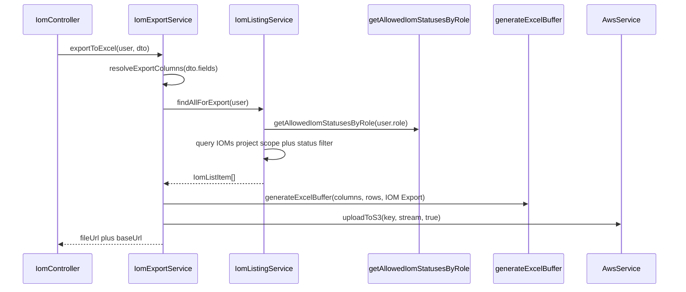

# PN-49 AI Review — Cycle 2

## Verdict

**Approve with fixes.** The IOM export feature ([`src/modules/iom/services/iom-export.service.ts`](src/modules/iom/services/iom-export.service.ts), controller endpoint, shared role filtering, column config) matches [docs/ai/stories/PN-49/spec.md](docs/ai/stories/PN-49/spec.md) and [docs/ai/stories/PN-49/implementation-plan.md](docs/ai/stories/PN-49/implementation-plan.md). All IOM-related unit suites pass (38 tests across 5 suites). Merge is blocked by a compile failure in [`src/modules/users/services/user-availability.service.spec.ts`](src/modules/users/services/user-availability.service.spec.ts).

## Cycle-1 Resolution

| ID | Status | Notes |
|----|--------|-------|
| R1 | **Resolved** | `generateExcelBuffer` 3-arg calls include `'Team Availability'` (lines 735, 775) |
| R2 | **Resolved** | `id` column present in [`src/constants/iom-export.columns.ts`](src/constants/iom-export.columns.ts) line 15 |
| R3 | Open (advisory) | No test for disallowed `iomStatus` intersection |
| R4 | Open (advisory) | Eligibility delegation controller tests still removed |

## Requirements Coverage

| AC | Status | Notes |
|----|--------|-------|
| AC-1 | Pass | `POST /iom/export/excel` with same guards/roles as listing |
| AC-2 | Pass | Default export excludes `statusCode` and `crmVerifiedBy`; includes `id` and `statusLabel` |
| AC-3 | Pass | `resolveExportColumns(fields)` filters by flat keys; unknown fields → 400 |
| AC-4 | Pass | `getAllowedIomStatusesByRole` shared in `findIoms` and `findAllForExport` |
| AC-5 | Pass | Generic `generateExcelBuffer(columns, data, worksheetName?)` |
| AC-6 | Pass | `awsService.uploadToS3(key, stream, true)` in export service |
| AC-7 | Pass | Returns `{ data: { fileUrl, baseUrl } }` |
| AC-8 | Pass | `IOM_EXPORT_COLUMNS` + `DEFAULT_EXPORT_EXCLUDED_KEYS` in constants file |
| AC-9 | Pass | Orchestration in `IomExportService` |
| AC-10 | Pass | No role logic in controller |
| AC-11 | Pass | Helper remains module-agnostic |
| AC-12 | Pass | Default excludes Status Code and CRM Verified By ID; human-readable columns remain |

## What Looks Good

- **Listing refactor** — [`src/modules/iom/services/iom-listing.service.ts`](src/modules/iom/services/iom-listing.service.ts) cleanly extracts `createBaseQueryBuilder`, `applyListingFilters`, `resolveEffectiveStatuses`, and `findAllForExport`; debug `console.log` removed.
- **Shared role util** — [`src/modules/iom/utils/iom-role-status.util.ts`](src/modules/iom/utils/iom-role-status.util.ts) anchors to seed migration sequences; specs cover all role buckets.
- **Export orchestration** — [`src/modules/iom/services/iom-export.service.ts`](src/modules/iom/services/iom-export.service.ts) mirrors Team Availability S3 pattern; date formatting, empty-set upload, and error handling are covered by specs.
- **Column config** — [`resolveExportColumns`](src/constants/iom-export.columns.ts) correctly implements default exclusions per change request.
- **Excel helper** — [`src/common/helpers/excel.helper.ts`](src/common/helpers/excel.helper.ts) optional `worksheetName` param is backward-compatible.

## Findings

### R1 (Must-fix): `user-availability.service.spec.ts` does not compile

**File:** [`src/modules/users/services/user-availability.service.spec.ts`](src/modules/users/services/user-availability.service.spec.ts)

**Issue:** Spec imports and mocks `src/common/helpers/s3-upload.helper`, which does not exist. Service was updated to use `awsService.uploadToS3` directly ([`src/modules/users/services/user-availability.service.ts`](src/modules/users/services/user-availability.service.ts) line 313). Jest fails at compile time:

```
Cannot find module 'src/common/helpers/s3-upload.helper'
```

**Fix:**
- Remove `s3-upload.helper` import and mock.
- Assert `awsService.uploadToS3` (already provided in test module at line 184) instead of `uploadBufferToS3`.
- Update export response assertion: service returns `data: { url: fileName, basePath: baseUrl }` (lines 315-317), not a combined full URL in `data.url`.
- Mock `formatDateTime` in the date.helper mock and update unavailable-date row expectations (lines 771-772 still expect `toISOString()` but service uses `formatDateTime()` at lines 296-298).

---

### R2 (Should-fix): User Availability collateral changes exceed PN-49 scope

**File:** [`src/modules/users/services/user-availability.service.ts`](src/modules/users/services/user-availability.service.ts)

**Issue:** Staged changes include behavioral edits unrelated to the Excel helper `worksheetName` param required by PN-49:
- Unavailability conflict check changed from overlap detection to "any active window" (`hasActiveUnavailability`, lines 78-89)
- Team search `ILIKE` → `LIKE` (lines 197-199)
- `loadActiveWindowsForUsers` → `loadRelevantWindowsForUsers` with different ordering/priority (lines 339-365)
- Export response shape changed to split `url` / `basePath`

These are valid improvements but belong in a separate story/PR or need explicit PN-49 plan amendment. Bundling increases regression risk and left specs out of sync (R1).

**Fix:** Either revert non-Excel-helper changes from this branch, or complete spec updates and document the behavioral changes in the PR description.

---

### R3 (Advisory): No test for disallowed `iomStatus` intersection

**File:** [`src/modules/iom/services/iom-listing.service.spec.ts`](src/modules/iom/services/iom-listing.service.spec.ts)

**Issue:** `resolveEffectiveStatuses()` throws when a restricted role requests statuses outside their bucket, but no spec covers this (carried from cycle 1).

**Fix (optional):** Add test for e.g. LOYALTY user requesting `IOM_CREATED` via `iomStatus`.

---

### R4 (Advisory): Controller spec removed eligibility routing tests

**File:** [`src/modules/iom/iom.controller.spec.ts`](src/modules/iom/iom.controller.spec.ts)

**Issue:** Eligibility delegation tests removed; `GET /iom/listing` always calls `findIoms` (pre-existing). Reduces coverage of documented DTO `listType` contract.

**Fix (optional, out of PN-49 scope):** Track separately or restore tests.

---

### R5 (Advisory): Enum additions not used by role buckets

**File:** [`src/modules/iom/enums/iom-status-code.enum.ts`](src/modules/iom/enums/iom-status-code.enum.ts)

**Issue:** Added `FINANCE_APPROVED`, `FINANCE_APPROVER_REJECTED`, `POINTS_ALLOTTED`, `COMPLETED`, `CANCELLED` are not in seed migration [`1780669000001-SeedIomStatuses.ts`](src/migrations/1780669000001-SeedIomStatuses.ts) or `IOM_STATUS_SEQUENCES`. Some pre-exist in approve/reject services; not blocking export but creates enum/DB drift.

**Fix (optional):** Align enum with seeded codes or document why extras are needed.

## Scope / Extra Files

- Story artifacts under `docs/ai/stories/PN-49/` are expected.
- IOM enum extensions support existing workflow service references; verify separately from export ACs.
- Several IOM files remain **unstaged** in the working tree; ensure full feature diff is staged before merge.

## Validation Results

```bash
# IOM-related suites: PASS (38 tests, 5 suites)
npm run test -- --testPathPatterns="iom-export|iom-listing|iom-role-status|iom-export.columns" --no-coverage

# user-availability: FAIL (compile error — R1)
npm run test -- --testPathPatterns="user-availability" --no-coverage
```

Recommended before merge:

```bash
npm run lint
npm run test -- --testPathPatterns="iom-export|iom-listing|iom-role-status|user-availability|iom-export.columns" --no-coverage
npm run build
```

## Architecture (unchanged from cycle 1)


