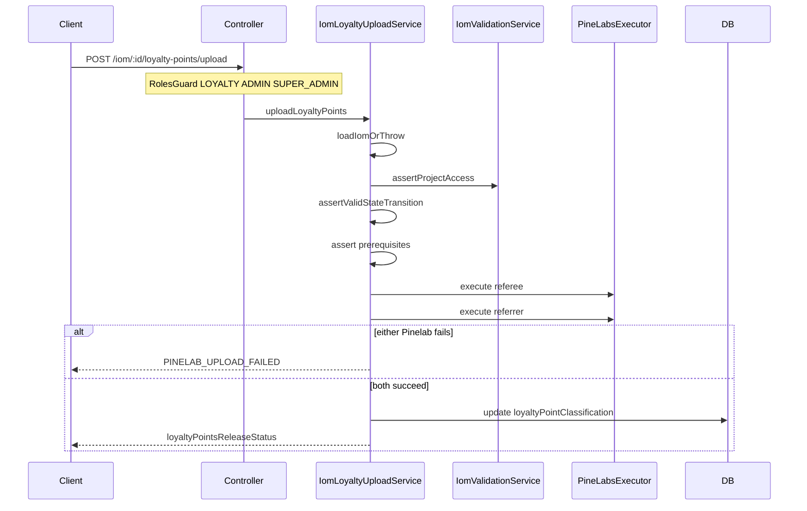

# PN-51_3 Final Review Summary

## Summary

Final review of unstaged changes for story **PN-51_3** (extend loyalty details GET + new loyalty points upload POST). Validated against [docs/ai/stories/PN-51_3/spec.md](docs/ai/stories/PN-51_3/spec.md), [docs/ai/stories/PN-51_3/implementation-plan.md](docs/ai/stories/PN-51_3/implementation-plan.md), and both approved change requests:

1. **Plan-approval CR (2026-06-29):** Upload restricted to **LOYALTY / ADMIN / SUPER_ADMIN** only.
2. **Final-review CR (2026-06-29):** Update `loyaltyPointClassification` and return `loyaltyPointsReleaseStatus` on interim Pine Labs executor success so FE is not blocked pending live Pinelab contracts.

**Verdict:** Implementation is complete and consistent with spec and plan. Targeted unit tests pass (40/40). **Approve for merge.**

**Prior finding resolution:** Cycle 2 **R1** (accidental `console.log` in `list()` at [iom.controller.ts](src/modules/iom/iom.controller.ts) line 110) is **resolved** — the debug log is no longer present; `list()` now delegates directly to `iomListingService.findIoms`.

---

## Scope Alignment

| Area | Status | Notes |
|------|--------|-------|
| Part 1 — extended GET fields | OK | `LoyaltyParticipantDetails` extended in [loyalty-details.interface.ts](src/modules/iom/types/loyalty-details.interface.ts); [loyalty-participant.mapper.ts](src/modules/iom/helpers/loyalty-participant.mapper.ts) extracted; cross `projectName2`/`unitNo2` mapping matches plan |
| Part 2 — upload endpoint | OK | `POST :id/loyalty-points/upload` delegates to [IomLoyaltyUploadService](src/modules/iom/services/iom-loyalty-upload.service.ts); `{ data }` envelope |
| Auth (plan-approval CR) | OK | `@Roles(LOYALTY, ADMIN, SUPER_ADMIN)` on upload; GET `/:id/loyalty-details` keeps broader role list unchanged; controller spec verifies metadata excludes CRM/Finance |
| Interim Pinelab / FE-unblock (final-review CR) | OK | Executor `{ success: true }` drives DB update + response status; private `invokePinelabForParticipant` isolates future live Pinelab swap-in |
| State machine | OK | ELIGIBLE blocked when `ELIGIBLE` or `REDEEMABLE`; REDEEMABLE blocked when `REDEEMABLE`; REDEEMABLE allowed from `null` per spec |
| Pinelab orchestration | OK | Sequential referee→referrer; DB update only after both succeed; `PINELAB_UPLOAD_FAILED` on vendor failure |
| DB persistence | OK | Persists `REDEEMABLE` after redeem; API returns `loyaltyPointsReleaseStatus: 'REDEEMED'` |
| Error codes | OK | `LOYALTY_UPLOAD_PREREQUISITE_MISSING` added with HTTP 400 mapping in [iom-error.util.ts](src/modules/iom/utils/iom-error.util.ts) |
| Module wiring | OK | `IomLoyaltyUploadService` registered in [iom.module.ts](src/modules/iom/iom.module.ts) |
| Story docs | OK | `spec.md` / `implementation-plan.md` document interim strategy and role restriction |

---

## Key Verification

### Final-review CR — interim Pinelab success drives status

[iom-loyalty-upload.service.ts](src/modules/iom/services/iom-loyalty-upload.service.ts) flow:

1. Call `pineLabsExecutor.execute` for referee, then referrer.
2. On `!result.success`, throw `PINELAB_UPLOAD_FAILED` — **no DB update** (partial failure covered by tests).
3. On both succeed, transaction-update `loyaltyPointClassification` to `ELIGIBLE` or `REDEEMABLE`.
4. Return stable FE contract:

```typescript
{
  loyaltyPointsReleaseType: dto.loyaltyPointsReleaseType,  // ELIGIBLE | REDEEMABLE
  loyaltyPointsReleaseStatus: isRedeem ? 'REDEEMED' : 'ELIGIBLE',
}
```

This matches spec R2.11 and implementation-plan interim semantics — FE can integrate now without waiting for final Pinelab request/response shapes.

### Plan-approval CR — upload roles

```202:217:src/modules/iom/iom.controller.ts
  // Upload loyalty points to Pinelab — restricted to Loyalty / Admin / Super Admin only.
  @UseGuards(RmAdminAuthGuard, RolesGuard)
  @Roles(RolesEnum.LOYALTY, RolesEnum.ADMIN, RolesEnum.SUPER_ADMIN)
  @Post(':id/loyalty-points/upload')
  async uploadLoyaltyPoints(...)
```

Controller spec asserts `@Roles` metadata and excludes CRM/Finance. **No regression.**

### Upload orchestration diagram



---

## Test Results

```bash
npm run test -- \
  src/modules/iom/services/iom-loyalty-details.service.spec.ts \
  src/modules/iom/services/iom-loyalty-upload.service.spec.ts \
  src/modules/iom/helpers/loyalty-participant.mapper.spec.ts \
  src/modules/iom/iom.controller.spec.ts
```

**Result:** 4 suites, 40 tests — all passed (final pass re-run).

Upload service tests cover: success paths (ELIGIBLE/REDEEMABLE), duplicate guards, partial Pinelab failure, missing prerequisites, not-found/unauthorized.

---

## Prior Findings

| ID | Status | Notes |
|----|--------|-------|
| R1 (cycle 2) | **Resolved** | Debug `console.log` removed from `list()` handler |

---

## Non-Blocking Observations (unchanged)

1. **User activity logging:** Other IOM mutation routes use `UserActivityInterceptor`; upload does not. Not required by spec/plan.
2. **Cyclomatic complexity:** `getLoyaltyDetails` at complexity 16 (eslint warn threshold 15). Warning-only.
3. **Test gap (minor):** Upload spec tests missing referee Pinelab ID but not missing referrer ID; same code path, low risk.

---

## Findings

Findings: None

---

## Approval Recommendation

**Approve** for merge. Optional pre-merge validation: `npm run test -- src/modules/iom/` and `npm run build` if not already covered by CI.
