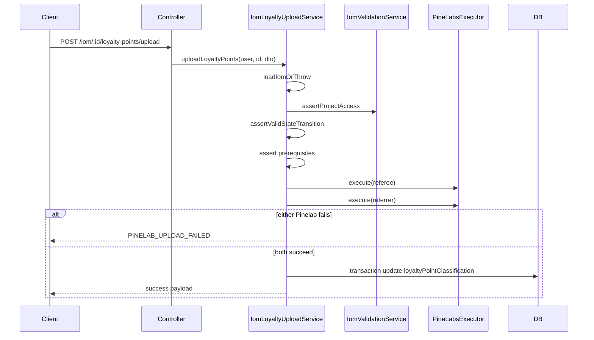

# PN-51_3 Code Review (Cycle 1)

## Summary

Reviewed unstaged changes for story **PN-51_3** (extend loyalty details GET + new loyalty points upload POST). Compared against [docs/ai/stories/PN-51_3/spec.md](docs/ai/stories/PN-51_3/spec.md), [docs/ai/stories/PN-51_3/implementation-plan.md](docs/ai/stories/PN-51_3/implementation-plan.md), and the approved plan-approval CR restricting upload to **LOYALTY / ADMIN / SUPER_ADMIN** only.

**Verdict:** Implementation is complete and consistent with the plan. Targeted unit tests pass (40/40). No blocking issues found.

---

## Scope Alignment

| Area | Status | Notes |
|------|--------|-------|
| Part 1 — extended GET fields | OK | `LoyaltyParticipantDetails` extended; mapper extracted; cross `projectName2`/`unitNo2` mapping matches plan tables |
| Part 2 — upload endpoint | OK | `POST :id/loyalty-points/upload` delegates to `IomLoyaltyUploadService`; `{ data }` envelope |
| Auth (approved CR) | OK | `@Roles(LOYALTY, ADMIN, SUPER_ADMIN)`; controller spec verifies metadata excludes CRM/Finance |
| State machine | OK | ELIGIBLE blocked when `ELIGIBLE` or `REDEEMABLE`; REDEEMABLE blocked when `REDEEMABLE`; REDEEMABLE allowed from `null` per plan default |
| Pinelab orchestration | OK | Sequential referee→referrer; DB update only after both succeed; `PINELAB_UPLOAD_FAILED` on vendor failure |
| DB persistence | OK | Persists `REDEEMABLE` after redeem; API returns `loyaltyPointsReleaseStatus: 'REDEEMED'` per approved plan |
| Error codes | OK | `LOYALTY_UPLOAD_PREREQUISITE_MISSING` added with HTTP 400 mapping |
| Module wiring | OK | `IomLoyaltyUploadService` registered in [iom.module.ts](src/modules/iom/iom.module.ts) |
| Extra docs | OK | `spec.md` / `implementation-plan.md` are expected story artifacts, not scope creep |

---

## Key Implementation Checks

### Part 1 — Loyalty details enrichment

- [loyalty-participant.mapper.ts](src/modules/iom/helpers/loyalty-participant.mapper.ts): Reuses `pickStringField` with camelCase/snake_case aliases; address composition and `sfdcId` fallbacks match plan.
- [iom-loyalty-details.service.ts](src/modules/iom/services/iom-loyalty-details.service.ts): Referee `customerName` fixed to read `customerDetails` (plan §1.5); extended fields spread without altering PN-65 verification flags.
- Tests cover populated fixtures, null fallbacks, and cross-participant `projectName2`/`unitNo2`.

### Part 2 — Upload orchestration

- [iom-loyalty-upload.service.ts](src/modules/iom/services/iom-loyalty-upload.service.ts):
  - Load + `assertProjectAccess` mirror GET patterns
  - Prerequisites: referrer present, both Pinelab customer IDs non-empty
  - `MARK_ELIGIBLE` / `REDEEM_POINTS` payloads match Pine Labs definitions (`customerId` required; `programId` optional per dummy path)
  - Transaction wraps only the IOM state update (correct all-or-nothing DB semantics)
- [iom.controller.ts](src/modules/iom/iom.controller.ts): Route placed after `GET :id/loyalty-details` as specified.



---

## Test Results

```bash
npm run test -- \
  src/modules/iom/services/iom-loyalty-details.service.spec.ts \
  src/modules/iom/services/iom-loyalty-upload.service.spec.ts \
  src/modules/iom/iom.controller.spec.ts \
  src/modules/iom/helpers/loyalty-participant.mapper.spec.ts
# 4 suites, 40 tests — all passed
```

Upload service tests cover all cases in plan §Testing Plan table (success paths, duplicate guards, partial Pinelab failure, missing prerequisites, not-found/unauthorized).

---

## Non-Blocking Observations (not must-fix)

1. **User activity logging:** Other IOM mutation routes (`submit`, `approve`, `reject`, etc.) use `UserActivityInterceptor`; upload does not. Not required by spec/plan; add only if audit parity is desired.
2. **Cyclomatic complexity:** `getLoyaltyDetails` is at complexity 16 (eslint warn threshold 15). Warning-only in default `npm run lint`; optional refactor by extracting participant assembly helper.
3. **Test gap (minor):** Upload spec tests missing referee Pinelab ID but not missing referrer ID; same code path, low risk.

---

## Findings

Findings: None

---

## Approval Recommendation

**Approve** for merge after standard full-module validation (`npm run test -- src/modules/iom/`, `npm run build`) if not already run in CI.
