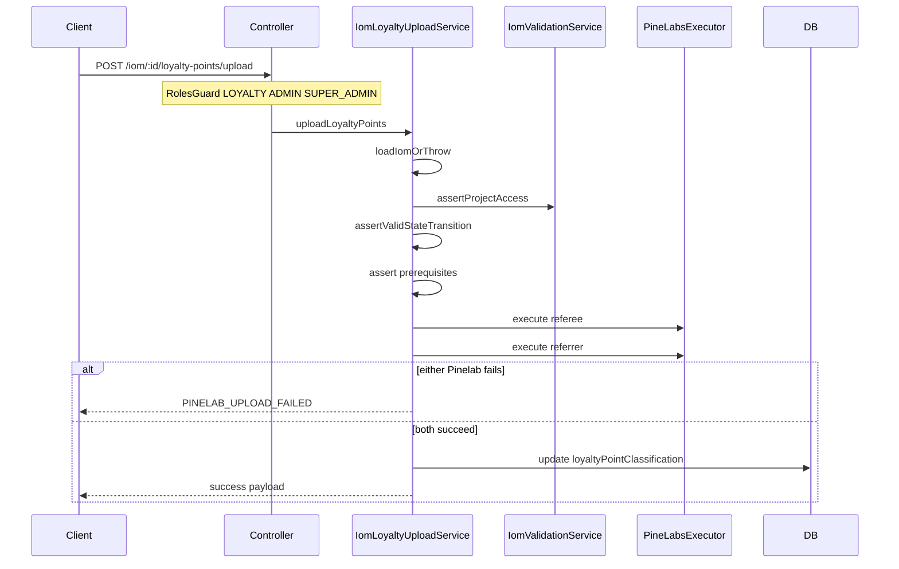

# PN-51_3 Code Review (Cycle 2)

## Summary

Reviewed unstaged changes for story **PN-51_3** (extend loyalty details GET + new loyalty points upload POST) against [docs/ai/stories/PN-51_3/spec.md](docs/ai/stories/PN-51_3/spec.md), [docs/ai/stories/PN-51_3/implementation-plan.md](docs/ai/stories/PN-51_3/implementation-plan.md), and approved change requests (upload roles: LOYALTY/ADMIN/SUPER_ADMIN; interim Pinelab success drives status update).

**Verdict:** Implementation is functionally complete and well-tested, but **one must-fix finding** blocks merge approval.

Targeted unit tests re-run successfully: **40/40 passed**.

---

## Scope Alignment

| Area | Status | Notes |
|------|--------|-------|
| Part 1 — extended GET fields | OK | `LoyaltyParticipantDetails` extended; [`loyalty-participant.mapper.ts`](src/modules/iom/helpers/loyalty-participant.mapper.ts) extracted; cross `projectName2`/`unitNo2` mapping matches plan |
| Part 2 — upload endpoint | OK | `POST :id/loyalty-points/upload` delegates to [`IomLoyaltyUploadService`](src/modules/iom/services/iom-loyalty-upload.service.ts); `{ data }` envelope |
| Auth (approved CR) | OK | `@Roles(LOYALTY, ADMIN, SUPER_ADMIN)` on upload; GET `/:id/loyalty-details` unchanged; controller spec verifies metadata |
| State machine | OK | ELIGIBLE blocked when `ELIGIBLE` or `REDEEMABLE`; REDEEMABLE blocked when `REDEEMABLE`; REDEEMABLE allowed from `null` per spec |
| Pinelab orchestration | OK | Sequential referee→referrer; DB update only after both succeed; `PINELAB_UPLOAD_FAILED` on vendor failure |
| DB persistence | OK | Persists `REDEEMABLE` after redeem; API returns `loyaltyPointsReleaseStatus: 'REDEEMED'` |
| Error codes | OK | `LOYALTY_UPLOAD_PREREQUISITE_MISSING` added with HTTP 400 mapping |
| Module wiring | OK | `IomLoyaltyUploadService` registered in [`iom.module.ts`](src/modules/iom/iom.module.ts) |
| Story docs | OK | `spec.md` / `implementation-plan.md` are expected artifacts |

---

## Findings

### R1 — Remove accidental debug `console.log` in listing handler (must-fix)

**File:** [`src/modules/iom/iom.controller.ts`](src/modules/iom/iom.controller.ts) line 110

**Issue:** The `list()` handler contains debug logging unrelated to PN-51_3:

```typescript
console.log('USer', user, query);
```

This was introduced in the same diff as the upload endpoint. It:
- Is out of story scope (accidental edit on `GET listing`)
- Logs authenticated user + query on every list request (PII/noise in production logs)
- Was missed by cycle 1 review

**Fix:** Delete line 110 entirely. No replacement logging needed.

---

## Key Implementation Checks (verified)

### Upload orchestration

[`iom-loyalty-upload.service.ts`](src/modules/iom/services/iom-loyalty-upload.service.ts) full file inspected (truncated budget context):

- Load + `assertProjectAccess` mirror GET patterns
- Prerequisites: referrer present, both Pinelab customer IDs non-empty
- `MARK_ELIGIBLE` / `REDEEM_POINTS` payloads with `customerId`; points + `referenceId` on redeem
- Transaction wraps only IOM state update after both Pinelab calls succeed
- Partial failure paths covered by unit tests (referee fail, referrer fail after referee ok)

### Part 1 enrichment

- [`loyalty-participant.mapper.ts`](src/modules/iom/helpers/loyalty-participant.mapper.ts): camelCase/snake_case aliases via `pickStringField`; address composition and `sfdcId` fallbacks
- [`iom-loyalty-details.service.ts`](src/modules/iom/services/iom-loyalty-details.service.ts): referee `customerName` from `customerDetails`; extended fields spread without altering PN-65 verification flags



---

## Test Results

```bash
npm run test -- \
  src/modules/iom/services/iom-loyalty-details.service.spec.ts \
  src/modules/iom/services/iom-loyalty-upload.service.spec.ts \
  src/modules/iom/helpers/loyalty-participant.mapper.spec.ts \
  src/modules/iom/iom.controller.spec.ts
```

**Result:** 4 suites, 40 tests — all passed.

---

## Comparison to Cycle 1

Cycle 1 reported **Findings: None**. Cycle 2 identifies **R1** after direct inspection of [`iom.controller.ts`](src/modules/iom/iom.controller.ts) beyond the budgeted diff hunks (the `console.log` sits in the `list()` method, not in the upload handler hunk).

---

## Recommended Next Step

Auto-fix **R1** (remove `console.log`), then re-run the 4 targeted test suites. No other code changes required for spec/plan compliance.
