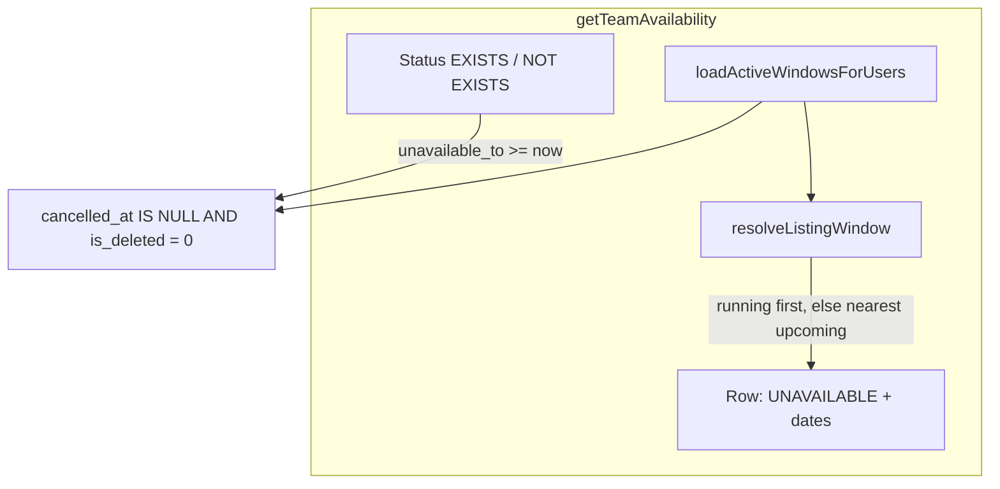

# PN-49-1 Final Review Summary

## Verdict

**Approve.** The working tree implements all three scoped parts from the [spec](docs/ai/stories/PN-49-1/spec.md) and [implementation plan](docs/ai/stories/PN-49-1/implementation-plan.md), including the **final-review change request** to list running or upcoming unavailable windows instead of moment-in-time status. Changes are confined to the planned target surface.

---

## Change Request Compliance

**Request:** *"if user has upcoming or running unavailable window then that should get listed instead of current status at this moment"*

**Status: Satisfied**

| Requirement | Implementation |
|-------------|----------------|
| Surface running window in listing | [`loadActiveWindowsForUsers`](src/modules/users/services/user-availability.service.ts) fetches active rows (`unavailable_to >= :now`); [`resolveListingWindow`](src/modules/users/services/user-availability.service.ts) picks latest running window |
| Surface upcoming window when no running window | `resolveListingWindow` falls back to nearest upcoming (earliest `unavailable_from`) |
| Replace moment-in-time AVAILABLE display | [`getTeamAvailability`](src/modules/users/services/user-availability.service.ts) sets `currentStatus = 'UNAVAILABLE'` and populates `unavailableFrom` / `unavailableTo` when a window resolves |
| Status filter consistency | `status=UNAVAILABLE` / `AVAILABLE` subqueries use `unavailable_to >= :now` (not running-only), so upcoming-only users filter as UNAVAILABLE |
| Export inherits listing | `exportTeamAvailability` delegates to `getTeamAvailability(..., { skipPagination: true })`; test covers upcoming export rows |
| IOM non-regression | [`loadUnavailableUserIds`](src/modules/iom/services/iom-assignment.service.ts) retains running-only bounds (`unavailable_from <= :now AND unavailable_to >= :now`) |



---

## Scope Check

| File | Status |
|------|--------|
| [`src/migrations/1781510857243-AddIsDeletedToUserAvailability.ts`](src/migrations/1781510857243-AddIsDeletedToUserAvailability.ts) | In plan — `TINYINT NOT NULL DEFAULT 0` up / drop on down |
| [`src/modules/users/entities/user-availability.entity.ts`](src/modules/users/entities/user-availability.entity.ts) | In plan — `isDeleted` column added |
| [`src/modules/users/services/user-availability.service.ts`](src/modules/users/services/user-availability.service.ts) | In plan — predicate, soft-delete writes, Part 3 window resolution |
| [`src/modules/users/services/user-availability.service.spec.ts`](src/modules/users/services/user-availability.service.spec.ts) | In plan — Part 1, 2, and 3 coverage |
| [`src/modules/iom/services/iom-assignment.service.ts`](src/modules/iom/services/iom-assignment.service.ts) | In plan — active + running-only filters |
| [`src/modules/iom/services/iom-assignment.service.spec.ts`](src/modules/iom/services/iom-assignment.service.spec.ts) | In plan — predicate assertions |
| [`docs/ai/stories/PN-49-1/*`](docs/ai/stories/PN-49-1/) | Expected story artifacts — not scope creep |

No accidental edits outside the target surface. All `user_availability` query-builder sites in `src/` are confined to `user-availability.service.ts` and `iom-assignment.service.ts`.

---

## Spec / Plan Compliance

### Part 1: Soft delete — compliant

- Migration, entity, and `ACTIVE_AVAILABILITY_SQL` (`ua.cancelled_at IS NULL AND ua.is_deleted = 0`) are correct.
- Active reads updated: overlap check (`markUnavailable`), `resolveRelevantWindow`, `loadActiveWindowsForUsers`, `getTeamAvailability` status subqueries, and IOM `loadUnavailableUserIds`.
- `markAvailable` sets `isDeleted: 1` on both in-progress and upcoming branches; no hard deletes.
- IOM assignment excludes cancelled and soft-deleted windows.

### Part 2: Export filter parity — compliant

- Export delegates to `getTeamAvailability(loggedInUser, query, { skipPagination: true })` only.
- Test `uses the same filtered listing query without pagination` asserts `status` / `search` / `project` filters and `is_deleted` exclusion flow through export.

### Part 3: Running/upcoming window listing — compliant

- Tests cover: active running window, upcoming-only user, running-over-upcoming precedence, nearest-upcoming selection, status-filter SQL, soft-deleted exclusion, and export upcoming rows.

---

## Prior Findings (Cycle 1 / Cycle 2)

### R1 — Spec/AC text vs `markAvailable` in-progress path (non-blocking)

**Severity:** Low (documented, intentional)

**Location:** [`user-availability.service.ts`](src/modules/users/services/user-availability.service.ts) `markAvailable` in-progress branch (lines 117–122)

**Issue:** Story spec/AC require `cancelled_at`, `cancelled_by`, and `is_deleted = 1` on all active rows when marking available. The in-progress (early-end) branch sets only `unavailableTo: now` and `isDeleted: 1`, omitting `cancelledAt` / `cancelledBy`.

**Status:** Unchanged since cycle 1. Implementation plan preserves early-end semantics; tests affirm the omission. Functionally excluded from all active queries via `is_deleted = 1`.

**Recommendation:** Confirm with product whether strict AC literal compliance is required before merge.

---

## Findings

None

---

## Merge Readiness Notes

- Commit the untracked migration [`1781510857243-AddIsDeletedToUserAvailability.ts`](src/migrations/1781510857243-AddIsDeletedToUserAvailability.ts) together with entity/service changes.
- Part 3 is an intentional listing behavior change; IOM assignment correctly remains running-only per spec non-regression AC.
- Run before merge:

```bash
npm run test -- src/modules/users/services/user-availability.service.spec.ts
npm run test -- src/modules/iom/services/iom-assignment.service.spec.ts
npm run lint
npm run build
npm run migration:run   # staging/DB only
```

---

## Minor Observations (no IDs)

- IOM service uses inline `andWhere` strings instead of shared `ACTIVE_AVAILABILITY_SQL` — acceptable; behavior matches.
- Entity `isDeleted: number` for `tinyint` matches nearby entity conventions.
- Plan Step 8 optional IOM negative test (upcoming-only user remains assignable) not added — low risk; running-only SQL unchanged.
- Spec mentions listing `reason`; DTO does not expose it — pre-existing, out of scope.
