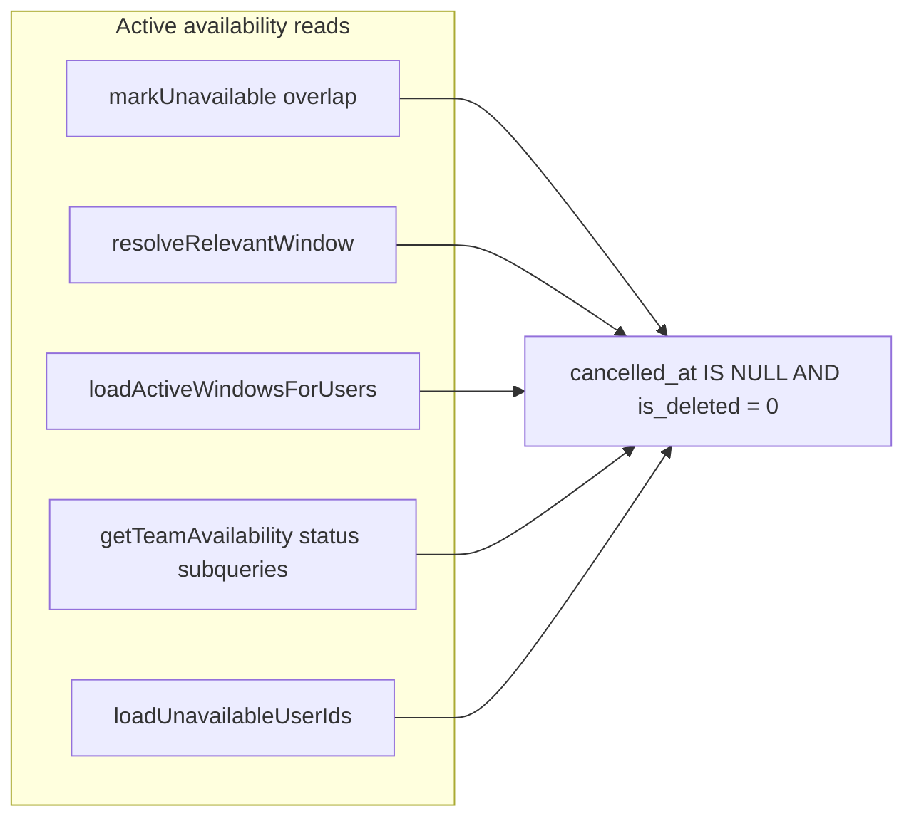

# PN-49-1 Review Pointers (Cycle 1)

## Verdict

**Approve with one non-blocking clarification.** Changes match the [implementation plan](docs/ai/stories/PN-49-1/implementation-plan.md) and correctly implement `is_deleted` soft-delete semantics across all identified `user_availability` query sites. Part 2 (export filter parity) is satisfied via existing `exportTeamAvailability` → `getTeamAvailability(..., { skipPagination: true })` delegation; new tests verify filtered export behavior.

## Scope Check

| File | Status |
|------|--------|
| `src/migrations/1781510857243-AddIsDeletedToUserAvailability.ts` | In plan (create) — correct `TINYINT NOT NULL DEFAULT 0` / drop on down |
| `src/modules/users/entities/user-availability.entity.ts` | In plan — `isDeleted` column added |
| `src/modules/users/services/user-availability.service.ts` | In plan — predicate centralized, queries updated, `markAvailable` sets `isDeleted: 1` |
| `src/modules/iom/services/iom-assignment.service.ts` | In plan — `loadUnavailableUserIds` filters active rows |
| `*.spec.ts` (both services) | In plan — adequate coverage for new predicates and export parity |
| `docs/ai/stories/PN-49-1/*` | Expected story artifacts — not scope creep |

No accidental edits outside target surface. All `UserAvailability` query sites in the repo are confined to the two updated services (verified via symbol search).

## Spec / Plan Compliance

### Part 1: Soft delete — compliant with plan

- Migration, entity, and `ACTIVE_AVAILABILITY_SQL` (`cancelled_at IS NULL AND is_deleted = 0`) are correct.
- Overlap check (`markUnavailable`), `resolveRelevantWindow`, `loadActiveWindowsForUsers`, and `getTeamAvailability` status subqueries all include `is_deleted = 0`.
- `markAvailable` sets `isDeleted: 1` on both in-progress and upcoming branches without hard deletes.
- IOM assignment now excludes cancelled and soft-deleted windows (fixes pre-existing gap where `cancelled_at` was not filtered).

### Part 2: Export filter parity — compliant

- No export code changes required; existing delegation preserved.
- New test `uses the same filtered listing query without pagination` asserts `status` / `search` / `project` filters and `is_deleted` exclusion flow through export.

### Query coverage diagram



## Findings

### R1 — Spec/AC text vs `markAvailable` in-progress path (non-blocking)

**Severity:** Low (documented, intentional)

**Location:** [`src/modules/users/services/user-availability.service.ts`](src/modules/users/services/user-availability.service.ts) `markAvailable` in-progress branch (~lines 117–122)

**Issue:** Story spec and AC state that marking a user available must set `cancelled_at`, `cancelled_by`, and `is_deleted = 1` on all active rows. The in-progress (early-end) branch sets only `unavailableTo: now` and `isDeleted: 1`, omitting `cancelledAt` / `cancelledBy`.

**Why not must-fix:** Implementation plan Step 5 explicitly preserves existing early-end semantics and lists this as a known risk. Tests affirm the omission. Functionally the row is excluded from all active queries because `is_deleted = 1`.

**Recommendation:** Confirm with product whether strict AC literal compliance is required. If yes, add `cancelledAt` / `cancelledBy` to the in-progress update and adjust tests.

---

**Must-fix findings:** None

## Minor Observations (no IDs)

- IOM service uses inline `andWhere` strings instead of the shared `ACTIVE_AVAILABILITY_SQL` constant — acceptable; behavior matches.
- Entity uses `isDeleted: number` for `tinyint`, consistent with nearby entities (`iom-status.entity.ts`, `group-bookings.entity.ts`).
- Migration omits column `COMMENT` present on `cancelled_at`/`cancelled_by` migration — cosmetic only.
- No data backfill for pre-existing cancelled rows (`cancelled_at IS NOT NULL`, `is_deleted = 0`) — safe because `cancelled_at IS NULL` predicate still excludes them.

## Validation (not executed in this review)

Run before merge per implementation plan:

```bash
npm run test -- src/modules/users/services/user-availability.service.spec.ts
npm run test -- src/modules/iom/services/iom-assignment.service.spec.ts
npm run lint
npm run build
npm run migration:run   # staging/DB only
```

## Extra Files

- `docs/ai/stories/PN-49-1/spec.md` and `implementation-plan.md` — expected deliverables.
- `src/migrations/1781510857243-AddIsDeletedToUserAvailability.ts` — required; ensure committed with code changes.
