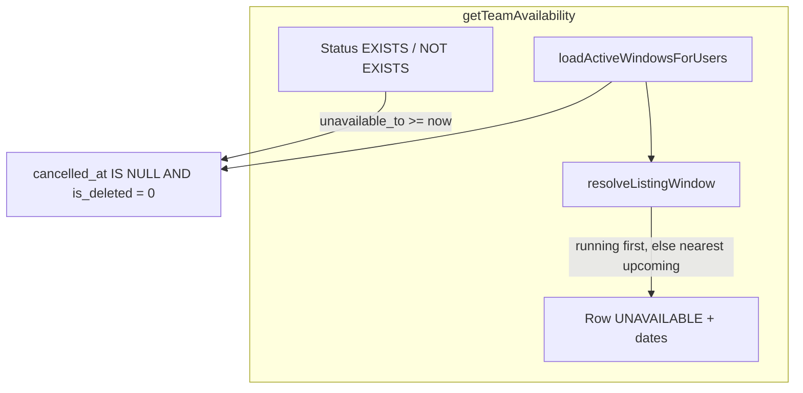

# PN-49-1 Review Pointers (Cycle 2)

## Verdict

**Approve.** The working tree now implements all three scoped parts from the [spec](docs/ai/stories/PN-49-1/spec.md) and [implementation plan](docs/ai/stories/PN-49-1/implementation-plan.md): Part 1 (`is_deleted` soft delete), Part 2 (export filter parity via delegation), and Part 3 (running/upcoming window listing with updated status-filter semantics). Changes are confined to the planned target surface.

---

## Scope Check

| File | Status |
|------|--------|
| [`src/migrations/1781510857243-AddIsDeletedToUserAvailability.ts`](src/migrations/1781510857243-AddIsDeletedToUserAvailability.ts) | In plan — `TINYINT NOT NULL DEFAULT 0` up / drop on down |
| [`src/modules/users/entities/user-availability.entity.ts`](src/modules/users/entities/user-availability.entity.ts) | In plan — `isDeleted` column added |
| [`src/modules/users/services/user-availability.service.ts`](src/modules/users/services/user-availability.service.ts) | In plan — predicate, soft-delete writes, Part 3 window resolution |
| [`src/modules/users/services/user-availability.service.spec.ts`](src/modules/users/services/user-availability.service.spec.ts) | In plan — Part 1, 2, and 3 coverage |
| [`src/modules/iom/services/iom-assignment.service.ts`](src/modules/iom/services/iom-assignment.service.ts) | In plan — active + running-only filters |
| [`src/modules/iom/services/iom-assignment.service.spec.ts`](src/modules/iom/services/iom-assignment.service.spec.ts) | In plan — predicate assertions |
| [`docs/ai/stories/PN-49-1/*`](docs/ai/stories/PN-49-1/) | Expected story artifacts — not scope creep |

No accidental edits outside the target surface. All `user_availability` query-builder sites in `src/` are confined to `user-availability.service.ts` and `iom-assignment.service.ts`.

---

## Spec / Plan Compliance

### Part 1: Soft delete — compliant

- Migration, entity, and `ACTIVE_AVAILABILITY_SQL` (`ua.cancelled_at IS NULL AND ua.is_deleted = 0`) are correct.
- Active reads updated: overlap check (`markUnavailable`), `resolveRelevantWindow`, `loadActiveWindowsForUsers`, `getTeamAvailability` status subqueries, and IOM `loadUnavailableUserIds`.
- `markAvailable` sets `isDeleted: 1` on both in-progress and upcoming branches; no hard deletes.
- IOM assignment excludes cancelled and soft-deleted windows while preserving **running-only** time bounds (`unavailable_from <= :now AND unavailable_to >= :now`).

### Part 2: Export filter parity — compliant

- [`exportTeamAvailability`](src/modules/users/services/user-availability.service.ts) delegates to `getTeamAvailability(loggedInUser, query, { skipPagination: true })` only.
- Test `uses the same filtered listing query without pagination` asserts `status` / `search` / `project` filters and `is_deleted` exclusion flow through export without pagination.

### Part 3: Running/upcoming window listing — compliant (change request)

- [`loadActiveWindowsForUsers`](src/modules/users/services/user-availability.service.ts) fetches active rows with `unavailable_to >= :now` (not running-only at query time).
- [`resolveListingWindow`](src/modules/users/services/user-availability.service.ts) resolves running-first (latest `unavailable_from` among running), else nearest upcoming (earliest `unavailable_from`).
- Listing row assembly sets `currentStatus = 'UNAVAILABLE'` and populates `unavailableFrom` / `unavailableTo` when any resolved window exists.
- Status filters use `unavailable_to >= :now` without `unavailable_from <= :now`, so upcoming-only users are UNAVAILABLE for filtering and excluded from `status=AVAILABLE`.
- Export inherits Part 3 behavior via shared listing path; test `maps upcoming window date fields in export rows` covers upcoming export rows.



### Cycle 1 → Cycle 2 delta

| Area | Cycle 1 | Cycle 2 |
|------|---------|---------|
| Part 3 listing | Gap (running-only) | Implemented |
| Status filters | Moment-in-time | Active window (`unavailable_to >= now`) |
| Tests | Part 1/2 focus | Running, upcoming, precedence, filter SQL, export upcoming |

---

## Findings

### R1 — Spec/AC text vs `markAvailable` in-progress path (non-blocking)

**Severity:** Low (documented, intentional)

**Location:** [`src/modules/users/services/user-availability.service.ts`](src/modules/users/services/user-availability.service.ts) `markAvailable` in-progress branch (lines 117–122)

**Issue:** Story spec/AC state that marking a user available must set `cancelled_at`, `cancelled_by`, and `is_deleted = 1` on all active rows. The in-progress (early-end) branch sets only `unavailableTo: now` and `isDeleted: 1`, omitting `cancelledAt` / `cancelledBy`.

**Why not must-fix:** Implementation plan preserves early-end semantics; tests affirm the omission. Functionally excluded from all active queries via `is_deleted = 1`.

**Recommendation:** Confirm with product whether strict AC literal compliance is required before merge. If yes, add `cancelledAt` / `cancelledBy` to the in-progress update and adjust tests.

---

**Must-fix findings:** None

---

## Minor Observations (no IDs)

- IOM service uses inline `andWhere` strings instead of shared `ACTIVE_AVAILABILITY_SQL` — acceptable; behavior matches.
- Entity `isDeleted: number` for `tinyint` matches nearby entity conventions.
- Migration omits column `COMMENT` present on prior `cancelled_at`/`cancelled_by` migration — cosmetic only.
- No backfill for legacy cancelled rows (`cancelled_at IS NOT NULL`, `is_deleted = 0`) — safe because `cancelled_at IS NULL` predicate still excludes them.
- Plan Step 8 optional IOM negative test (upcoming-only user remains assignable) not added — low risk; running-only SQL is unchanged and covered by existing time-bound filters.
- Spec mentions listing `reason` among exposed fields; [`TeamMemberAvailabilityDto`](src/modules/users/dto/team-availability.dto.ts) does not include `reason` — pre-existing, out of scope for this story.

---

## Validation (not executed in this review)

Run before merge:

```bash
npm run test -- src/modules/users/services/user-availability.service.spec.ts
npm run test -- src/modules/iom/services/iom-assignment.service.spec.ts
npm run lint
npm run build
npm run migration:run   # staging/DB only
```

---

## Merge Readiness Notes

- Commit the untracked migration [`1781510857243-AddIsDeletedToUserAvailability.ts`](src/migrations/1781510857243-AddIsDeletedToUserAvailability.ts) together with entity/service changes.
- Part 3 is an intentional listing behavior change; IOM assignment correctly remains running-only per spec non-regression AC.

---

## Extra Files

- `docs/ai/stories/PN-49-1/spec.md` and `implementation-plan.md` — expected deliverables.
- `.opencode/executions/exec-34714b61-6fdf-4495-b975-a9ecd24d00ad/*` — execution artifacts; not application code.
