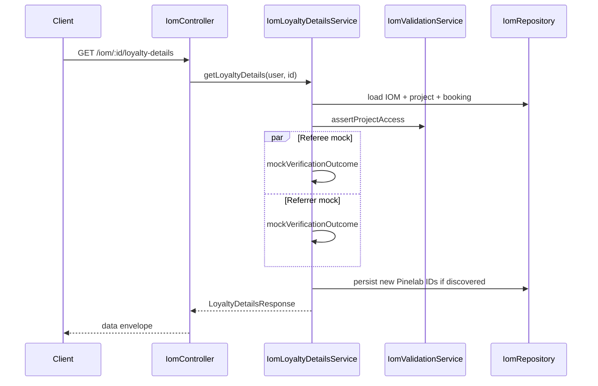

# PN-65 Final Review Summary

## Verdict

**Approve** — implementation matches approved plan and both change requests; prior must-fix findings (R1–R4) are resolved; targeted tests pass (29/29).

## Scope Compliance

| Area | Status |
|------|--------|
| Migration + entity (2 Pinelab ID columns only; no boolean DB flags) | OK — [`src/migrations/1782500000000-AddPinelabCustomerIdsToIoms.ts`](src/migrations/1782500000000-AddPinelabCustomerIdsToIoms.ts), [`src/modules/iom/entities/iom.entity.ts`](src/modules/iom/entities/iom.entity.ts) |
| Interim static random mock (final-review CR) | OK — [`verifyParticipant`](src/modules/iom/services/iom-loyalty-details.service.ts) delegates to `mockVerificationOutcome()`; no live executor calls; no client-facing *"Unable to verify Pinelab customer profile at this time."* during mock phase |
| No separate `iom-pinelab-profile-verification.service.ts` (plan-approval CR) | OK — verification is private logic in [`iom-loyalty-details.service.ts`](src/modules/iom/services/iom-loyalty-details.service.ts); live path preserved as unused `verifyParticipantViaPinelab` for future swap-in |
| No new util modules (`iom-brokerage-split.util`, `iom-participant-details.util`) | OK — reused exports from [`iom-pdf-template.mapper.ts`](src/modules/iom/helpers/iom-pdf-template.mapper.ts) |
| `GET /iom/:id/loyalty-details` endpoint | OK — [`iom.controller.ts`](src/modules/iom/iom.controller.ts) route order: `listing` → `:id` → `:id/pdf` → `:id/loyalty-details` |
| Roles/guards mirror `GET :id` | OK |
| Module wiring (`PineLabsModule`, `Projects`, service provider) | OK — [`iom.module.ts`](src/modules/iom/iom.module.ts) |
| Runtime flags only in API response | OK — [`loyalty-details.interface.ts`](src/modules/iom/types/loyalty-details.interface.ts) |
| Side-effect ID persistence on GET | OK — `persistPinelabCustomerIds` writes only when mock/live returns a discovered ID (no writes during mock) |
| Upstream docs updated | OK — [`docs/ai/stories/PN-65/spec.md`](docs/ai/stories/PN-65/spec.md) and [`implementation-plan.md`](docs/ai/stories/PN-65/implementation-plan.md) document interim mock behavior |

## Change Request Verification

### Final-review CR — static random mock outcomes

[`mockVerificationOutcome()`](src/modules/iom/services/iom-loyalty-details.service.ts) randomly selects among three branches per participant:

| Outcome | `isProfileDataMatching` | `shouldCreatePinelabProfile` |
|---------|-------------------------|------------------------------|
| Profile matched | `true` | `false` |
| Profile create | `false` | `true` |
| Profile not matching | `false` | `false` |

- Referee and referrer verified independently via separate `mockVerificationOutcome()` calls in `Promise.all`
- Early exit when no mobile and no stored Pinelab ID (no mock call)
- Missing referrer skips verification; returns `EMPTY_PARTICIPANT` block
- Spec stubs mock for determinism and covers all three branches plus independence

### Plan-approval CR — no extra service/util files

Confirmed: no `iom-pinelab-profile-verification.service.ts`, `iom-brokerage-split.util.ts`, or `iom-participant-details.util.ts` created.

## Prior Findings Resolution

### R1 — FIXED: `CUSTOMER_FETCH` empty-payload validation

- `requiredOneOf: ['customerId', 'mobileNumber']` in [`pine-labs-api.definitions.ts`](src/modules/pine-labs/config/pine-labs-api.definitions.ts) and [`pine-labs.interface.ts`](src/modules/pine-labs/interfaces/pine-labs.interface.ts)
- `assertRequiredFields` in [`pine-labs.helper.ts`](src/helpers/pine-labs.helper.ts) enforces at-least-one before HTTP
- Optional-field payload mapping skips null/undefined mapped keys
- Executor spec: empty-payload rejection + `maps mobileNumber to mobile for CUSTOMER_FETCH`

### R2 — FIXED: Stale ID + `shouldCreatePinelabProfile: true` contradiction

- `resolveDisplayedPinelabCustomerId` returns `null` when `shouldCreatePinelabProfile` is true
- Spec: stored ID + mock profile-create outcome → `pinelabCustomerId: null`

### R3 — FIXED: Referee `unitNumber` `booking.propertyNumber` fallback

- `iom.unitNumber ?? iom.booking?.propertyNumber ?? pickStringField(...)`
- Spec: `falls back to booking.propertyNumber for referee unitNumber`

### R4 — FIXED: Mobile-only `CUSTOMER_FETCH` executor test

- Added in [`pine-labs-executor.service.spec.ts`](src/modules/pine-labs/pine-labs-executor.service.spec.ts)

## Architecture (current — mock phase)



## Test Validation (executed)

```bash
npm run test -- src/modules/pine-labs/pine-labs-executor.service.spec.ts \
  src/modules/iom/services/iom-loyalty-details.service.spec.ts \
  src/modules/iom/iom.controller.spec.ts
```

Result: **3 suites, 29 tests passed**

Coverage highlights:
- **Service (15 tests):** not-found, unauthorized, all three mock branches, independence, no executor calls, no integration errors, payment breakdown, stored-ID display rules, `booking.propertyNumber` fallback, missing referrer block, no persistence during mock
- **Controller (1+ tests):** delegation + `{ data: ... }` envelope
- **Pine Labs executor:** empty-payload rejection + mobile mapping

## What Looks Good

- Mock state machine matches spec AC-4 through AC-11
- `verifyParticipantViaPinelab` preserved with TODO for clean live swap-in
- Parallel referee/referrer verification via `Promise.all`
- Defensive Pinelab response parsing and normalized field comparison ready for live phase
- `resolveReferrerProjectName` mirrors CRM listing pattern
- Pine Labs `requiredOneOf` changes are justified infrastructure for future mobile lookup

## Optional Follow-ups (non-blocking)

- **Stale ID DB cleanup:** When live Pinelab is enabled, a stored ID that 404s will still be queried first. Response semantics are correct today; consider clearing stale IDs on not-found when swapping to live.
- **`mapPayload` optional-key skip:** Global change in [`pine-labs.helper.ts`](src/helpers/pine-labs.helper.ts) omits unmapped optional keys instead of throwing. Monitor when wiring optional Pine Labs fields.
- **Dead live path:** `throwPinelabIntegrationError` and `verifyParticipantViaPinelab` remain unused during mock phase — intentional per plan.

## Findings

Findings: None
