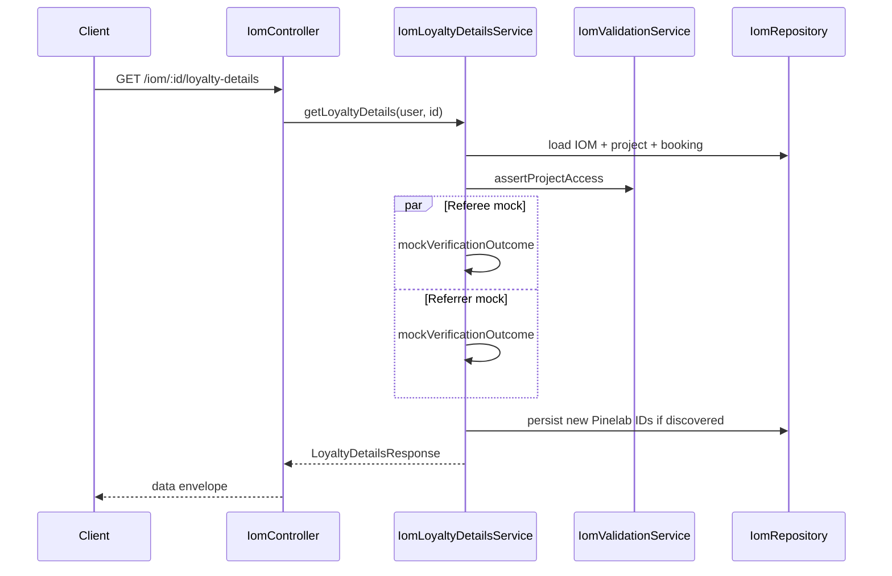

# PN-65 Code Review — Cycle 2

## Summary

The implementation delivers the approved PN-65 scope: `GET /iom/:id/loyalty-details`, interim **static random mock** Pinelab verification in [`src/modules/iom/services/iom-loyalty-details.service.ts`](src/modules/iom/services/iom-loyalty-details.service.ts), DB persistence of only the two Pinelab customer ID columns, reuse of pdf-mapper helpers, and solid unit test coverage. All cycle-1 must-fix findings (R1–R2) and should-fix/nit items (R3–R4) are resolved in the current working tree.

**Verdict: Approve**

## Scope Compliance

| Area | Status |
|------|--------|
| Migration + entity (2 Pinelab ID columns only; no boolean DB flags) | OK — [`src/migrations/1782500000000-AddPinelabCustomerIdsToIoms.ts`](src/migrations/1782500000000-AddPinelabCustomerIdsToIoms.ts), [`src/modules/iom/entities/iom.entity.ts`](src/modules/iom/entities/iom.entity.ts) |
| Interim static mock (no live Pinelab calls, no integration errors) | OK — `verifyParticipant` delegates to `mockVerificationOutcome()`; executor not called in tests |
| No separate `iom-pinelab-profile-verification.service.ts` | OK — verification is private logic in loyalty-details service; live path preserved as `verifyParticipantViaPinelab` for future swap-in |
| No new util modules | OK — reused exports from [`src/modules/iom/helpers/iom-pdf-template.mapper.ts`](src/modules/iom/helpers/iom-pdf-template.mapper.ts) |
| `GET /iom/:id/loyalty-details` endpoint | OK — [`src/modules/iom/iom.controller.ts`](src/modules/iom/iom.controller.ts); route order after `:id` and `:id/pdf` |
| Roles/guards mirror `GET :id` | OK — same role set and guards |
| Module wiring (`PineLabsModule`, `Projects`, service provider) | OK — [`src/modules/iom/iom.module.ts`](src/modules/iom/iom.module.ts) |
| Runtime flags only in API response | OK — [`src/modules/iom/types/loyalty-details.interface.ts`](src/modules/iom/types/loyalty-details.interface.ts) |
| Response contract + payment breakdown | OK — `computeBrokerageSplit`, field sources match spec |
| Extra pine-labs files | Justified — `requiredOneOf` + optional-field mapping prepares `CUSTOMER_FETCH` for future live mobile lookup |

## Cycle-1 Findings — Resolution Verified

### R1 — FIXED: `CUSTOMER_FETCH` empty-payload validation

- `requiredOneOf: ['customerId', 'mobileNumber']` added in [`pine-labs-api.definitions.ts`](src/modules/pine-labs/config/pine-labs-api.definitions.ts) and [`pine-labs.interface.ts`](src/modules/pine-labs/interfaces/pine-labs.interface.ts)
- `assertRequiredFields` in [`pine-labs.helper.ts`](src/helpers/pine-labs.helper.ts) enforces at-least-one before HTTP
- Optional-field payload mapping skips null/undefined mapped keys (enables mobile-only lookup)
- Executor spec retains empty-payload rejection and adds `maps mobileNumber to mobile for CUSTOMER_FETCH`

### R2 — FIXED: Stale ID + `shouldCreatePinelabProfile: true` contradiction

- `resolveDisplayedPinelabCustomerId` returns `null` when `shouldCreatePinelabProfile` is true (no DB fallback)
- Spec case: stored ID + mock profile-create outcome → `pinelabCustomerId: null`

### R3 — FIXED: Referee `unitNumber` `booking.propertyNumber` fallback

- Response builder: `iom.unitNumber ?? iom.booking?.propertyNumber ?? pickStringField(...)`
- Spec case: `falls back to booking.propertyNumber for referee unitNumber`

### R4 — FIXED: Mobile-only `CUSTOMER_FETCH` executor test

- Added in [`pine-labs-executor.service.spec.ts`](src/modules/pine-labs/pine-labs-executor.service.spec.ts)

## Architecture (current — mock phase)

## Test Coverage (verified in spec files)

- **Service (15 tests):** not-found, unauthorized, all three mock branches, independence, no executor calls, no integration errors, payment breakdown, stored-ID display rules, `booking.propertyNumber` fallback, missing referrer block, no persistence during mock
- **Controller (1 test):** delegation + `{ data: ... }` envelope
- **Pine Labs executor:** empty-payload rejection + mobile mapping

Per [`final-summary.md`](.opencode/executions/exec-39a8ec7b-5886-437b-a5b4-b817490aa538/final-summary.md), targeted suites reported 28/28 passing.

## Acceptance Criteria Spot-Check

| AC group | Status |
|----------|--------|
| AC-1–AC-3 (DB) | Pass |
| AC-4–AC-11 (mock verification) | Pass |
| AC-12–AC-17 (API) | Pass |
| AC-18–AC-19 (code organization) | Pass |
| AC-20–AC-24 (testing) | Pass |

## Optional Follow-ups (non-blocking)

- **Stale ID DB cleanup:** When live Pinelab is enabled, a stored ID that 404s will still be queried first (no mobile fallback). Response semantics are correct today; consider clearing stale IDs on not-found when swapping to live.
- **`mapPayload` optional-key skip:** Global change in [`pine-labs.helper.ts`](src/helpers/pine-labs.helper.ts) now omits unmapped optional keys instead of throwing. Consistent with `requiredFields` as source of truth; monitor when wiring optional Pine Labs fields (e.g. `programId`).

## Findings

Findings: None
