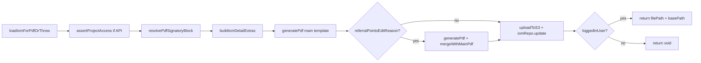

# PN-50 Final Review — IOM PDF Generation

## Verdict

**Request changes** — fix **R1** before merge. R3–R5 are non-blocking coordination or scope items.

## Change-Request Compliance

| Requirement | Status | Evidence |
|-------------|--------|----------|
| Inline CSS in templates (no external stylesheet) | Pass | [`iom-details-pdf.html`](src/templates/iom/iom-details-pdf.html), [`iom-referral-edit-reason-pdf.html`](src/templates/iom/iom-referral-edit-reason-pdf.html); deleted [`iom-details-pdf.css`](src/templates/iom/iom-details-pdf.css) |
| Print CSS: explicit borders, shadows, radii, backgrounds | Pass | `.iom-card` + `.iom-payment-box` use explicit `border`, `border-radius`, `background-color`, `box-shadow: 0 2px 8px rgba(0,0,0,0.12)`; `@media print` retains shadows (no `box-shadow: none`) |
| `print-color-adjust: exact` on body/cards | Pass | Applied on `body`, `.iom-page`, `.iom-card`, payment boxes |
| Cards: `display: block`, `box-sizing: border-box` | Pass | Base + `@media print` rules |
| No `overflow: hidden` clipping borders | Pass | No `overflow` rules in templates |
| Missing scalar placeholders → `"-"` | Partial | `withPdfFallback` / `fmtNumber` in [`iom-pdf-template.mapper.ts`](src/modules/iom/helpers/iom-pdf-template.mapper.ts); signatory blanks intentionally `''` per spec |
| All `{{placeholders}}` mapped | Partial | All keys present, but **referrer `customerName` uses wrong source** (R1) |
| `PdfService.generatePdf` + print settings | Pass | [`pdf.service.ts`](src/modules/pdf/pdf.service.ts): `printBackground: true`, `emulateMediaType('print')`; IOM calls pass HTML only |
| Replace existing `iom_pdf` in DB | Pass | Always regenerates, uploads new key, `iomRepo.update` overwrites column; test in [`iom-crm.service.spec.ts`](src/modules/iom/services/iom-crm.service.spec.ts) |
| API returns `{ basePath, filePath }` | Pass | [`getIomPdf`](src/modules/iom/services/iom-crm.service.ts) returns `{ filePath, basePath }`; path stored without base URL |
| Visual match to original UI (img1) | Unverified | Requires manual PDF smoke test — code changes look correct but cannot be confirmed in review |

## Scope Reviewed

| File | Role |
|------|------|
| [`src/modules/iom/services/iom-crm.service.ts`](src/modules/iom/services/iom-crm.service.ts) | `getIomPdf`, `loadIomForPdfOrThrow`, `resolvePdfSignatoryBlock` |
| [`src/modules/iom/helpers/iom-pdf-template.mapper.ts`](src/modules/iom/helpers/iom-pdf-template.mapper.ts) | Template variable mapping |
| [`src/modules/iom/helpers/iom-pdf-template.mapper.spec.ts`](src/modules/iom/helpers/iom-pdf-template.mapper.spec.ts) | Mapper unit tests |
| [`src/modules/pdf/pdf.service.ts`](src/modules/pdf/pdf.service.ts) | Public `generatePdf(html, css?)` |
| [`src/modules/iom/iom.module.ts`](src/modules/iom/iom.module.ts) | `PdfModule` import |
| [`src/modules/iom/iom.controller.ts`](src/modules/iom/iom.controller.ts) | `getIomPdf(id, user)` |
| [`src/templates/iom/iom-details-pdf.html`](src/templates/iom/iom-details-pdf.html) | Main PDF template + inline/print CSS |
| [`src/templates/iom/iom-referral-edit-reason-pdf.html`](src/templates/iom/iom-referral-edit-reason-pdf.html) | Attachment template |
| [`src/modules/iom/services/iom-crm.service.spec.ts`](src/modules/iom/services/iom-crm.service.spec.ts) | 8 `getIomPdf` tests |
| [`src/modules/iom/entities/iom.entity.ts`](src/modules/iom/entities/iom.entity.ts) | `referralPointsEditor` relation |

**Out-of-scope in working tree:** [`src/modules/users/services/user-availability.service.ts`](src/modules/users/services/user-availability.service.ts) — adds `cancelled_at IS NULL` to overlap check (see R5).

## What Looks Good



- End-to-end orchestration matches [implementation plan](docs/ai/stories/PN-50/implementation-plan.md): always regenerate, no cache short-circuit, S3 upload with relative path.
- Inline CSS hardening addresses the flat-card root cause (`box-shadow: none` in print removed; stronger shadows/borders added).
- `resolvePdfSignatoryBlock` correctly strips higher-hierarchy signatures for API callers without `hasActed`.
- Empty signature images hidden via `.iom-signature-block__image[src=""] { display: none; }`.
- **R2 resolved:** `referralPointsEditor` relation + join + `editedByName` mapping.
- **Validation:** 17 targeted unit tests passed (`iom-pdf-template.mapper` + `getIomPdf`).

## Findings

### R1 — Referrer `customerName` maps to referee data (functional bug)

**Severity:** High (blocking)  
**File:** [`src/modules/iom/helpers/iom-pdf-template.mapper.ts`](src/modules/iom/helpers/iom-pdf-template.mapper.ts)

The Referrer Details section uses `{{customerName}}` (line 485 of template), but the mapper sets:

```ts
customerName: withPdfFallback(resolveCustomerName(iom)),        // booking / customer_details (referee)
refereeCustomerName: withPdfFallback(resolveCustomerName(iom)), // same source
```

`resolveCustomerName` reads `iom.booking.customerName` or `customer_details` — the **referee** (new buyer). The referrer section should read `referrer_details` (e.g. `pickStringField(referrer, 'name', 'customerName', 'fullName')`).

**Fix:** Add `resolveReferrerName(iom)` and map `customerName` to it; keep `refereeCustomerName` on `resolveCustomerName(iom)`.

---

### R2 — `editedByName` always empty (RESOLVED)

**Status:** Fixed in current branch  
Entity `referralPointsEditor` relation added; joined in `loadIomForPdfOrThrow`; mapper sets `editedByName: withPdfFallback(iom.referralPointsEditor?.name ?? '')`; spec tests added.

---

### R3 — API response shape breaking change for `{ url }` consumers

**Severity:** Medium (coordination)  
**Files:** [`iom-crm.service.ts`](src/modules/iom/services/iom-crm.service.ts), controller

Previous stub returned `{ url: iom.iomPdf }`. New implementation returns `{ filePath, basePath }`. Matches PN-50 spec and change request; no in-repo FE callers found.

**Action:** Confirm FE/client contract before release; no code change if intentional.

---

### R4 — Mapper spec missing referrer vs referee name separation test

**Severity:** Low  
**File:** [`src/modules/iom/helpers/iom-pdf-template.mapper.spec.ts`](src/modules/iom/helpers/iom-pdf-template.mapper.spec.ts)

No test asserting `customerName` (referrer) differs from `refereeCustomerName` when `referrer_details.name` and `booking.customerName` differ. Would have caught R1.

**Fix:** Add fixture with distinct referrer/referee names after R1 fix.

---

### R5 — Unrelated `user-availability.service.ts` change

**Severity:** Low (scope)  
**File:** [`src/modules/users/services/user-availability.service.ts`](src/modules/users/services/user-availability.service.ts)

Adds `.andWhere('ua.cancelled_at IS NULL')` to overlap detection — valid fix but unrelated to IOM PDF. Split to its own PR/commit for reviewability.

---

## Prior Review

Prior execution [`exec-b5f8cced`](.opencode/executions/exec-b5f8cced-d91b-4519-9054-c687cda28f46/final-summary.md) and earlier [`final-summary.md`](.opencode/executions/exec-4cbc72e9-33a0-4409-a4b9-195528c34d3d/final-summary.md) identified R1–R5. **R2 resolved**; **R1 and R4 remain**; CSS hardening, `basePath` API key, scoping/regeneration tests, and print rendering fixes from the 2026-06-19 change request are now addressed.

## Recommended Fix Order

1. Fix R1 in `iom-pdf-template.mapper.ts` (required)
2. Add mapper test for referrer vs referee name split (closes R4, guards R1)
3. Revert or split R5 (`user-availability.service.ts`) out of PN-50
4. Coordinate R3 with frontend before release
5. Manual smoke: `GET /api/{NODE_ENV}/iom/:id/pdf` — verify card borders/shadows, distinct referrer/referee names, merged referral page when reason text exists

## Validation (post-fix)

```bash
npm run test -- src/modules/iom/helpers/iom-pdf-template.mapper.spec.ts
npm run test -- src/modules/iom/services/iom-crm.service.spec.ts --testNamePattern=getIomPdf
npm run lint
npm run build
```
