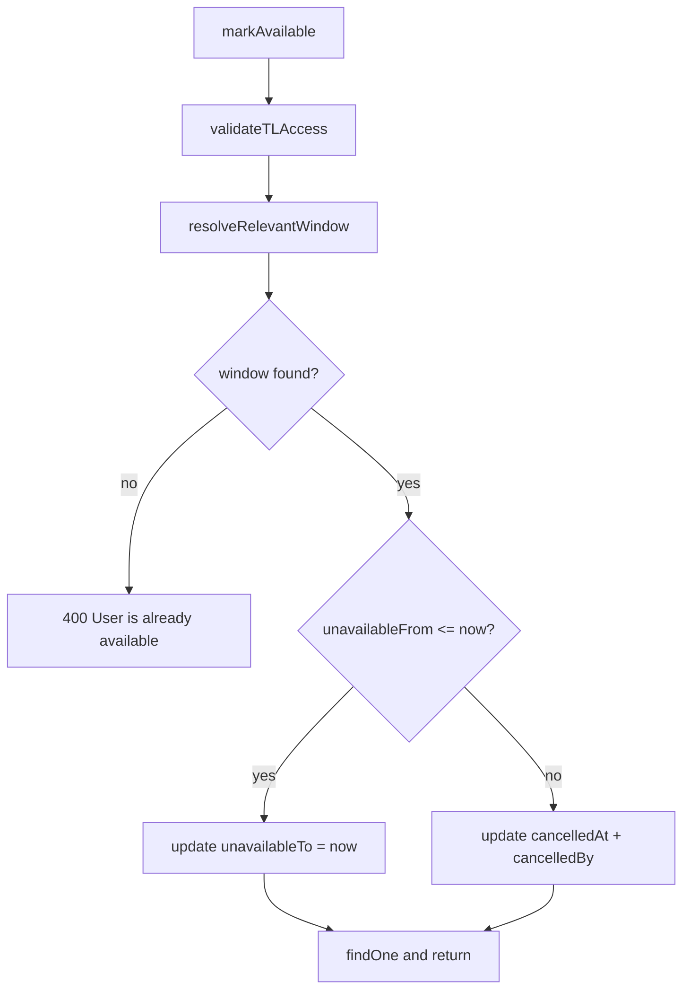

# PN-39 Final Review Summary

**Verdict: Approve**

## Scope Reviewed

| File | Role |
|------|------|
| [`src/modules/users/services/user-availability.service.ts`](src/modules/users/services/user-availability.service.ts) | `markAvailable` + `resolveRelevantWindow` |
| [`src/modules/users/services/user-availability.service.spec.ts`](src/modules/users/services/user-availability.service.spec.ts) | Branch coverage (10 `markAvailable` cases) |
| [`src/modules/users/entities/user-availability.entity.ts`](src/modules/users/entities/user-availability.entity.ts) | `cancelledAt`, `cancelledBy` columns |
| [`src/migrations/1781510857242-AddCancelledColumnsToUserAvailability.ts`](src/migrations/1781510857242-AddCancelledColumnsToUserAvailability.ts) | Schema migration |
| [`docs/ai/stories/PN-39/spec.md`](docs/ai/stories/PN-39/spec.md) | Soft-cancel story (supersedes collapse approach) |
| [`docs/ai/stories/PN-39/implementation-plan.md`](docs/ai/stories/PN-39/implementation-plan.md) | Updated plan |

No controller, DTO, or `markUnavailable` / `getTeamAvailability` edits — consistent with R9/R10 scope isolation.

## Prior Reviews

- [Cycle 1](.opencode/executions/exec-4d129923-a33e-454c-b742-01ec35cd6534/review-pointers-cycle-1.md): Approved collapse-based approach — **superseded** by soft-cancel change request.
- [Cycle 2](.opencode/executions/exec-4d129923-a33e-454c-b742-01ec35cd6534/review-pointers-cycle-2.md): Approved soft-cancel implementation — **Findings: None**.

## Active Change Request Verification

| Rule | Status | Evidence |
|------|--------|----------|
| Active window → `unavailable_to = now` | OK | Lines 99–103 in service |
| Upcoming window → soft-cancel | OK | Lines 105–109: `cancelledAt`, `cancelledBy` only |
| Already available → `400 User is already available` | OK | Line 96 |
| Never update `unavailable_from` | OK | Update payloads exclude it; tests assert |
| Never delete records | OK | `update` only; test `does not delete rows...` |
| Never touch past / cancelled windows | OK | Resolver: `cancelled_at IS NULL`, `unavailable_to >= :now` |
| Resolver fetches earliest relevant window | OK | `ORDER BY unavailable_from ASC` + `getOne()` |
| TL access before mutation | OK | `validateTLAccess` first (line 90) |
| Logic confined to `UserAvailabilityService` | OK | No other module changes |
| No impact on create/list APIs | OK | `markUnavailable`, `getTeamAvailability` untouched |



## Schema / Migration

[`1781510857242-AddCancelledColumnsToUserAvailability.ts`](src/migrations/1781510857242-AddCancelledColumnsToUserAvailability.ts):

- Adds nullable `cancelled_at` (DATETIME) and `cancelled_by` (INT)
- FK `fk_user_availability_cancelled_by` → `users(id) ON DELETE RESTRICT` mirrors `marked_by` in [`1781264100000-CreateUserAvailability.ts`](src/migrations/1781264100000-CreateUserAvailability.ts)
- `down()` drops FK before columns — correct order

**Deploy note:** Run `npm run migration:run` before deploying service code that writes cancel columns.

## Test Coverage vs Acceptance Criteria

| AC | Covered by |
|----|------------|
| 1 Active window unchanged | `ends the active window...` + `ends an active window without modifying unavailableFrom` |
| 2 Upcoming soft-cancel | `soft-cancels an upcoming window without modifying window dates` |
| 3 Already available | `throws BadRequestException when user is already available` |
| 4 Active precedence | `ends active window when both active and upcoming windows exist` |
| 5 Earliest upcoming | `soft-cancels only the earliest upcoming window when multiple exist` |
| 6 Past windows untouched | `throws when only past windows exist` |
| 7 Cancelled windows ignored | `filters cancelled windows via resolver` |
| 8 Authorization | `throws ForbiddenException when TL access is denied` |
| 9 Scope limited | No edits to create/list/controller paths |
| 10 Full test matrix | 25 tests pass (confirmed this review) |

## Validation (confirmed)

```bash
npm run test -- src/modules/users/services/user-availability.service.spec.ts  # 25 passed
```

Recommend before merge: `npm run lint`, `npm run build`, `npm run migration:run` on target DB.

## Extra Changed Files

| File | Assessment |
|------|------------|
| [`docs/ai/stories/PN-39/spec.md`](docs/ai/stories/PN-39/spec.md) | Rewritten for soft-cancel — aligned with code |
| [`docs/ai/stories/PN-39/implementation-plan.md`](docs/ai/stories/PN-39/implementation-plan.md) | Updated — aligned |
| [`.opencode/executions/.../final-summary.md`](.opencode/executions/exec-4d129923-a33e-454c-b742-01ec35cd6534/final-summary.md) | **Stale** — still describes cycle-1 collapse approach; execution artifact only |
| [`.opencode/executions/.../working-tree.diff`](.opencode/executions/exec-4d129923-a33e-454c-b742-01ec35cd6534/working-tree.diff) | Generated artifact |

## Non-Blocking Observations (not must-fix)

1. **`markUnavailable` overlap ignores `cancelled_at`** — Soft-cancelled future windows may still block overlapping inserts. Documented out-of-scope follow-up in spec (R10).
2. **`getTeamAvailability` active-window query does not filter `cancelled_at`** — Only loads currently active windows (`unavailable_from <= now`); soft-cancelled upcoming rows do not affect status display. Spec open question notes potential follow-up.
3. **AC4/AC5 mock style** — Precedence and earliest-upcoming validated via mocked `getOne` returns, not multi-row DB scenarios; consistent with plan mock strategy.
4. **`findOne` nullable return** — `markAvailable` return type is `Promise<UserAvailability>` but `findOne` may return `null`; pre-existing pattern, extremely unlikely after `update` on known id.
5. **Entity relation parity** — `cancelled_by` lacks optional `@ManyToOne`; DB FK provides integrity (acceptable per plan).

## Findings

Findings: None
