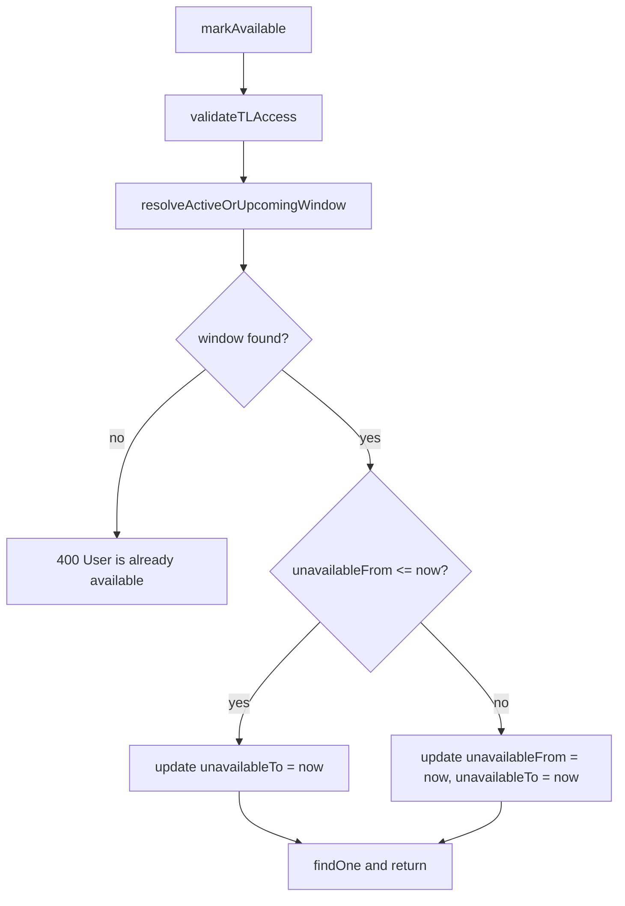

# PN-39 Review Pointers — Cycle 1

**Verdict: Approve.** Changes in [`user-availability.service.ts`](src/modules/users/services/user-availability.service.ts) and [`user-availability.service.spec.ts`](src/modules/users/services/user-availability.service.spec.ts) correctly implement the narrowed PN-39 scope. Doc updates in [`spec.md`](docs/ai/stories/PN-39/spec.md) and [`implementation-plan.md`](docs/ai/stories/PN-39/implementation-plan.md) align story artifacts with the `markAvailable`-only execution (not scope creep).

## Spec / Plan Alignment

| Requirement | Status | Evidence |
|-------------|--------|----------|
| R1 — `validateTLAccess` first | OK | Unchanged first call in `markAvailable` |
| R2 — Active window: `unavailable_to = now` | OK | Branch at `window.unavailableFrom <= now` |
| R3 — Upcoming cancel: collapse to `now` | OK | Else branch sets both fields; no `delete`/`remove` |
| R4 — Already available: `400` + exact message | OK | `BadRequestException('User is already available')` |
| R5 — Decision flow comments | OK | Inline comments on all three branches |
| R6 — Resolver query semantics | OK | `unavailable_to >= :now`, `ORDER BY unavailable_from ASC` |
| R7 — Active precedence | OK | ASC ordering returns earliest `unavailable_from`; active windows sort before future ones |
| R8 — Endpoint contract unchanged | OK | No controller/DTO/entity edits |
| Dead code removal | OK | `resolveActiveWindow` replaced by `resolveActiveOrUpcomingWindow` |
| Scope | OK | Only service + spec + story docs touched |



## Test Coverage vs Acceptance Criteria

| AC | Covered by |
|----|------------|
| 1 Active window unchanged | `ends the active window by setting unavailableTo to now` |
| 2 Upcoming cancellation | `cancels an upcoming window by collapsing...` |
| 3 Already available | `throws BadRequestException when user is already available` (+ `update` not called) |
| 4 Active precedence | `ends an active window without modifying unavailableFrom` (mock simulates resolver returning active row) |
| 5 Earliest upcoming | `updates only the earliest upcoming window when multiple exist` |
| 6 Authorization | `throws ForbiddenException when TL access is denied` (unchanged) |
| 7 Scope limited | No edits to `markUnavailable`, `getTeamAvailability`, controller |
| 8 Test matrix | All planned branches present under `describe('markAvailable')` |

## Extra Changed Files

- [`docs/ai/stories/PN-39/spec.md`](docs/ai/stories/PN-39/spec.md) and [`docs/ai/stories/PN-39/implementation-plan.md`](docs/ai/stories/PN-39/implementation-plan.md) were rewritten from the broader Parts 2–3 plan to the focused `markAvailable` story. Content is consistent with the code diff and implementer handoff; appropriate for this execution.

## Non-Blocking Observations (not must-fix)

1. **AC4 test style** — Precedence is validated via mocked `getOne` returning an active window rather than an integration-style dual-window DB scenario. Matches the implementation plan’s explicit mock strategy; resolver SQL semantics are not asserted on the query-builder chain.
2. **No-delete audit** — `does not delete rows when cancelling an upcoming window` asserts `save` is not called; `delete`/`remove` are not on the repo mock, so those methods are implicitly untestable without extending the mock.
3. **Validation evidence** — No execution artifact confirms `npm run test`, `npm run lint`, or `npm run build` were run for this cycle. Recommend running plan validation commands before merge.

## Findings

Findings: None

## Pre-Merge Validation (recommended)

```bash
npm run test -- src/modules/users/services/user-availability.service.spec.ts
npm run lint
npm run build
```
