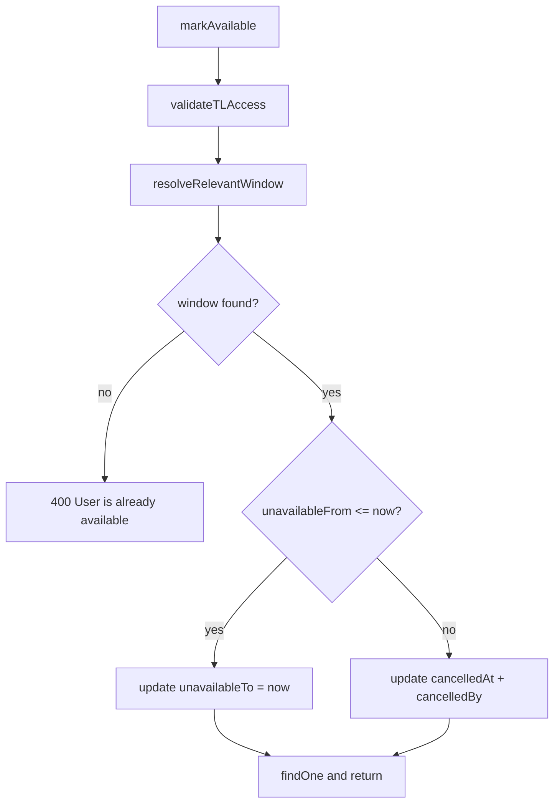

# PN-39 Review Pointers — Cycle 2

**Verdict: Approve.** The implementation correctly replaces cycle-1 collapse-based upcoming cancellation with **soft-cancel** via `cancelled_at` / `cancelled_by`, adds the required schema migration and entity columns, and provides comprehensive unit test coverage. All 25 tests in [`user-availability.service.spec.ts`](src/modules/users/services/user-availability.service.spec.ts) pass; `npm run build` succeeds.

## Spec / Plan Alignment

| Requirement | Status | Evidence |
|-------------|--------|----------|
| R1 — `validateTLAccess` first | OK | Unchanged first call in `markAvailable` |
| R2 — Active window: `unavailable_to = now` only | OK | Branch at `window.unavailableFrom <= now`; update payload excludes `cancelledAt`/`cancelledBy`/`unavailableFrom` |
| R3 — Upcoming soft-cancel | OK | Else branch sets `cancelledAt: now`, `cancelledBy: loggedInUser.dbId`; dates not mutated |
| R4 — Already available: exact message | OK | `BadRequestException('User is already available')` |
| R5 — Resolution order + comments | OK | Active → upcoming → error; inline comments on both branches |
| R6 — `resolveRelevantWindow` query | OK | `cancelled_at IS NULL`, `unavailable_to >= :now`, `ORDER BY unavailable_from ASC` |
| R7 — Active precedence | OK | ASC ordering returns active row before any upcoming row |
| R8 — Immutable constraints | OK | No deletes; no `unavailable_from` updates; resolver excludes cancelled rows |
| R9 — Endpoint contract unchanged | OK | No controller/DTO edits |
| R10 — Scope isolation | OK | `markUnavailable`, `getTeamAvailability`, controller untouched |
| R11 — Schema / entity columns | OK | Entity columns + migration [`1781510857242-AddCancelledColumnsToUserAvailability.ts`](src/migrations/1781510857242-AddCancelledColumnsToUserAvailability.ts) with FK mirroring `marked_by` pattern |



## Migration Review

[`src/migrations/1781510857242-AddCancelledColumnsToUserAvailability.ts`](src/migrations/1781510857242-AddCancelledColumnsToUserAvailability.ts):

- Adds nullable `cancelled_at` (`DATETIME`) and `cancelled_by` (`INT`) — consistent with base table `DATETIME` types in [`1781264100000-CreateUserAvailability.ts`](src/migrations/1781264100000-CreateUserAvailability.ts).
- FK `fk_user_availability_cancelled_by` → `users(id) ON DELETE RESTRICT` mirrors `marked_by` constraint.
- `down()` drops FK before columns — correct order.

**Deploy note (non-blocking):** Run migration before deploying service code that writes `cancelled_at`/`cancelled_by`.

## Entity Review

[`user-availability.entity.ts`](src/modules/users/entities/user-availability.entity.ts) adds `cancelledAt` and `cancelledBy` scalar columns. Optional `cancelledByUser` `@ManyToOne` relation (mirroring `markedByUser`) was noted as optional in the implementation plan and was not added — acceptable for persistence of `markAvailable` writes.

## Test Coverage vs Acceptance Criteria

| AC | Covered by |
|----|------------|
| 1 Active window unchanged | `ends the active window...` + `ends an active window without modifying unavailableFrom` |
| 2 Upcoming soft-cancel | `soft-cancels an upcoming window without modifying window dates` |
| 3 Already available | `throws BadRequestException when user is already available` |
| 4 Active precedence | `ends active window when both active and upcoming windows exist` |
| 5 Earliest upcoming | `soft-cancels only the earliest upcoming window when multiple exist` |
| 6 Past windows untouched | `throws when only past windows exist` |
| 7 Cancelled windows ignored | `filters cancelled windows via resolver` (asserts `cancelled_at IS NULL` filter) |
| 8 Authorization | `throws ForbiddenException when TL access is denied` |
| 9 Scope limited | No edits to `markUnavailable`, `getTeamAvailability`, controller |
| 10 Test matrix + no-delete | `does not delete rows when soft-cancelling...`; full branch matrix under `describe('markAvailable')` |

## Extra Changed Files

| File | Assessment |
|------|------------|
| [`docs/ai/stories/PN-39/spec.md`](docs/ai/stories/PN-39/spec.md) | Rewritten for soft-cancel scope — aligned with code |
| [`docs/ai/stories/PN-39/implementation-plan.md`](docs/ai/stories/PN-39/implementation-plan.md) | Updated prerequisites, migration steps, test matrix — aligned |
| [`.opencode/executions/.../final-summary.md`](.opencode/executions/exec-4d129923-a33e-454c-b742-01ec35cd6534/final-summary.md) | **Stale** — still describes cycle-1 collapse approach; execution artifact only, not a code defect |
| [`.opencode/executions/.../working-tree.diff`](.opencode/executions/exec-4d129923-a33e-454c-b742-01ec35cd6534/working-tree.diff) | Generated diff artifact |

## Non-Blocking Observations (not must-fix)

1. **`markUnavailable` overlap ignores `cancelled_at`** — Soft-cancelled future windows may still block overlapping inserts via existing overlap query. Documented as out-of-scope follow-up in spec and implementation plan (R10).
2. **`getTeamAvailability` does not filter `cancelled_at`** — Only queries active windows (`unavailable_from <= now`); soft-cancelled upcoming windows do not affect current status display. Spec open question notes potential follow-up if listing semantics expand.
3. **AC4/AC5 mock style** — Precedence and earliest-upcoming behavior validated via mocked `getOne` return values rather than multi-row integration scenarios; consistent with plan mock strategy.
4. **AC8 mutation guard** — Forbidden test does not assert `availabilityRepo.update` was not called (validateTLAccess throws before resolver).
5. **Entity relation parity** — `cancelled_by` lacks optional `@ManyToOne`/`@JoinColumn`; DB FK provides referential integrity.

## Findings

Findings: None

## Pre-Merge Validation (confirmed this review)

```bash
npm run test -- src/modules/users/services/user-availability.service.spec.ts  # 25 passed
npm run build                                                                 # succeeded
npm run lint                                                                  # recommended before merge
npm run migration:run                                                         # required on target DB before deploy
```
