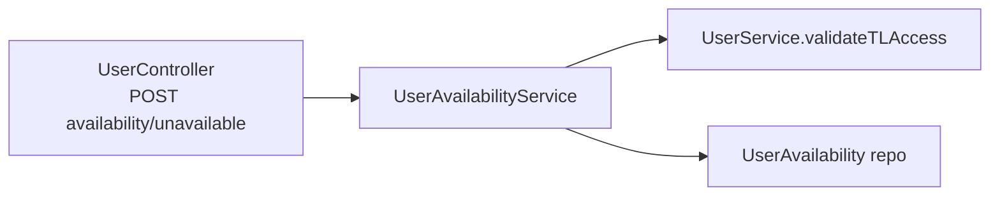

# PN-39 Final Review Summary

## Verdict

**Approve.** The implementation satisfies [spec](docs/ai/stories/PN-39/spec.md) and [implementation plan](docs/ai/stories/PN-39/implementation-plan.md). Auto-fixer changes from cycle 1 fully address prior findings. No new issues identified.

## Prior Findings — Resolution Status

| ID | Severity | Status | Evidence |
|---|---|---|---|
| R1 | must-fix | **Resolved** | New [`src/modules/users/user.service.spec.ts`](src/modules/users/user.service.spec.ts) directly tests `validateTLAccess` with mocked `Users` repository: self-target, not found, non-CRM role, `reportingTo` mismatch, and success path |
| R2 | should-fix | **Resolved** | [`mark-unavailable.dto.ts`](src/modules/users/dto/mark-unavailable.dto.ts) adds `@MaxLength(255)` on optional `reason` |
| R3 | nice-to-have | **Resolved** | [`user-availability.service.ts`](src/modules/users/services/user-availability.service.ts) rejects `NaN` dates; spec test covers invalid `unavailableFrom` |

## Spec / Plan Compliance

| Requirement | Status |
|---|---|
| Entity relocated to Users module with `markedBy`, `reason`, indexes | Done |
| `POST /users/availability/unavailable` with `RmAdminAuthGuard`, `RolesGuard`, `CRM_TL` | Done |
| `validateTLAccess` in `UserService` (self, not found, CRM role, `reportingTo`) | Done |
| `UserAvailabilityService.markUnavailable` (dates, overlap, persist) | Done |
| IOM import-path updates only (no new IOM feature code) | Done |
| Unit tests per plan table | **Done** — `user.service.spec.ts` + `user-availability.service.spec.ts` |
| No migration (schema pre-exists) | Done |

## Architecture (unchanged, correct)



- No circular module imports.
- `UserAvailability` registered in both `UsersModule` and `IomModule` `forFeature` — standard shared-entity pattern.
- Overlap query: `unavailable_from < :to AND unavailable_to > :from`.
- Entity columns align with migration [`1781264100000-CreateUserAvailability.ts`](src/migrations/1781264100000-CreateUserAvailability.ts).

## Validation Results

```bash
npm run test -- user.service.spec user-availability.service.spec iom-assignment.service.spec
# 3 suites, 25 tests — all passed

npm run lint   # 0 errors (pre-existing warnings in unrelated files)
npm run build  # success
```

## Extra Changed Files (not in original plan)

| File | Assessment |
|---|---|
| [`src/modules/users/user.service.spec.ts`](src/modules/users/user.service.spec.ts) | Required fix for R1; focused `validateTLAccess` coverage |
| [`docs/ai/stories/PN-39/*`](docs/ai/stories/PN-39/) | Expected story artifacts |
| `.opencode/executions/...` | Generated review/execution artifacts — not application code |

## Non-Issues (confirmed, no action)

- IOM files changed only for entity import relocation.
- `user_id` typed `int` in entity (spec says bigint; migration uses `INT`) — entity matches DB.
- No `UserActivityInterceptor` on new endpoint — plan marks optional.
- Redundant forbidden-case tests in `user-availability.service.spec.ts` (mocked `validateTLAccess`) are acceptable now that R1 direct tests exist.

Findings: None
