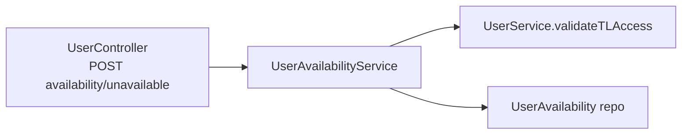

# PN-39 Code Review — Cycle 1

## Verdict

**Approve with one must-fix.** Core implementation matches [spec](docs/ai/stories/PN-39/spec.md) and [implementation plan](docs/ai/stories/PN-39/implementation-plan.md). Entity relocation, endpoint wiring, service validation, and overlap logic are correct. Security-critical `validateTLAccess` logic lacks direct test coverage.

## Spec / Plan Compliance

| Requirement | Status |
|---|---|
| Entity relocated to Users module with `markedBy`, `reason`, indexes | Done |
| `POST /users/availability/unavailable` with `RmAdminAuthGuard`, `RolesGuard`, `CRM_TL` | Done |
| `validateTLAccess` in `UserService` (self, not found, CRM role, `reportingTo`) | Done |
| `UserAvailabilityService.markUnavailable` (dates, overlap, persist) | Done |
| IOM import-path updates only (no new IOM feature code) | Done |
| Unit tests per plan table | **Partial** — service tests mock `validateTLAccess` |
| No migration (schema pre-exists) | Done |
| Docs (`spec.md`, `implementation-plan.md`) | Expected story artifacts; no scope creep |

## Architecture (correct)



- No circular module imports (`UserAvailabilityService` → `UserService` only).
- `UserAvailability` registered in both `UsersModule` and `IomModule` `forFeature` — standard NestJS pattern for shared entities.
- Overlap query matches spec: `unavailable_from < :to AND unavailable_to > :from`.
- Date rules: `unavailableFrom < now` rejects past; `unavailableTo <= unavailableFrom` rejected — satisfies AC 5–6.
- Entity column types (`user_id`/`marked_by` as `int`) match migration [`1781264100000-CreateUserAvailability.ts`](src/migrations/1781264100000-CreateUserAvailability.ts).

## Findings

### R1 (must-fix): `validateTLAccess` has no direct unit tests

**Location:** [`src/modules/users/user.service.ts`](src/modules/users/user.service.ts) (`validateTLAccess`, lines 1594–1622)

**Issue:** [`user-availability.service.spec.ts`](src/modules/users/services/user-availability.service.spec.ts) mocks `UserService.validateTLAccess` for all forbidden-case tests. Those tests only verify exception propagation from the mock — they never execute the real access-control logic (self-target, user lookup, CRM role check, `reportingTo` match).

**Plan gap:** Implementation plan Step 7 requires tests for TL self-target, not found, non-CRM, and `reportingTo` mismatch. No `user.service.spec.ts` exists in the repo.

**Fix:** Add focused unit tests for `validateTLAccess` (new `user.service.spec.ts` or a dedicated `validate-tl-access.spec.ts`) with a mocked `Users` repository covering:
- TL targets self → `ForbiddenException`
- Target not found → `ForbiddenException`
- Target role ≠ `CRM` → `ForbiddenException`
- `reportingTo !== tlUserId` → `ForbiddenException`
- Valid direct-report CRM user → returns user

Keep existing `user-availability.service.spec.ts` for service-layer date/overlap/persistence cases.

---

### R2 (should-fix): `reason` lacks `@MaxLength(255)` on DTO

**Location:** [`src/modules/users/dto/mark-unavailable.dto.ts`](src/modules/users/dto/mark-unavailable.dto.ts)

**Issue:** Entity maps `reason` to `varchar(255)`. Oversized input passes DTO validation and fails at the DB layer with an opaque error instead of `BadRequestException`.

**Fix:** Add `@MaxLength(255)` to `reason` (optional field).

---

### R3 (nice-to-have): Invalid date strings not rejected explicitly

**Location:** [`src/modules/users/services/user-availability.service.ts`](src/modules/users/services/user-availability.service.ts) (lines 26–40)

**Issue:** Malformed `unavailableFrom`/`unavailableTo` values produce `Invalid Date`; comparisons with `now` may not throw, allowing a bad save attempt.

**Fix:** After parsing, check `Number.isNaN(date.getTime())` and throw `BadRequestException`.

## Non-Issues (reviewed, no action)

- IOM files changed only for entity import relocation — required by plan, not AC 12 violation.
- `user_id` typed `int` in entity (spec says bigint; migration uses `INT`) — entity matches DB.
- No `UserActivityInterceptor` on new endpoint — plan marks optional.
- `docs/ai/stories/PN-39/*` — expected planner/implementer artifacts.

## Recommended Validation (post R1 fix)

```bash
npm run lint
npm run build
npm run test -- user-availability.service.spec
npm run test -- user.service.spec   # after R1
npm run test -- iom-assignment.service.spec
```

## Review Pointers Output

```
Findings: R1 (must-fix), R2 (should-fix), R3 (nice-to-have)

R1 — validateTLAccess untested: add direct unit tests with mocked Users repository; current service spec mocks bypass real access-control logic.
R2 — reason MaxLength: add @MaxLength(255) to MarkUnavailableDto.reason.
R3 — invalid dates: reject NaN dates after new Date() parsing in markUnavailable.
```
