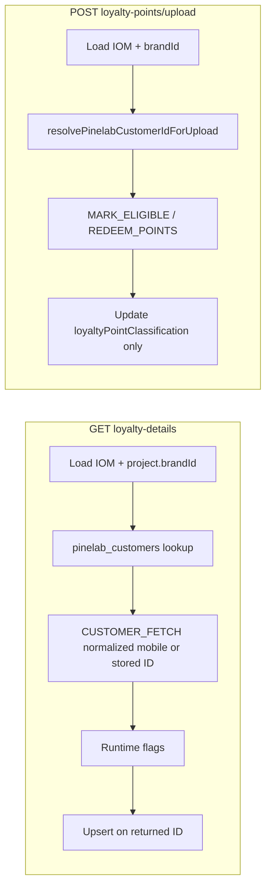

# PN-51_4 Final Review Summary

## Verdict

**Approve.** Cycle-1 must-fix **R1** is resolved. The change set aligns with [docs/ai/stories/PN-51_4/spec.md](docs/ai/stories/PN-51_4/spec.md) and [docs/ai/stories/PN-51_4/implementation-plan.md](docs/ai/stories/PN-51_4/implementation-plan.md).

## Prior Findings Status

| ID | Issue | Status |
|---|---|---|
| R1 | `CUSTOMER_FETCH` mobile not normalized in loyalty-details | **Fixed** — `verifyParticipantViaPinelab` now uses `normalizeMobileForLookup` before setting `fetchPayload.mobileNumber` ([iom-loyalty-details.service.ts](src/modules/iom/services/iom-loyalty-details.service.ts) L288–296), matching upload path behavior |

## Scope Check

All planned deliverables are present and correctly scoped:

- Migration + entity: [1782600000000-CreatePinelabCustomers.ts](src/migrations/1782600000000-CreatePinelabCustomers.ts), [pinelab-customer.entity.ts](src/modules/pine-labs/entities/pinelab-customer.entity.ts)
- Service layer: [pinelab-customer.service.ts](src/modules/pine-labs/services/pinelab-customer.service.ts) with normalization + upsert semantics
- Helpers: [normalize-mobile.util.ts](src/modules/pine-labs/utils/normalize-mobile.util.ts), [resolve-brand-from-iom.helper.ts](src/modules/iom/helpers/resolve-brand-from-iom.helper.ts)
- Module wiring: [pine-labs.module.ts](src/modules/pine-labs/pine-labs.module.ts) registers/exports `PinelabCustomerService`; [iom.module.ts](src/modules/iom/iom.module.ts) imports `PineLabsModule` (no duplicate entity registration needed)
- Entity export: [src/entities/index.ts](src/entities/index.ts)
- Loyalty services refactored to brand+mobile resolution; IOM Pinelab columns no longer read/written
- Unit specs updated across 3 service spec files

Extra docs (`spec.md`, `implementation-plan.md`) and execution artifacts are expected story/SDLC outputs, not scope creep.

## Architecture Validation

**Key behaviors verified:**

- **Brand resolution:** `resolveBrandIdFromIom` throws `MANDATORY_FIELDS_MISSING` when `project.brandId` is absent; both services join `iom.project`
- **GET loyalty-details:** Random mock removed; executor drives verification; runtime flags not persisted; upsert only when fetch returns ID; no `iomRepo.update` for Pinelab IDs
- **POST upload:** IDs resolved via `pinelab_customers` + fetch fallback; Pinelab mark/redeem runs only after both IDs resolve; IOM state update remains transactional and post-Pinelab success
- **Normalization consistency:** GET fetch path and POST resolution path both use `normalizeMobileForLookup` for mobile-based lookups
- **Migration/entity:** DDL matches spec (`UNIQUE (brand_id, mobile_no)`, FK to `brands`, no profile columns)

## Acceptance Criteria Spot-Check

| AC | Met? |
|---|---|
| AC-1–3 DB migration/entity | Yes |
| AC-4–5 Brand resolution | Yes |
| AC-6–10 GET loyalty-details | Yes (R1 fix closes prior gap) |
| AC-11–17 POST upload | Yes |
| AC-18 Null safety | Yes in touched paths |
| AC-19 Tests | Yes — comprehensive mock-to-executor migration |
| AC-20 lint/build/migration run | Not verified in this review pass |

## Findings

Findings: None

## Non-Blocking Observations (unchanged from cycle 1)

- Duplicated `isCustomerNotFound` / customer-ID extraction in both loyalty services — acceptable for minimal scope; consider shared helper if more Pinelab flows are added
- No loyalty-details spec asserting formatted-mobile normalization in `CUSTOMER_FETCH` payload (e.g. `+91 …` → digits-only); production code is correct; `PinelabCustomerService` and upload tests cover normalization elsewhere
- Test name `resolveDisplayedPinelabCustomerId uses DB ID, not IOM columns` is slightly misleading — it correctly asserts fetch-returned ID while proving IOM columns are ignored
- Confirm `npm run test`, `lint`, `build`, and migration run/revert before merge (AC-20)

## Recommended Merge Checklist

1. Run targeted tests: `pinelab-customer.service.spec.ts`, `iom-loyalty-details.service.spec.ts`, `iom-loyalty-upload.service.spec.ts`
2. Run `npm run lint` and `npm run build`
3. Run `npm run migration:run` / `migration:revert` in a dev environment
