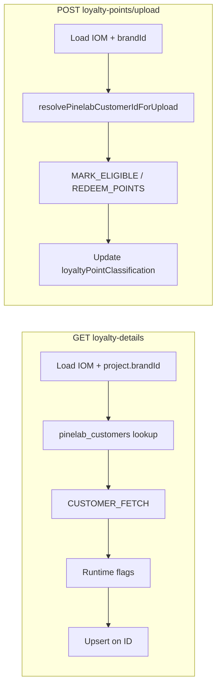

# PN-51_4 Code Review — Cycle 1

## Verdict

**Approve with one must-fix.** The implementation matches the story spec ([docs/ai/stories/PN-51_4/spec.md](docs/ai/stories/PN-51_4/spec.md)) and plan ([docs/ai/stories/PN-51_4/implementation-plan.md](docs/ai/stories/PN-51_4/implementation-plan.md)) on all major requirements: `pinelab_customers` table/entity/service, brand resolution, mock removal, executor wiring, IOM-column decoupling, upload ID resolution, and test coverage.

## Scope Check

| Planned item | Status |
|---|---|
| Migration + entity + `PinelabCustomerService` | Done |
| `normalize-mobile.util.ts` + `resolve-brand-from-iom.helper.ts` | Done |
| `PineLabsModule` wiring + `entities/index.ts` export | Done |
| `IomLoyaltyDetailsService` refactor (executor, upsert, no IOM writes) | Done |
| `IomLoyaltyUploadService` refactor (brand+mobile resolution) | Done |
| Unit specs (3 files) | Done |
| `iom.module.ts` TypeORM registration | Correctly omitted — `PineLabsModule` export is sufficient |
| Extra docs (`spec.md`, `implementation-plan.md`) | Expected story artifacts, not scope creep |

## What Looks Good

- **R1/R2 brand resolution:** `resolveBrandIdFromIom` throws `MANDATORY_FIELDS_MISSING` when `project.brandId` is absent; both services join `iom.project`.
- **R3 loyalty-details:** Random `mockVerificationOutcome` removed; `verifyParticipantViaPinelab` drives `CUSTOMER_FETCH`; runtime flags not persisted; upsert only when fetch returns an ID; `persistPinelabCustomerIds` / IOM-column writes removed.
- **R4 upload:** Prerequisites resolve via `pinelab_customers` + fetch; `MARK_ELIGIBLE`/`REDEEM_POINTS` run only after both IDs resolve; IOM state updates remain transactional and post-Pinelab.
- **Tests:** Cover brand missing, executor payloads, upsert/no-upsert, 404 → `shouldCreatePinelabProfile`, integration errors, IOM columns ignored, upload failure without DB update, and `PinelabCustomerService` normalization/upsert semantics.
- **Migration/entity:** Match spec DDL (`UNIQUE (brand_id, mobile_no)`, FK to `brands`, no profile columns).

## Findings

### R1 — Must-fix: `CUSTOMER_FETCH` mobile payload not normalized in loyalty-details

**File:** [src/modules/iom/services/iom-loyalty-details.service.ts](src/modules/iom/services/iom-loyalty-details.service.ts) (`verifyParticipantViaPinelab`, ~L286–287)

**Issue:** When no stored `pinelab_customers` ID exists, the fetch payload uses `mobileNumber.trim()` only. Upload path uses `normalizeMobileForLookup()` (digits-only) per plan Part 2.1 and spec assumption on consistent normalization.

**Impact:** Formatted mobiles (e.g. `+91 98765-43210`) may behave differently between GET and POST — DB lookup normalizes correctly, but GET may send a non-normalized value to Pinelab while POST sends `919876543210`. Violates plan requirement to centralize normalization for all lookup/fetch keys.

**Fix:** Import `normalizeMobileForLookup` and set `fetchPayload.mobileNumber` to the normalized value (guard null → existing early-return/skip path). Align test `calls CUSTOMER_FETCH for referee and referrer` if fixture mobiles change.

---

### Observations (non-blocking)

- **Duplicated Pinelab helpers:** `isCustomerNotFound` and customer-ID extraction exist in both loyalty services. Acceptable for minimal scope; consider shared helper in a follow-up if more Pinelab flows are added.
- **Validation not evidenced:** Plan lists `npm run test`, `lint`, `build`, and migration run/revert — confirm before merge (handoff did not include command output).
- **Test naming:** `resolveDisplayedPinelabCustomerId uses DB ID, not IOM columns` actually asserts fetch-returned ID (`PINE-REF-1`) while proving IOM columns are ignored; behavior is correct, name is slightly misleading.

## Acceptance Criteria Spot-Check

| AC | Met? |
|---|---|
| AC-1–3 DB migration/entity | Yes (structure matches spec) |
| AC-4–5 Brand resolution | Yes |
| AC-6–10 GET loyalty-details | Yes, pending R1 normalization |
| AC-11–17 POST upload | Yes |
| AC-18 Null safety | Yes in touched paths |
| AC-19 Tests | Yes — comprehensive updates |
| AC-20 lint/build | Not verified in review |

## Recommended Fix Order

1. Apply R1 (single-line import + normalized mobile in `verifyParticipantViaPinelab`).
2. Run targeted tests from plan validation section.
3. Re-review or approve.
