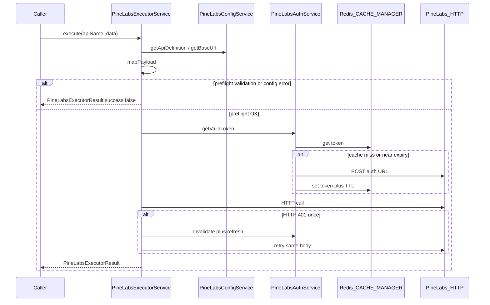

# PN-51 Final Review Summary

## Verdict

**Approve.** The Pine Labs base integration layer is ready for merge. Cycle-1 **R1** (must-fix) has been addressed; build and targeted unit tests pass.

## Review scope

- **Story:** [docs/ai/stories/PN-51/spec.md](docs/ai/stories/PN-51/spec.md)
- **Plan:** [docs/ai/stories/PN-51/implementation-plan.md](docs/ai/stories/PN-51/implementation-plan.md)
- **Changed code:** `src/modules/pine-labs/**`, [src/helpers/pine-labs.helper.ts](src/helpers/pine-labs.helper.ts), [src/app.module.ts](src/app.module.ts)
- **Prior review:** [.opencode/executions/exec-acc83ea7-0b67-4929-94c5-e383a5a91b45/review-pointers-cycle-1.md](.opencode/executions/exec-acc83ea7-0b67-4929-94c5-e383a5a91b45/review-pointers-cycle-1.md)

## Cycle-1 finding resolution

### R1 (Must-fix) — Resolved

Pre-flight failures now return `PineLabsExecutorResult` instead of throwing to callers.

[`pine-labs-executor.service.ts`](src/modules/pine-labs/pine-labs-executor.service.ts) wraps config resolution and `mapPayload` in try/catch and routes `BadRequestException` through `handlePreflightError` → `buildNormalizedError`, preserving `apiName` and `correlationId`.

Three new unit tests cover:
- Unknown `apiName` from config service
- Missing base URL configuration
- Missing required payload fields

This satisfies **AC-13** and **AC-14**.

### R2–R5 — Carried forward (no new IDs)

| ID | Status | Notes |
|----|--------|-------|
| R2 | Open (pre-production) | Optimistic response success heuristic in `normalizePineLabsResponse` — acceptable for skeleton; tighten when Pine Labs schema is confirmed |
| R3 | Open (tracking) | API paths/mappings marked `TODO(PN-51)` — blocks production deployment, not PN-51 code merge |
| R4 | Suggestion | Mixed-template `mapPayloadFromMapping` edge case — no current APIs affected |
| R5 | Suggestion | Parameterized test over all five `PineLabsApiName` values would strengthen AC-20 coverage |

## Spec / plan alignment

| Area | Assessment |
|------|------------|
| **Auth (AC-1–4)** | `PineLabsAuthService`: Redis cache, expiry buffer, single-flight refresh, `expiresAt` metadata — mirrors SFDC `CACHE_MANAGER` pattern |
| **Config (AC-5–9)** | Dev/uat/prod base URLs, five API definitions, payload mappings, global headers, auth settings in config files; services read via `PineLabsConfigService` |
| **Executor (AC-10–14)** | Generic `execute(apiName, data, options?)`, config-driven routing/mapping, token per call, unified result envelope including pre-flight failures |
| **401 retry (AC-16–18)** | Invalidate → refresh → single retry; warn/error logs include `apiName` and `correlationId`; `sanitizeForLog` redacts secrets/PII |
| **Structure (AC-19–21)** | Auth / config / executor separated; module exports only `PineLabsExecutorService`; no controllers |
| **Module wiring** | `PineLabsModule` registered in [`app.module.ts`](src/app.module.ts); relies on global `CacheModule` + `CustomConfigModule` |

## Verification performed

| Check | Result |
|-------|--------|
| `npm run build` | Pass |
| `npm run test -- --testPathPatterns=pine-labs` | 14/14 pass (up from 12 in cycle 1) |

## Out of scope / no issues found

- No public controllers or REST endpoints (correct)
- No hardcoded production URLs in service code (AC-9)
- `redeemPonts` enum spelling matches story (AC-6)
- Docs-only additions (`spec.md`, `implementation-plan.md`) are expected planner/implementer artifacts
- `.cursor/mcp.json` modified in git status but outside this review's changed-file set

## Findings

Findings: None

(New issues beyond cycle-1 R2–R5 tracking items were not identified.)

## Recommendation for downstream

- **Merge:** Safe to merge PN-51 base infrastructure.
- **Before production:** Confirm Pine Labs API paths, payload field names, and response schema (R2, R3).
- **Optional hardening:** R4, R5 in a follow-up or when adding the sixth API.
