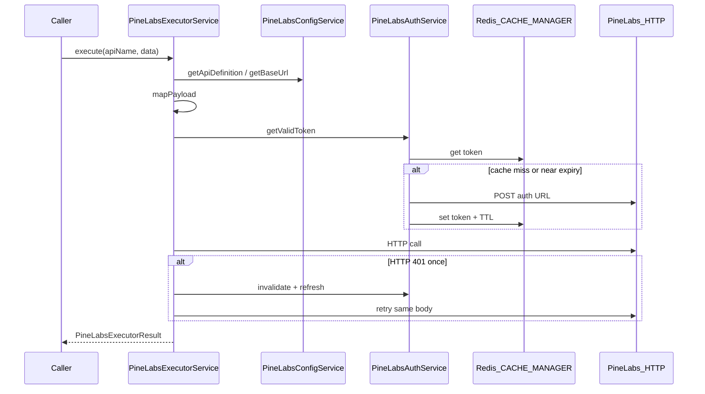

# PN-51 AI Review — Cycle 1

## Review scope

- **Story:** [docs/ai/stories/PN-51/spec.md](docs/ai/stories/PN-51/spec.md)
- **Plan:** [docs/ai/stories/PN-51/implementation-plan.md](docs/ai/stories/PN-51/implementation-plan.md)
- **Changed code:** `src/modules/pine-labs/**`, [src/helpers/pine-labs.helper.ts](src/helpers/pine-labs.helper.ts), [src/app.module.ts](src/app.module.ts)
- **Extra docs (in scope):** spec + implementation-plan — expected planner/implementer artifacts, not scope creep

## Verdict

**Approve with one must-fix.** The module structure, auth caching, config layering, 401 retry-once flow, and unit tests match the plan and reference patterns (SFDC `CACHE_MANAGER`, global `CustomConfigModule`, `HttpModule`). Build and targeted tests pass. Address **R1** before treating the executor as a stable internal contract for downstream stories.

## Spec / plan alignment (what looks good)

| Area | Assessment |
|------|------------|
| **R1 Auth (AC-1–4)** | `PineLabsAuthService` checks Redis cache with expiry buffer, single-flight refresh, stores `expiresAt` metadata — matches SFDC pattern |
| **R2 Config (AC-5–9)** | Dev/uat/prod base URLs, five API definitions, payload mappings, global headers, auth settings live in config files; services read via `PineLabsConfigService` |
| **R3 Executor (AC-10–12)** | Generic `execute(apiName, data, options?)`, config-driven routing/mapping, token attached per call |
| **R4 401 retry (AC-16–18)** | Invalidate → refresh → single retry; warn + error logs include `apiName` and `correlationId`; `sanitizeForLog` redacts secrets/PII |
| **R5 Structure (AC-19–21)** | Auth / config / executor separated; module exports only `PineLabsExecutorService`; no controllers |
| **Module wiring** | `PineLabsModule` registered in [src/app.module.ts](src/app.module.ts); relies on global `CacheModule` + `CustomConfigModule` (same as `SfdcModule`) |
| **Tests** | 12/12 unit tests pass (`pine-labs-auth`, `pine-labs-executor`); build passes |



## Findings

### R1 (Must-fix) — Pre-flight failures bypass `PineLabsExecutorResult` envelope

**AC-13 / R3.6** require the executor to return a standardized internal format for both success and failure. Today, several failure paths **throw** before `executeWithRetry`'s normalized error handling runs:

- `PineLabsConfigService.getApiDefinition()` → `BadRequestException` (unknown `apiName`)
- `PineLabsConfigService.getBaseUrl()` → `BadRequestException` (missing env URL)
- `mapPayload()` / `assertRequiredFields()` → `BadRequestException` (missing caller fields)

These are invoked in `execute()` **outside** the try/catch that produces `PineLabsExecutorResult`:

```32:52:src/modules/pine-labs/pine-labs-executor.service.ts
  async execute(
    apiName: PineLabsApiName,
    data: Record<string, unknown>,
    options?: PineLabsExecutorOptions,
  ): Promise<PineLabsExecutorResult> {
    const correlationId =
      options?.correlationId ?? getRequestContext()?.requestId ?? randomUUID();

    const definition = this.configService.getApiDefinition(apiName);
    const baseUrl = this.configService.getBaseUrl();
    const body = mapPayload(definition, data);
    const url = `${baseUrl}${definition.path}`;

    return this.executeWithRetry(
      apiName,
      correlationId,
      definition,
      url,
      body,
      false,
    );
  }
```

HTTP/auth failures inside `executeWithRetry` correctly return `buildNormalizedError(...)`, but validation/config failures force callers to catch Nest exceptions — inconsistent contract for an internal integration layer.

**Suggested fix:** Wrap pre-flight resolution in try/catch (or helper) and map `BadRequestException` (and optionally config `UnauthorizedException`) to `PineLabsExecutorResult` with `success: false`, preserving `apiName` + `correlationId`. Add executor unit tests for missing required fields and missing base URL returning `success: false` (not thrown).

---

### R2 (Should-fix before production) — Response success heuristic is optimistic

In [src/helpers/pine-labs.helper.ts](src/helpers/pine-labs.helper.ts), `normalizePineLabsResponse` treats a body as success unless `success === false`, `status === 'error'`, or `error` is defined. A Pine Labs **HTTP 200** body with only `{ message: "..." }` (no explicit error flag) would be classified `success: true`.

This is tolerable for the base story while API schema is unknown (plan open questions OQ 1–5), but it risks silent misclassification once live traffic starts.

**Suggested fix:** When Pine Labs docs arrive, add config-driven success/error field mapping (similar to auth `tokenResponseMapping`) rather than hardcoded heuristics.

---

### R3 (Risk / tracking) — API paths and mappings are explicit placeholders

[pine-labs-api.definitions.ts](src/modules/pine-labs/config/pine-labs-api.definitions.ts) marks every endpoint with `TODO(PN-51): confirm with Pine Labs API doc`. This matches the implementation plan's "ship skeleton" strategy but **blocks production deployment** until vendor confirmation.

Not a code defect for PN-51 scope; track under open questions in spec.

---

### R4 (Suggestion) — `mapPayloadFromMapping` mixed-template path is fragile

If a future mapping mixes simple key remaps with nested template objects, the branch that calls `resolveTemplateValue(mapping, data)` on the whole mapping will emit **caller keys** with literal string values instead of remapped Pine Labs keys. Current five APIs use flat string remaps only, so no immediate bug.

**Suggested fix:** When adding nested templates, split remapping vs template resolution or document that mappings must be uniformly one style.

---

### R5 (Suggestion) — Test coverage gaps vs AC-20

Tests cover `CUSTOMER_FETCH` and `REDEEM_POINTS` well; the other three enum values are config-defined but not exercised in tests. Low risk given config-driven design; a parameterized test over all `PineLabsApiName` values would lock AC-20.

---

## Verification performed

| Check | Result |
|-------|--------|
| `npm run build` | Pass |
| `npm run test -- --testPathPatterns=pine-labs` | 12/12 pass |
| `npm run lint` (full repo) | Fails on **pre-existing** warnings in unrelated modules; no lint output for pine-labs files |

## Out of scope / no issues found

- No public controllers or REST endpoints (correct)
- No hardcoded production URLs in service code (AC-9)
- `redeemPonts` enum spelling matches story (AC-6 / OQ 7)
- Docs-only additions (`spec.md`, `implementation-plan.md`) are expected
- `.cursor/mcp.json` modified in git status but outside this review's changed-file set

## Summary for downstream auto-fix

**Must-fix:** R1 — unify pre-flight executor failures into `PineLabsExecutorResult`.

**Pre-production:** R2, R3 — confirm Pine Labs API schema and endpoints.

**Optional hardening:** R4, R5.
