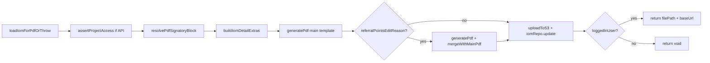

# PN-50 Final Review — IOM PDF Generation

## Verdict

**Request changes** — fix R1 before merge. R2–R5 are non-blocking or coordination items.

## Change-Request Compliance

| Requirement | Status | Evidence |
|-------------|--------|----------|
| Use `PdfService.generatePdf` only (no `generatePdfFromInlineHtml` at IOM call sites) | Pass | [`iom-crm.service.ts`](src/modules/iom/services/iom-crm.service.ts) calls `generatePdf(mainHtml)` / `generatePdf(reasonHtml)` |
| Inline CSS in `iom-details-pdf.html` | Pass | External stylesheet link commented out; `<style>` block embedded |
| Blank signature section when role user is `null` | Pass | `mapSignatorySlot` returns empty `name`/`role`/`signatureUrl` when `userId == null`; unit test covers this |
| Date fields `DD-MM-YYYY` | Pass | `IOM_PDF_DATE_FORMAT = 'dd-MM-yyyy'` in mapper; tests assert `\d{2}-\d{2}-\d{4}` |
| Preserve existing URL-based PDF path (`generatePdf` rename) | Pass | Private method renamed to `generatePdfFromUrl`; booking/voucher flows updated |

## Scope Reviewed

| File | Role |
|------|------|
| [`src/modules/iom/services/iom-crm.service.ts`](src/modules/iom/services/iom-crm.service.ts) | `getIomPdf`, `loadIomForPdfOrThrow`, `resolvePdfSignatoryBlock` |
| [`src/modules/iom/helpers/iom-pdf-template.mapper.ts`](src/modules/iom/helpers/iom-pdf-template.mapper.ts) | Template variable mapping |
| [`src/modules/iom/helpers/iom-pdf-template.mapper.spec.ts`](src/modules/iom/helpers/iom-pdf-template.mapper.spec.ts) | Mapper unit tests |
| [`src/modules/pdf/pdf.service.ts`](src/modules/pdf/pdf.service.ts) | Public `generatePdf(html, css?)`; private `generatePdfFromUrl` |
| [`src/modules/iom/iom.module.ts`](src/modules/iom/iom.module.ts) | `PdfModule` import |
| [`src/modules/iom/iom.controller.ts`](src/modules/iom/iom.controller.ts) | Parameter order fix |
| [`src/templates/iom/iom-details-pdf.html`](src/templates/iom/iom-details-pdf.html) | Inline CSS + placeholders |
| [`src/templates/iom/iom-referral-edit-reason-pdf.html`](src/templates/iom/iom-referral-edit-reason-pdf.html) | Attachment template |
| [`src/modules/iom/services/iom-crm.service.spec.ts`](src/modules/iom/services/iom-crm.service.spec.ts) | `getIomPdf` tests |

**Out-of-scope file in working tree:** [`src/modules/users/services/user-availability.service.ts`](src/modules/users/services/user-availability.service.ts) adds `cancelled_at IS NULL` to overlap check — unrelated to PN-50 (see R5).

## What Looks Good



- End-to-end orchestration matches the implementation plan: always regenerate, S3 path `exports/iom/iom-{id}-{timestamp}.pdf`, `isPrivate: true`, DB stores relative path only.
- No duplicate Puppeteer/pdf-lib/S3 logic outside existing `PdfService` / `AwsService`.
- `resolvePdfSignatoryBlock` correctly layers role-hierarchy signature hiding on `buildSignatoryBlock`.
- Five `getIomPdf` service tests cover happy path, internal void return, merge/no-merge, and project access denial.
- Mapper unit tests added for date formatting, null-signatory blanking, and `loadTemplate` HTML-only contract.
- Targeted tests pass: `iom-pdf-template.mapper.spec.ts` + `getIomPdf` cases in `iom-crm.service.spec.ts`.

## Findings

### R1 — Referrer Details customer name maps to referee/booking customer (functional bug)

**Severity:** High  
**File:** [`src/modules/iom/helpers/iom-pdf-template.mapper.ts`](src/modules/iom/helpers/iom-pdf-template.mapper.ts)

The Referrer Details section uses `{{customerName}}`, but the mapper sets:

```ts
customerName: resolveCustomerName(iom),        // booking / customer_details (referee)
refereeCustomerName: resolveCustomerName(iom), // same source
```

`resolveCustomerName` reads `iom.booking.customerName` or `customer_details` — the **referee** (new buyer). The referrer section should use `referrer_details` (e.g. `pickStringField(referrer, 'name', 'customerName', 'fullName')`).

**Fix:** Add `resolveReferrerName(iom)` and map `customerName` to it; keep `refereeCustomerName` on `resolveCustomerName(iom)`.

---

### R2 — `editedByName` always empty in referral attachment PDF

**Severity:** Low  
**File:** [`src/modules/iom/helpers/iom-pdf-template.mapper.ts`](src/modules/iom/helpers/iom-pdf-template.mapper.ts)

`buildReferralEditReasonTemplateVars` hardcodes `editedByName: ''` while `iom.referralPointsEditedBy` exists on the entity. The attachment template renders "Edited By:" blank.

**Fix (optional):** Join `referralPointsEditedBy` → `Users` in `loadIomForPdfOrThrow` and populate `editedByName`.

---

### R3 — API response shape is a breaking change for consumers of `{ url }`

**Severity:** Medium (coordination)  
**Files:** [`src/modules/iom/services/iom-crm.service.ts`](src/modules/iom/services/iom-crm.service.ts), controller

Previous stub returned `{ url: iom.iomPdf }`. New implementation returns `{ filePath, baseUrl }`. Matches spec AC8 and the plan but conflicts with spec AC10 ("backward compatible"). No in-repo FE callers found.

**Action:** Confirm FE/client contract update; no code change if intentional.

---

### R4 — Mapper spec does not guard referrer vs referee name separation

**Severity:** Low  
**File:** [`src/modules/iom/helpers/iom-pdf-template.mapper.spec.ts`](src/modules/iom/helpers/iom-pdf-template.mapper.spec.ts)

Mapper spec was added (partially addressing prior R4), but there is no test asserting `customerName` (referrer) ≠ `refereeCustomerName` when `referrer_details.name` and `booking.customerName` differ. This would have caught R1.

**Fix:** Add fixture test with distinct referrer/referee names.

---

### R5 — Unrelated `user-availability.service.ts` change in PN-50 branch

**Severity:** Low (scope)  
**File:** [`src/modules/users/services/user-availability.service.ts`](src/modules/users/services/user-availability.service.ts)

Adds `.andWhere('ua.cancelled_at IS NULL')` to overlap detection — a valid fix but unrelated to IOM PDF generation. Should be split to its own PR/commit to keep PN-50 reviewable.

---

## Prior Review

No prior `ai_reviewer` or `auto_fixer` handoffs in the execution folder. Findings R1–R4 were identified in an earlier pass of this execution; R1 remains unfixed, R4 partially addressed (spec file added, referrer/referee test still missing). R5 is new.

## Recommended Fix Order

1. Fix R1 in `iom-pdf-template.mapper.ts` (required)
2. Add mapper test for referrer vs referee name split (closes R4, guards R1)
3. Optionally resolve R2 (`editedByName`) in same PR
4. Revert or split R5 (`user-availability.service.ts`) out of PN-50
5. Coordinate R3 with frontend before release

## Validation (post-fix)

```bash
npm run test -- src/modules/iom/helpers/iom-pdf-template.mapper.spec.ts
npm run test -- src/modules/iom/services/iom-crm.service.spec.ts --testNamePattern=getIomPdf
npm run lint
```
