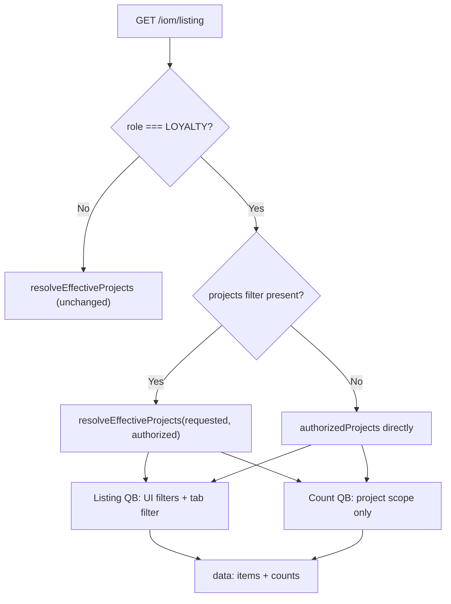

# PN-51_1 Final AI Review

## Verdict

**Approve** — ready to merge. Cycle-1 must-fix (R1) and should-fix items (R2, R3) are addressed. No new findings.

## Findings: None

---

## Prior findings — resolution status

| ID | Severity | Status | Evidence |
|----|----------|--------|----------|
| R1 | Must-fix | **Resolved** | [`list-iom-listing.dto.ts`](src/modules/iom/dto/list-iom-listing.dto.ts) no longer defaults `listType` to `'eligible'`; omitted param stays `undefined`. [`applyLoyaltyTabFilter`](src/modules/iom/services/iom-listing.service.ts) now reaches the `iomRequestInvoice` default branch for Loyalty when `listType` is absent. Test added: `applies iomRequestInvoice tab filter when listType is omitted`. |
| R2 | Should-fix | **Resolved** | [`iom-listing.service.spec.ts`](src/modules/iom/services/iom-listing.service.spec.ts) now asserts SQL for all three Loyalty tabs (`iomRequestInvoice`, `pendingSubmission`, `submittedInvoice`). |
| R3 | Should-fix | **Resolved** | Count-isolation test now asserts `countQb.andWhere` is never called when search/date/status filters are present on the listing request. |

---

## Scope verified

Compared current changes against:

- [`docs/ai/stories/PN-51_1/spec.md`](docs/ai/stories/PN-51_1/spec.md) (R1–R7, AC1–AC9)
- [`docs/ai/stories/PN-51_1/implementation-plan.md`](docs/ai/stories/PN-51_1/implementation-plan.md) (§4a–4c, §7)
- **Approved change request (2026-06-24):** `resolveEffectiveProjects` for Loyalty only when `projects` filter is present

### Acceptance criteria

| AC | Result |
|----|--------|
| AC1 — No new API | Same `GET /iom/listing` route; controller unchanged |
| AC2 — Loyalty listing | Tab filters via [`iom-loyalty-listing.util.ts`](src/modules/iom/utils/iom-loyalty-listing.util.ts); UI filters + pagination preserved; default tab `iomRequestInvoice` when `listType` omitted |
| AC3 — Counts shape | `IomLoyaltyCounts` with three keys inside `IomListingResult`; no `all`; non-Loyalty gets no `counts` |
| AC4 — Counts ignore UI filters | `computeLoyaltyCounts` uses project scope only; test locks `countQb.andWhere` absence |
| AC5 — Counts ignore active tab | Same `projectScope` passed to count query regardless of `listType` |
| AC6 — Count conditions | Util CASE expressions match spec (`invoiceId` null + invoice status null; `INVOICE_REQUESTED_FROM_VENDOR`; `INVOICE_SUBMITTED`) |
| AC7 — Project scope | `resolveLoyaltyProjectScope` intersects only when `filters.projects` present; else `authorizedProjects` |
| AC8 — Non-Loyalty unchanged | Role gating on `RolesEnum.LOYALTY`; CRM tests updated without Loyalty tab/count leakage |
| AC9 — Tests | Expanded Loyalty suite + DTO/controller specs; cycle-1 reported 46 targeted tests passing |

### Approved project-scope change (preserved)



---

## What looks good

- **Role gating:** Tab logic and `counts` only for `RolesEnum.LOYALTY`
- **DTO pipeline:** Loyalty `listType` values validated; `listType` forwarded through mapper to filters
- **Response shape:** `counts` on `IomListingResult` inside existing `{ data: ... }` envelope
- **Empty scope:** Zero counts without DB round-trip when authorized or intersected projects are empty
- **Util extraction:** [`iom-loyalty-listing.util.ts`](src/modules/iom/utils/iom-loyalty-listing.util.ts) centralizes tab SQL and aggregated count SELECT fragments
- **Non-regression:** CRM status bucket, search, pagination, and project-intersection tests retained

---

## Non-blocking notes (not findings)

1. **Plan doc drift:** Implementation plan §2 still says "Keep default `'eligible'`" but the intentional R1 fix removed the DTO default. Code behavior is correct; plan text could be updated in a follow-up doc pass.
2. **Export path:** `findAllForExport` triggers Loyalty count query when role is LOYALTY — harmless per plan §6 (export reads `items` only); minor extra DB work on export.
3. **Explicit `listType=eligible` for Loyalty:** Per plan §4b, CRM-only values intentionally skip tab filter. This is now **distinct** from the omitted-param path (which defaults to `iomRequestInvoice`).

---

## Recommended validation (post-approval)

```bash
npm run test -- src/modules/iom/services/iom-listing.service.spec.ts \
  src/modules/iom/dto/list-iom-listing.dto.spec.ts \
  src/modules/iom/iom.controller.spec.ts
```

---

## Artifact

This content is intended for:
`.opencode/executions/exec-df635175-dca3-432f-a46c-d63e5e3a11e6/final-summary.md`
