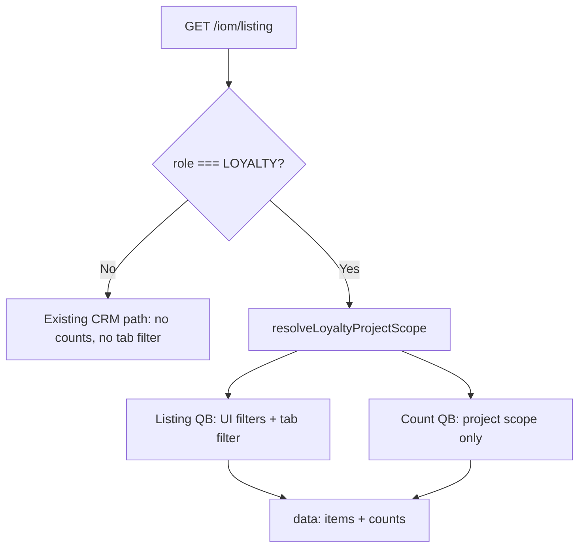

# PN-51_1 AI Review — Cycle 1

## Verdict

**Request changes** — one must-fix defect (R1). Loyalty tab filtering, counts shape, role gating, approved project-scope change, and non-Loyalty preservation are otherwise implemented correctly. All 46 targeted unit tests pass.

## Scope checked

Compared changes in [src/modules/iom/services/iom-listing.service.ts](src/modules/iom/services/iom-listing.service.ts), [src/modules/iom/utils/iom-loyalty-listing.util.ts](src/modules/iom/utils/iom-loyalty-listing.util.ts), DTO/mapper/types, and specs against [docs/ai/stories/PN-51_1/spec.md](docs/ai/stories/PN-51_1/spec.md) and [docs/ai/stories/PN-51_1/implementation-plan.md](docs/ai/stories/PN-51_1/implementation-plan.md), including the approved CR: Loyalty uses `resolveEffectiveProjects` only when `projects` filter is present.

Extra docs (`spec.md`, `implementation-plan.md`) are in-scope story artifacts — not scope creep.

---

## Findings

### R1 — Must-fix: Loyalty default tab never applies when `listType` is omitted (AC2 / plan §4b)

**Problem:** Implementation plan requires default Loyalty tab `iomRequestInvoice` when `listType` is omitted. `applyLoyaltyTabFilter` only reaches that branch when `listType` is falsy and not `'eligible'`/`'ioms'`:

```194:209:src/modules/iom/services/iom-listing.service.ts
  private applyLoyaltyTabFilter(
    qb: SelectQueryBuilder<Iom>,
    listType?: string,
  ): void {
    if (listType && isLoyaltyListType(listType)) {
      applyLoyaltyListTypeFilter(qb, listType);
      return;
    }

    if (listType === 'ioms' || listType === 'eligible') {
      return;
    }

    // listType omitted — default Loyalty tab
    applyLoyaltyListTypeFilter(qb, 'iomRequestInvoice');
  }
```

**Conflict:** [ListIomListingDto](src/modules/iom/dto/list-iom-listing.dto.ts) defaults `listType` to `'eligible'` (preserved for CRM). [fromListIomListingDto](src/modules/iom/mappers/iom-listing-filters.mapper.ts) always passes `dto.listType`. On `GET /iom/listing` without a `listType` query param, Loyalty callers receive `'eligible'`, hit the early return, and get **no tab filter** — showing all Loyalty-role-visible statuses instead of the `iomRequestInvoice` tab.

**Evidence:** Test `ignores CRM-only listType values for tab filtering` encodes this incorrect behavior for `LOYALTY_USER` + `listType: 'eligible'`, which is indistinguishable from the omitted-param HTTP path.

**Fix direction (pick one coherent approach):**
- In `findIoms`, when `isLoyalty` and `filters.listType` is `'eligible'` (DTO default), treat as `'iomRequestInvoice'` **only if** the raw query omitted `listType` (e.g. pass a flag from mapper or check `query.listType === undefined` before DTO defaulting); **or**
- Stop materializing `'eligible'` when the query param is absent (leave `undefined`), and keep CRM behavior by ignoring undefined `listType` for non-Loyalty.
- Add a test: Loyalty + omitted `listType` → `i.invoiceId IS NULL` tab filter applied.

---

### R2 — Should-fix: Incomplete tab-filter test coverage

Only `pendingSubmission` tab SQL is asserted. Missing direct tests for `iomRequestInvoice` (`i.invoiceId IS NULL` + invoice status null) and `submittedInvoice` (`INVOICE_SUBMITTED`) filters in [iom-listing.service.spec.ts](src/modules/iom/services/iom-listing.service.spec.ts). Low risk given util logic, but AC6/AC9 would be stronger with explicit assertions per tab.

---

### R3 — Should-fix: AC4 count-isolation test is partial

`returns counts that ignore search and active tab filters` only asserts count query project scope and `getRawOne` invocation. It does **not** assert absence of search, date, `iomStatuses`, or `invoiceStatuses` clauses on `countQb` (plan §7 / AC4). Implementation appears correct; strengthen test to lock regression.

---

## What looks good

| Area | Assessment |
|------|------------|
| Role gating (R1 spec) | `counts` and tab logic only for `RolesEnum.LOYALTY`; non-Loyalty unchanged |
| Counts shape (R3 spec) | Three keys inside `IomListingResult` / `{ data: ... }`; no `all` |
| Count conditions (R4/AC6) | [iom-loyalty-listing.util.ts](src/modules/iom/utils/iom-loyalty-listing.util.ts) matches spec SQL mapping |
| Approved project-scope CR | `resolveLoyaltyProjectScope` — intersection only when `projects` filter present; else `authorizedProjects` |
| Empty scope | Zero counts without DB count query when projects empty |
| DTO validation | Loyalty `listType` values accepted; invalid rejected |
| Controller | Counts pass through in `{ data }` without route changes |
| Non-Loyalty regression | Existing CRM/status/search tests updated and passing |
| Search/date test alignment | Spec test updates match pre-existing service behavior (not new regressions) |



---

## Validation run

```bash
npm run test -- src/modules/iom/services/iom-listing.service.spec.ts \
  src/modules/iom/dto/list-iom-listing.dto.spec.ts \
  src/modules/iom/iom.controller.spec.ts
# 3 suites, 46 tests — all passed
```

---

## Recommended fix order

1. **R1** — resolve DTO-default vs Loyalty-default `listType` conflict; update/add tests
2. **R2/R3** — strengthen tab and count-isolation tests (can follow R1 in same PR)
