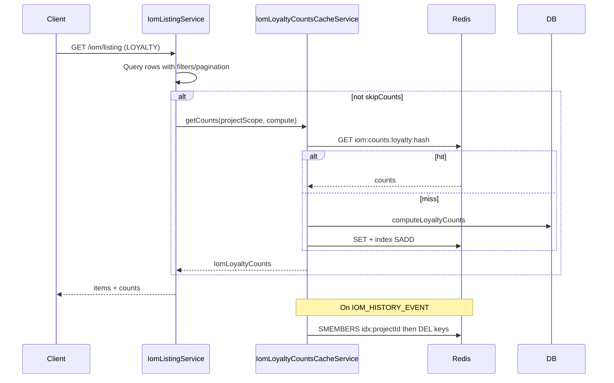

# AI Final Review — PN-51_2

## Verdict

**Approve** — Redis caching, listing integration, invalidation listener, and export/skipCounts paths are correctly implemented. Cycle-1 finding **R1 is resolved**. No new blocking defects.

---

## Summary

This change adds `IomLoyaltyCountsCacheService` and `IomLoyaltyCountsCacheListener` to cache LOYALTY tab counts (`iomRequestInvoice`, `pendingSubmission`, `submittedInvoice`) keyed by SHA-256 of sorted project scope, with 10-minute TTL and per-project Redis index sets for invalidation. [`IomListingService`](src/modules/iom/services/iom-listing.service.ts) routes counts through `resolveLoyaltyCounts` when `isLoyalty && !skipCounts`. Export and `findAllForExport` both pass `skipCounts: true`. Invalidation hooks `IOM_HISTORY_EVENT` (approve/reject/cancel/crm services).



---

## Prior Findings Status

| ID | Finding | Status |
|----|---------|--------|
| R1 | `findAllForExport` omitted `skipCounts: true` | **Resolved** — [`iom-listing.service.ts`](src/modules/iom/services/iom-listing.service.ts) lines 140–143 now pass both flags; unit test updated at lines 264–274 |

---

## Spec / Plan Alignment

| Requirement | Status | Notes |
|-------------|--------|-------|
| AC1 — Redis read on cache hit | Met | `getCounts` returns parsed cache without calling `compute` |
| AC2 — Miss computes, stores, returns | Met | Callback preserves `computeLoyaltyCounts` SQL |
| AC3 — Counts ignore UI filters | Met | `resolveLoyaltyCounts(projectScope)` uses `resolveLoyaltyProjectScope`, not `listType`/search |
| AC4 — Scope-specific keys | Met | SHA-256 of sorted project IDs in [`iom-loyalty-counts-cache.util.ts`](src/modules/iom/utils/iom-loyalty-counts-cache.util.ts) |
| AC5 — Cached shape | Met | Uses `submittedInvoice` per API contract (not spec example `submitted`) |
| AC6 — Invalidation on mutations | Met (current coverage) | Listener on `IOM_HISTORY_EVENT`; invoice-only writes not in codebase yet (documented forward-compat risk) |
| AC7 — No invalidation on read | Met | No invalidation in listing/export paths |
| AC8 — TTL safety net | Met | `IOM_LOYALTY_COUNTS_CACHE_TTL_MS` on `cache.set`; index keys get matching `pexpire` |
| AC9 — Non-LOYALTY unchanged | Met | Cache gated on `isLoyalty && !skipCounts` |
| AC10 — Export unaffected | Met | Export and `findAllForExport` pass `skipCounts: true`; tests updated |

---

## Findings

Findings: None

---

## Non-blocking Observations (no IDs)

- **Early-return `skipCounts` consistency:** `emptyListingResult` early returns (lines 70, 78) pass `isLoyalty` rather than `isLoyalty && !skipCounts`, so a LOYALTY caller with `skipCounts: true` and empty project scope would still receive zero counts in the result object. No production impact today — export paths consume only `items`.
- **Test gaps (unchanged from cycle 1):** Listing spec does not assert identical `projectScope` passed to `getCounts` across varying filters; cache service spec omits `set`/index failure and no-Redis-client invalidation cases; listener spec omits null `projectId` early return.
- **Forward-compat:** `IomLoyaltyCountsCacheService` not exported from [`iom.module.ts`](src/modules/iom/iom.module.ts); future invoice handlers will need export or shared invalidation hook.
- **Extra changed files:** `docs/ai/stories/PN-51_2/spec.md`, `implementation-plan.md`, and execution artifacts are expected SDLC outputs, not scope creep.

---

## Positive Observations

- Clean separation: cache service owns Redis/index logic; listing keeps `computeLoyaltyCounts` as DB fallback via callback.
- Invalidation index design matches plan (per-project `SADD` + `pexpire`, bulk `DEL` on mutation).
- Redis get failure degrades gracefully to DB without failing the listing request.
- Listener mirrors [`iom-history.listener.ts`](src/modules/iom/services/iom-history.listener.ts) error-swallowing pattern.
- Constants, util parsing, and module registration are minimal and consistent with repo patterns (`google.service.ts` ms TTL convention).

---

## Recommended Validation (not run in this review step)

```bash
npm run test -- src/modules/iom/services/iom-loyalty-counts-cache.service.spec.ts
npm run test -- src/modules/iom/services/iom-loyalty-counts-cache.listener.spec.ts
npm run test -- src/modules/iom/services/iom-listing.service.spec.ts
npm run test -- src/modules/iom/services/iom-export.service.spec.ts
npm run lint
npm run build
```
