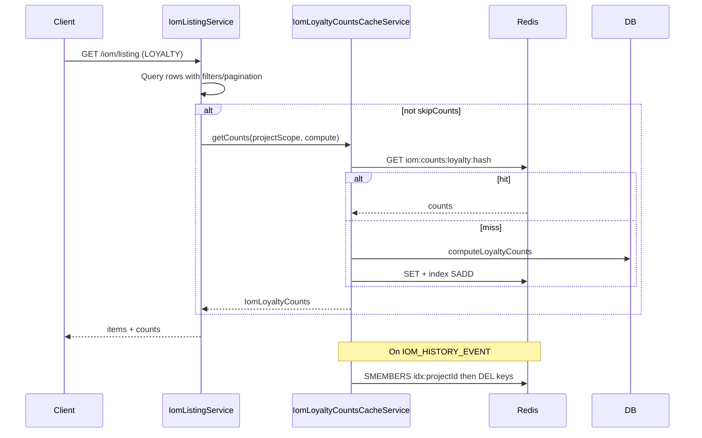

# AI Review — PN-51_2 Cycle 1

## Verdict

**Approve with minor follow-ups** — core Redis caching, listing integration, invalidation listener, and export skip path are correctly implemented. No blocking defects found.

---

## Summary

The change introduces `IomLoyaltyCountsCacheService` and `IomLoyaltyCountsCacheListener` to cache LOYALTY tab counts (`iomRequestInvoice`, `pendingSubmission`, `submittedInvoice`) keyed by sorted project-scope hash, with 10-minute TTL and project-scoped Redis index sets for invalidation. [`IomListingService`](src/modules/iom/services/iom-listing.service.ts) routes LOYALTY counts through the cache via `resolveLoyaltyCounts`, gated by `skipCounts`. [`IomExportService`](src/modules/iom/services/iom-export.service.ts) passes `skipCounts: true` to avoid wasted count work. Invalidation hooks the existing `IOM_HISTORY_EVENT` pipeline (approve/reject/cancel/crm services).



---

## Spec / Plan Alignment

| Requirement | Status | Notes |
|-------------|--------|-------|
| AC1 — Redis read on cache hit | Met | `getCounts` returns parsed cache without calling `compute` (tested in cache service spec) |
| AC2 — Miss computes, stores, returns | Met | Callback pattern preserves existing `computeLoyaltyCounts` SQL |
| AC3 — Counts ignore UI filters | Met | `resolveLoyaltyCounts(projectScope)` uses scope from `resolveLoyaltyProjectScope`, not `listType`/search |
| AC4 — Scope-specific keys | Met | SHA-256 of sorted project IDs in [`iom-loyalty-counts-cache.util.ts`](src/modules/iom/utils/iom-loyalty-counts-cache.util.ts) |
| AC5 — Cached shape | Met (intentional naming) | Uses `submittedInvoice` per plan/API contract, not spec example `submitted` |
| AC6 — Invalidation on mutations | Met (current coverage) | `IomLoyaltyCountsCacheListener` on `IOM_HISTORY_EVENT`; invoice-only writes not in codebase yet (documented forward-compat risk) |
| AC7 — No invalidation on read | Met | No invalidation in listing/export paths |
| AC8 — TTL safety net | Met | `IOM_LOYALTY_COUNTS_CACHE_TTL_MS` passed to `cache.set` (matches `google.service.ts` ms pattern); index keys get matching `pexpire` |
| AC9 — Non-LOYALTY unchanged | Met | Cache gated on `isLoyalty && !skipCounts`; CRM test asserts no cache call |
| AC10 — Export unaffected | Met | Export calls `findIoms` with `skipCounts: true`; tests updated |

---

## Findings

### R1 — `findAllForExport` omits `skipCounts` (plan deviation, low severity)

**File:** [`src/modules/iom/services/iom-listing.service.ts`](src/modules/iom/services/iom-listing.service.ts)

The implementation plan design section explicitly says to set `skipCounts: true` in `findAllForExport`, but only [`IomExportService`](src/modules/iom/services/iom-export.service.ts) passes the flag (via direct `findIoms` call). `findAllForExport` still calls:

```typescript
await this.findIoms(user, query, { skipPagination: true });
```

**Impact:** No production regression today — export uses `IomExportService.findIoms` directly and `findAllForExport` has no production callers. However, any future caller of `findAllForExport` for a LOYALTY user would trigger unnecessary cache/DB count work.

**Fix:** Add `skipCounts: true` to `findAllForExport` and update the existing unit test (`findAllForExport delegates to findIoms with skipPagination`) to expect both flags.

---

## Non-blocking Observations (no IDs)

- **Test gaps vs plan:** Listing spec verifies cache service is called for LOYALTY and skipped for CRM/`skipCounts`, but does not assert identical `projectScope` passed to `getCounts` across varying `search`/`listType` filters (AC3 is correct by code inspection; existing count-QB scope tests still pass through the cache mock).
- **Cache service spec:** Does not cover `set`/index failure fallback (counts still returned — acceptable) or `invalidateForProject` when Redis client is unavailable (silent no-op).
- **Listener spec:** Missing case when `findOne` returns null / `projectId` is null (early return, no invalidation).
- **Forward-compat:** `IomLoyaltyCountsCacheService` is not exported from [`iom.module.ts`](src/modules/iom/iom.module.ts); fine for in-module invoice handlers, but future cross-module writers would need an export or shared invalidation hook.
- **Extra changed files:** `docs/ai/stories/PN-51_2/spec.md` and `implementation-plan.md` are expected SDLC artifacts, not scope creep.

---

## Positive Observations

- Clean separation: cache service owns Redis/index logic; listing service keeps `computeLoyaltyCounts` as DB fallback via callback.
- Invalidation index design matches plan (per-project `SADD` + `pexpire`, bulk `DEL` on mutation).
- Redis get failure degrades gracefully to DB without failing the listing request.
- Listener mirrors [`iom-history.listener.ts`](src/modules/iom/services/iom-history.listener.ts) error-swallowing pattern.
- Constants, util parsing (`parseCachedLoyaltyCounts`), and module registration are minimal and consistent with repo patterns.
- `cache-manager-ioredis-yet` stores keys as-is in Redis, so direct `redis.del` on indexed keys is consistent with `cache.get`/`cache.set`.

---

## Recommended Validation (not run in this review step)

Per implementation plan:

```bash
npm run test -- src/modules/iom/services/iom-loyalty-counts-cache.service.spec.ts
npm run test -- src/modules/iom/services/iom-loyalty-counts-cache.listener.spec.ts
npm run test -- src/modules/iom/services/iom-listing.service.spec.ts
npm run test -- src/modules/iom/iom.controller.spec.ts
npm run lint
npm run build
```
