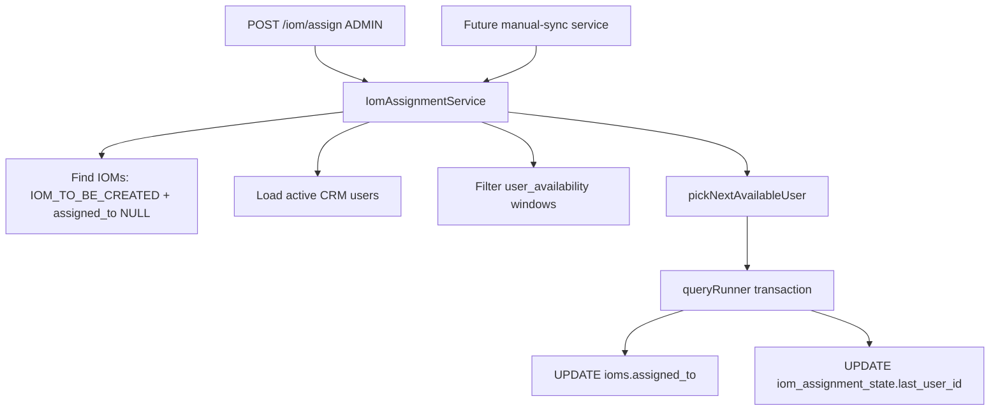

# PN-27 Final Review Summary

## Verdict

**Approve** — implementation is ready pending standard validation (`lint`, `test`, `build`, `migration:run` on dev DB).

## Scope Compliance

| Requirement | Status |
|---|---|
| `IomAssignmentService` with round-robin + availability | Done — [`src/modules/iom/services/iom-assignment.service.ts`](src/modules/iom/services/iom-assignment.service.ts) |
| `POST /iom/assign` ADMIN-only API trigger | Done — [`src/modules/iom/iom.controller.ts`](src/modules/iom/iom.controller.ts) lines 97–104 |
| Service exported for future manual-sync callers | Done — [`src/modules/iom/iom.module.ts`](src/modules/iom/iom.module.ts) exports `IomAssignmentService` |
| **No** `IomAssignmentCron` / cron enum changes | Confirmed — no cron files or `crons.enum` edits |
| No workflow/status transition changes | Confirmed — only `assigned_to` updated via raw SQL; uses `getStatusId(IOM_TO_BE_CREATED)` for filtering only |
| Migrations + entities | Done — 3 migrations, 2 new entities, `assignedTo` on `Iom` |

Approved scope change preserved: assignment is invoked via API or future service injection, not a scheduled job.

## What Was Reviewed

- Budgeted diffs for modified files: `entities/index.ts`, `iom.entity.ts`, `iom.controller.ts`, `iom.module.ts`
- Full untracked implementation: assignment service + spec, entities, migrations
- [`docs/ai/stories/PN-27/implementation-plan.md`](docs/ai/stories/PN-27/implementation-plan.md) acceptance mapping
- Prior reviewer handoff: **none** (first review pass)

## Implementation Quality Notes

**Correct behaviors verified:**

- Eligible IOM filter: `IOM_TO_BE_CREATED`, `assignedTo IS NULL`, soft-delete guard
- CRM pool: `RolesEnum.CRM`, `StatusEnum.ACTIVE`, `deleted_at IS NULL`, ordered by id ASC
- Availability: `unavailable_from <= now <= unavailable_to` preloaded once per run
- Round-robin: `pickNextAvailableUser` handles null/invalid last user, wrap-around, and skipping unavailable users — covered by unit tests
- Concurrency: per-IOM `queryRunner` transaction with `SELECT ... FOR UPDATE` on singleton state row + conditional `UPDATE ioms ... AND assigned_to IS NULL`
- Route ordering: `POST assign` is registered before `GET :id` (no param capture)
- Status correction: uses `IOM_TO_BE_CREATED` (not spec’s `IOM_TO_BE_GENERATED`)

**Architecture (matches plan):**



## Non-Blocking Observations (not findings)

- Plan step 8 lists an overlapping-availability-window unit test; not present in spec — optional coverage gap only
- `assigned_to` is `BIGINT` while `users.id` is `INT` — consistent with other user FK columns on [`iom.entity.ts`](src/modules/iom/entities/iom.entity.ts) (`crm_verified_by`, etc.)
- `POST assign` omits `UserActivityInterceptor` — acceptable; plan does not require audit logging for this admin batch op
- All new files are **untracked** and modified files **unstaged** — ensure they are included in the eventual commit

## Recommended Validation (pre-merge)

```bash
npm run lint
npm run test -- --testPathPattern=iom-assignment
npm run build
npm run migration:run   # dev DB only
```

## Findings

Findings: None
