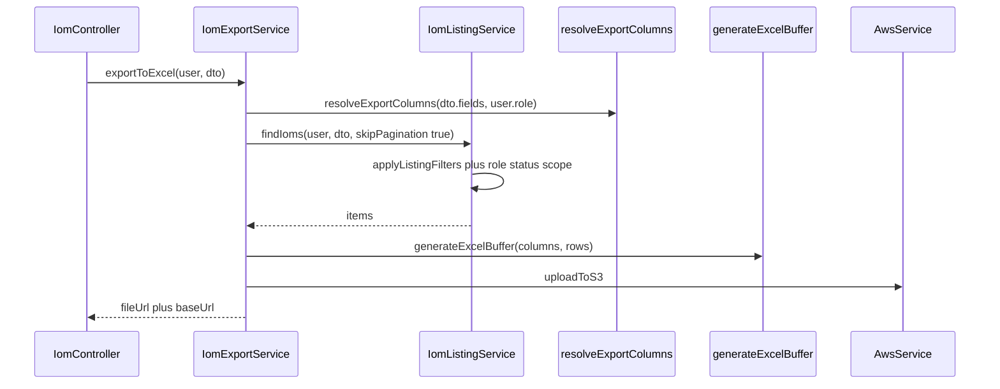

# PN-27-1 Final Review Summary

## Verdict

**Approve.** The 8 implementation files satisfy [docs/ai/stories/PN-27-1/spec.md](docs/ai/stories/PN-27-1/spec.md) and [docs/ai/stories/PN-27-1/implementation-plan.md](docs/ai/stories/PN-27-1/implementation-plan.md). Cycle-1 review ([review-pointers-cycle-1.md](.opencode/executions/exec-f02320c0-05ba-404a-97fa-681a8eb4d08b/review-pointers-cycle-1.md)) reported **Findings: None**; this final pass confirms that verdict after targeted test execution.

## Validation Performed

- Reviewed budgeted diffs for all 8 changed implementation files
- Cross-checked role matrix against implementation-plan spec→`RolesEnum` mapping (`CRM_HEAD`, `FINANCE_USER`, `FINANCE_HEAD`, `LOYALTY`)
- Verified caller surface: `resolveExportColumns` and `findAllForExport` have no external callers that break on signature changes; export path uses `findIoms` directly
- Ran targeted tests — **36/36 passed**:

```bash
npm run test -- src/constants/iom-export.columns.spec.ts \
  src/modules/iom/services/iom-export.service.spec.ts \
  src/modules/iom/services/iom-listing.service.spec.ts
```

## Requirements Coverage

| Requirement | Status | Evidence |
|-------------|--------|----------|
| R1 — Export DTO accepts listing filters | Pass | [`ExportIomExcelDto`](src/modules/iom/dto/export-iom-excel.dto.ts) extends `ListIomListingDto` + `fields` |
| R2 — Reuse listing query logic | Pass | [`iom-export.service.ts`](src/modules/iom/services/iom-export.service.ts) calls `findIoms(user, dto, { skipPagination: true })`; [`findAllForExport`](src/modules/iom/services/iom-listing.service.ts) delegates to same path |
| R3 — Role-based column mapping | Pass | [`iom-export.columns.ts`](src/constants/iom-export.columns.ts): `IOM_EXPORT_BASE_COLUMN_KEYS`, `IOM_EXPORT_ROLE_COLUMN_KEYS`, deterministic base+role ordering |
| R4 — Custom `fields` ∩ role allow-list | Pass | Unknown fields throw `BadRequestException`; disallowed fields silently dropped; request order preserved |
| R5 — API/format unchanged | Pass | Controller untouched; S3 upload + `{ data: { fileUrl, baseUrl } }` envelope preserved; `toExportRow` null→`''` |

## What Looks Good

- **Single query path** — `findIoms` gains `FindIomsOptions.skipPagination`; filters, role status intersection, and sort run identically before the pagination branch
- **Role column matrix** — Matches implementation-plan mapping table; base keys in spec order via `allowedKeys.map(COLUMN_BY_KEY.get)`
- **Export wiring** — `resolveExportColumns(dto.fields, user.role)` + filter-forwarding test in export service spec
- **Column tests** — Per-role defaults, intersection, unknown-field 400, CRM Head ordering, Finance User `financeVerifiedByName` exclusion
- **Listing tests** — `skipPagination` path asserts no `skip`/`take`, uses `getMany`, applies `search`/`iomStatus`/`startDate`/`invoiceStatus` filters
- **Missing data fields** — `saleValueCollectedPercentage` / `saleValueAmountCollected` on `IomListItem` and column config; stubbed `null` in `toListItem` (exports as `''`)

## Findings

Findings: None

## Advisories (non-blocking)

Carried forward from cycle 1; still applicable:

- **A1 — Stubbed sale-value collection fields:** `saleValueCollectedPercentage` and `saleValueAmountCollected` are always `null` in `toListItem`. Acceptable per plan; track product follow-up for real data source.
- **A2 — Intentional default column shrink:** PN-49 exported nearly all columns; PN-27-1 defaults to spec base + role columns only. Document in PR for frontend/consumers.
- **A3 — Test coverage gaps (optional):** No export-service smoke tests for `FINANCE_HEAD` / `LOYALTY` default columns or `ADMIN` base-only export; column-unit tests partially cover roles.
- **A4 — DTO composition deviation:** Plan suggested `OmitType(ListIomListingDto, ['page', 'limit'])`; implementation uses full extend. Harmless because `skipPagination` ignores page/limit.

## Scope / Extra Files

| File | Assessment |
|------|------------|
| `docs/ai/stories/PN-27-1/spec.md` | Expected story artifact |
| `docs/ai/stories/PN-27-1/implementation-plan.md` | Expected story artifact |
| `.opencode/executions/.../review-pointers-cycle-1.md` | Review artifact |
| `.opencode/executions/.../working-tree.diff` | Generated diff artifact |

## Architecture (post-change)



## Recommended Pre-Merge Validation

```bash
npm run test -- src/constants/iom-export.columns.spec.ts \
  src/modules/iom/services/iom-export.service.spec.ts \
  src/modules/iom/services/iom-listing.service.spec.ts
npm run lint
npm run build
```

Manual parity: same user + filters → listing `total` === export row count; spot-check role column sets per plan validation section.
