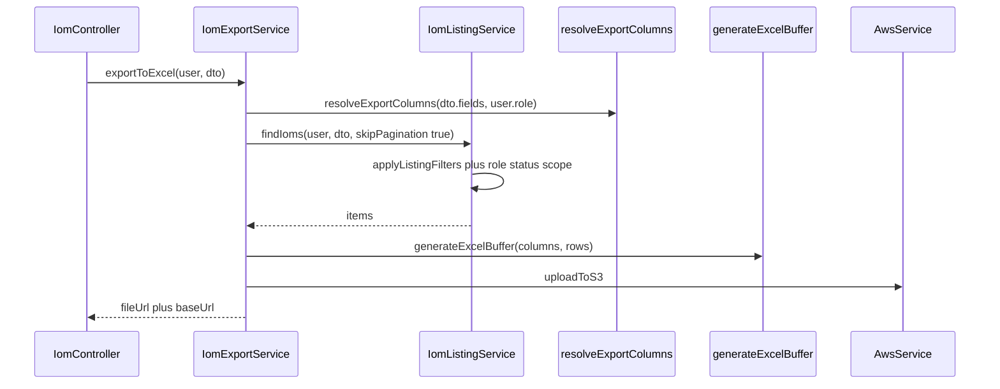

# PN-27-1 AI Review — Cycle 1

## Verdict

**Approve.** Changes in the 8 implementation files satisfy [docs/ai/stories/PN-27-1/spec.md](docs/ai/stories/PN-27-1/spec.md) and [docs/ai/stories/PN-27-1/implementation-plan.md](docs/ai/stories/PN-27-1/implementation-plan.md). Extra untracked story artifacts (`docs/ai/stories/PN-27-1/`) are expected scope documentation, not code creep.

## Requirements Coverage

| Requirement | Status | Evidence |
|-------------|--------|----------|
| R1 — Export DTO accepts listing filters | Pass | [`ExportIomExcelDto`](src/modules/iom/dto/export-iom-excel.dto.ts) extends `ListIomListingDto` + `fields` |
| R2 — Reuse listing query logic | Pass | [`iom-export.service.ts`](src/modules/iom/services/iom-export.service.ts) calls `findIoms(user, dto, { skipPagination: true })`; `findAllForExport` delegates to same path |
| R3 — Role-based column mapping | Pass | [`iom-export.columns.ts`](src/constants/iom-export.columns.ts): `IOM_EXPORT_BASE_COLUMN_KEYS`, `IOM_EXPORT_ROLE_COLUMN_KEYS`, spec→enum mapping (CRM_HEAD, FINANCE_USER, FINANCE_HEAD, LOYALTY) |
| R4 — Custom `fields` ∩ role allow-list | Pass | Unknown fields throw; disallowed fields silently dropped; request order preserved |
| R5 — API/format unchanged | Pass | Controller untouched; S3 upload + `{ data: { fileUrl, baseUrl } }` envelope preserved; `toExportRow` null→`''` |

## What Looks Good

- **Single query path** — `findIoms` gains `FindIomsOptions.skipPagination`; filters, role status intersection, and sort run identically before the pagination branch ([`iom-listing.service.ts`](src/modules/iom/services/iom-listing.service.ts) lines 79–106).
- **Role column matrix** — Matches implementation-plan mapping table; deterministic base+role ordering via `allowedKeys.map(COLUMN_BY_KEY.get)`.
- **Export wiring** — `resolveExportColumns(dto.fields, user.role)` + filter-forwarding test in [`iom-export.service.spec.ts`](src/modules/iom/services/iom-export.service.spec.ts).
- **Column tests** — Per-role defaults, intersection, unknown-field 400, and CRM Head ordering covered in [`iom-export.columns.spec.ts`](src/constants/iom-export.columns.spec.ts).
- **Listing tests** — `skipPagination` path asserts no `skip`/`take`, uses `getMany`, and applies `search`/`iomStatus`/`startDate`/`invoiceStatus` filters.
- **Missing data fields** — `saleValueCollectedPercentage` / `saleValueAmountCollected` added to `IomListItem` and column config; stubbed `null` in `toListItem` per plan (exports as `''`).

## Findings

Findings: None

## Advisories (non-blocking)

- **A1 — Stubbed sale-value collection fields:** `saleValueCollectedPercentage` and `saleValueAmountCollected` are always `null` in `toListItem`. Acceptable per plan Step 4; track product follow-up for real data source.
- **A2 — Intentional default column shrink:** PN-49 exported nearly all columns (minus `statusCode`/`crmVerifiedBy`); PN-27-1 defaults to spec base + role columns only. Document in PR for frontend/consumers (plan Risk table).
- **A3 — Test coverage gaps (optional):** No export-service smoke tests for `FINANCE_HEAD` / `LOYALTY` default columns or `ADMIN` base-only export; column-unit tests partially cover roles.
- **A4 — DTO composition deviation:** Plan suggested `OmitType(ListIomListingDto, ['page', 'limit'])`; implementation uses full extend. Harmless because `skipPagination` ignores page/limit, but API still accepts them.

## Scope / Extra Files

| File | Assessment |
|------|------------|
| `docs/ai/stories/PN-27-1/spec.md` | Expected story artifact |
| `docs/ai/stories/PN-27-1/implementation-plan.md` | Expected story artifact |
| `src/modules/iom/iom.controller.spec.ts` | Not modified; existing export delegation test still valid |

## Architecture (post-change)



## Recommended Validation

Run before merge (per implementation plan):

```bash
npm run test -- src/constants/iom-export.columns.spec.ts src/modules/iom/services/iom-export.service.spec.ts src/modules/iom/services/iom-listing.service.spec.ts
npm run lint
npm run build
```

Manual parity: same user + filters → listing `total` === export row count; spot-check role column sets per plan validation section.
