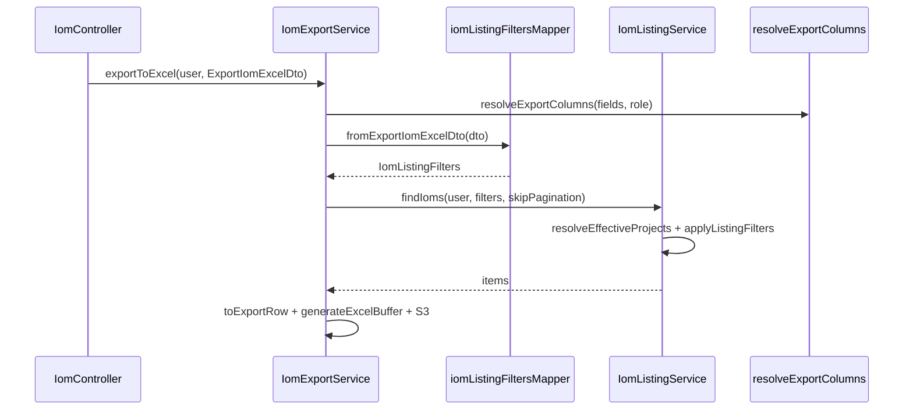

# PN-27-1 AI Review — Cycle 2

## Verdict

**Approve.** Changes across the 13 implementation files satisfy [docs/ai/stories/PN-27-1/spec.md](docs/ai/stories/PN-27-1/spec.md) and [docs/ai/stories/PN-27-1/implementation-plan.md](docs/ai/stories/PN-27-1/implementation-plan.md), including the **2026-06-19 final-review change request** (export-only status arrays + `projects` filter). Cycle-1 findings were superseded by this delta; this pass validates the full scope.

## Requirements Coverage

| Requirement | Status | Evidence |
|-------------|--------|----------|
| R1 — Export DTO accepts listing filters | Pass | Standalone [`ExportIomExcelDto`](src/modules/iom/dto/export-iom-excel.dto.ts): `search`, `sortBy`, `startDate`/`endDate`, `fields` |
| R1a — Export-only array types for status fields | Pass | `iomStatus?: string[]`, `invoiceStatus?: string[]` with `@IsArray()` validators; [`export-iom-excel.dto.spec.ts`](src/modules/iom/dto/export-iom-excel.dto.spec.ts) rejects scalar wire types |
| R1a — Listing status contracts unchanged | Pass | [`ListIomListingDto`](src/modules/iom/dto/list-iom-listing.dto.ts) retains `iomStatus` string + single `invoiceStatus`; only additive `projects` field |
| R2 — Reuse listing query logic | Pass | [`iom-export.service.ts`](src/modules/iom/services/iom-export.service.ts) maps DTO → `IomListingFilters` then calls `findIoms(user, filters, { skipPagination: true })`; no duplicate query builder |
| R3 — Role-based export columns | Pass | [`iom-export.columns.ts`](src/constants/iom-export.columns.ts): `IOM_EXPORT_BASE_COLUMN_KEYS` + `IOM_EXPORT_ROLE_COLUMN_KEYS` with spec→enum mapping (`CRM_HEAD`, `FINANCE_USER`, `FINANCE_HEAD`, `LOYALTY`) |
| R4 — Custom `fields` ∩ role allow-list | Pass | Unknown fields throw; disallowed fields silently dropped; request order preserved |
| R5 — API/format unchanged | Pass | Controller routes untouched; S3 upload + `{ data: { fileUrl, baseUrl } }` envelope preserved |
| R6 — `projects` filter (listing + export) | Pass | Listing: `@ToNumberArray()` on [`list-iom-listing.dto.ts`](src/modules/iom/dto/list-iom-listing.dto.ts); Export: `projects?: number[]`; shared intersection in [`resolveEffectiveProjects`](src/modules/iom/services/iom-listing.service.ts) |

## What Looks Good

- **Shared normalization layer** — New [`IomListingFilters`](src/modules/iom/types/iom-listing-filters.interface.ts) + [`iom-listing-filters.mapper.ts`](src/modules/iom/mappers/iom-listing-filters.mapper.ts) cleanly separates wire formats from query logic; export never passes raw arrays into listing DTO types.
- **Project scoping** — `resolveEffectiveProjects` dedupes, intersects with `resolveUserProjects`, and short-circuits to empty result when intersection is empty (no query, no leak). Covered by dedicated tests.
- **Invoice status multiselect** — `applyListingFilters` uses `inv.status IN (:...invoiceStatuses)`; listing single-value path wraps to one-element array in mapper (semantically equivalent to prior `=`).
- **Export DTO decoupling** — Correctly stops extending `ListIomListingDto`, avoiding class-validator conflicts on array multiselect fields (the risk called out in the implementation plan).
- **Single query path** — `findIoms` accepts `ListIomListingDto | IomListingFilters`; `findAllForExport` delegates with `skipPagination`; export calls `findIoms` directly with normalized filters.
- **Role column matrix** — Deterministic base+role ordering via `allowedKeys.map(COLUMN_BY_KEY.get)`; CRM/CRM_TL/CRM_HEAD/Finance/Loyalty cases tested in [`iom-export.columns.spec.ts`](src/constants/iom-export.columns.spec.ts).
- **Filter forwarding test** — [`iom-export.service.spec.ts`](src/modules/iom/services/iom-export.service.spec.ts) asserts `findIoms` receives `fromExportIomExcelDto(dto)`, not raw DTO.
- **Listing `projects` parsing** — Tests in [`list-iom-listing.dto.spec.ts`](src/modules/iom/dto/list-iom-listing.dto.spec.ts) cover comma-separated, empty, and invalid-token filtering.

## Architecture (post-change)



## Findings

Findings: None

## Advisories (non-blocking)

- **A1 — Stubbed sale-value collection fields:** `saleValueCollectedPercentage` and `saleValueAmountCollected` are always `null` in `toListItem`. Acceptable per plan; track product follow-up for real data source.
- **A2 — Intentional default column shrink:** PN-49 exported nearly all columns; PN-27-1 defaults to spec base + role columns only. Document in PR for frontend/consumers.
- **A3 — Test coverage gaps (optional):** No dedicated `iom-listing-filters.mapper.spec.ts`; parity assertion in listing spec only normalizes listing side (does not call `fromExportIomExcelDto` for full equality). No export-service smoke tests for `FINANCE_HEAD` / `LOYALTY` / `ADMIN` default columns.
- **A4 — Export DTO strict whitelist:** Decoupled `ExportIomExcelDto` no longer whitelists `page`, `limit`, `listType`, `status`, `brandId`. With controller `forbidNonWhitelisted: true`, clients sending those fields on export will get 400. Spec allows omit; coordinate FE if any client still forwards listing params verbatim.
- **A5 — `isListIomListingDto` heuristic:** Type guard relies on key presence (`iomStatuses`, `invoiceStatuses`, array-shaped status fields). Safe for current call sites (controller passes listing DTO; export passes mapper output) but fragile if future callers pass ambiguous plain objects.
- **A6 — Pre-merge validation scope:** Recommended test command should include new DTO specs per implementation plan:

```bash
npm run test -- \
  src/constants/iom-export.columns.spec.ts \
  src/modules/iom/dto/list-iom-listing.dto.spec.ts \
  src/modules/iom/dto/export-iom-excel.dto.spec.ts \
  src/modules/iom/services/iom-listing.service.spec.ts \
  src/modules/iom/services/iom-export.service.spec.ts
npm run lint && npm run build
```

## Scope / Extra Files

| File | Assessment |
|------|------------|
| `docs/ai/stories/PN-27-1/spec.md` | Expected story artifact |
| `docs/ai/stories/PN-27-1/implementation-plan.md` | Expected story artifact |
| `.opencode/executions/.../final-summary.md` | Stale — references pre-delta `ExportIomExcelDto extends ListIomListingDto`; ignore |
| `.opencode/executions/.../working-tree.diff` | Generated diff artifact |
| `src/modules/iom/types/iom-list-item.interface.ts` | In-scope — sale-value column fields for export |

## Delta from Cycle 1

Cycle 1 approved the pre-final-review scope. Cycle 2 adds and validates:

- Decoupled export DTO with array multiselects
- `projects` filter on listing (comma-separated) and export (array)
- `IomListingFilters` interface + mapper functions
- `findIoms` refactor to consume normalized filters
- `invoiceStatuses` IN-clause (listing single-value preserved via mapper wrap)
- New/expanded unit tests for DTO parsing, project intersection, and filter forwarding

No regressions identified in listing `iomStatus` comma-separated behavior or listing response shape.
