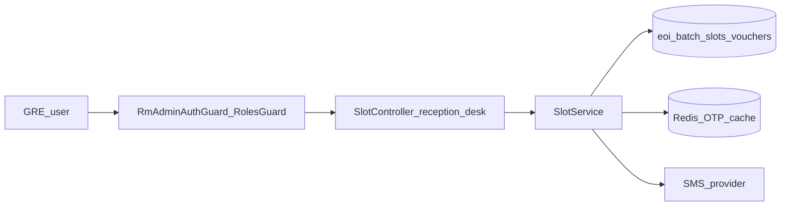

# PE-587 Reception Desk — Final AI Review Plan

## Verdict

**Approve** — Auto-fixer addressed all blocking findings from [review-pointers-cycle-1.md](.opencode/executions/exec-f603b6f0-bc0d-4574-8bd7-ddde48fc2c97/review-pointers-cycle-1.md). Implementation matches [implementation-plan.md](docs/ai/stories/PE-587/implementation-plan.md) and story scope. No new must-fix findings.

---

## Prior Findings Resolution (Cycle 1 → Current)

| ID | Priority | Status | Evidence |
|----|----------|--------|----------|
| **R1** | Must-fix | **Resolved** | [`getReceptionDashboard`](src/modules/eoi_manager/batch_manager/slot.service.ts) (~L1253–1277): `invited` sums `filledCount` for OPEN+ACTIVE eligible slots; `proratedInvites` sums **ACTIVE-only** eligible slots |
| **R2** | Must-fix | **Resolved** | `listGreBatches` uses `allowedSortFields` map + safe fallback (~L924–934); no raw `batch.${field}` injection |
| **R3** | Must-fix | **Resolved** | `listGreSlots` uses single grouped `COUNT` by `slotId` (`attendedBySlot`, ~L1065–1080) instead of per-slot `Promise.all` |
| **R4** | Should-fix | **Mostly resolved** | `mapViewRecordRow` uses `resolveDisplayMobile`; `createViewRecordsQuery` search includes voucher JSON mobile fields |
| **R5** | Should-fix | **Resolved** | `markAttendance` rejects `BatchVoucherStatus.ATTENDED` (~L1410–1412), same as send/resend |
| **R6** | Advisory | **Open** | No `slot.service.spec.ts`; test-plan exists but no unit tests in diff |
| **R7** | Advisory | **Open** | `.opencode/executions/...` artifacts untracked — exclude from PR commit |

---

## Scope Confirmed (unchanged from Cycle 1)



| Area | Result |
|------|--------|
| 10 GRE endpoints under `batch-slots/reception-desk/*` | Pass — all guarded with `RolesEnum.GRE` in [`slot.controller.ts`](src/modules/eoi_manager/batch_manager/slot.controller.ts) |
| Visibility OPEN/ACTIVE + non-deleted | Pass — `GRE_ELIGIBLE_SLOT_STATUSES`, `buildGreVisibilityJoin`, `assertGreEligibleBatchVoucher` |
| Entity + migration | Pass — [`1779600000000-AddReceptionDeskAttendanceToBatchVouchers.ts`](src/migrations/1779600000000-AddReceptionDeskAttendanceToBatchVouchers.ts), columns on [`batch_voucher.entity.ts`](src/modules/eoi_manager/batch_manager/entities/batch_voucher.entity.ts) |
| OTP hash + Redis TTL + verify gate before check-in | Pass |
| Check-in transaction + pessimistic lock + audit | Pass — `RECEPTION_CHECK_IN` in [`event-messages.enum.ts`](src/enums/event-messages.enum.ts) |
| Module wiring | Pass — `HttpModule`, `Users` repo, global `CacheModule` in [`app.module.ts`](src/app.module.ts) |

---

## Residual Advisory (non-blocking)

**R4 residual — `getAttendanceDetail` mobile display**

In [`getAttendanceDetail`](src/modules/eoi_manager/batch_manager/slot.service.ts) (~L1367), `mobileNumber` is still `mapping.phone` only, while list/search rows use `resolveDisplayMobile`. If product expects consistent mobile on the detail screen, align detail response with the shared helper (one-line change).

No new finding ID required if treating as R4 tail; optional **R8** if tracking separately.

---

## Acceptance Criteria Traceability

| Criterion | Result |
|-----------|--------|
| GRE guards on all reception endpoints | Pass |
| Listings/search only OPEN/ACTIVE non-deleted slots | Pass |
| View records fields + QueryBuilder joins | Pass |
| Dashboard metrics (`invited` vs `proratedInvites`) | Pass (R1 fixed) |
| OTP verify before check-in | Pass |
| Resend cooldown / max resend | Pass |
| Check-in persists headcount, timestamp, GRE user | Pass |
| UserActivityInterceptor on check-in | Pass |
| Migration for new columns | Pass |

---

## Output Artifact (when executing review step)

Write to [`.opencode/executions/exec-f603b6f0-bc0d-4574-8bd7-ddde48fc2c97/final-summary.md`](.opencode/executions/exec-f603b6f0-bc0d-4574-8bd7-ddde48fc2c97/final-summary.md):

```markdown
# PE-587 Final Review Summary

## Verdict: Approve

Cycle-1 must-fix items R1–R3 and should-fix R4–R5 are resolved. Reception Desk APIs are production-ready pending standard validation.

## Prior findings status
- R1–R3: Resolved
- R4–R5: Resolved (minor: getAttendanceDetail mobile could use resolveDisplayMobile)
- R6–R7: Advisory unchanged

Findings: None
```

---

## Suggested Validation (pre-merge)

```bash
npm run lint
npm run build
npm run migration:run
```

Manual GRE flow: batches → slots → records → OTP send/verify/resend → check-in → dashboard → attendance detail.

**PR hygiene:** Stage only product paths (`src/**`, `docs/ai/stories/PE-587/**`); do not commit `.opencode/executions/`.
