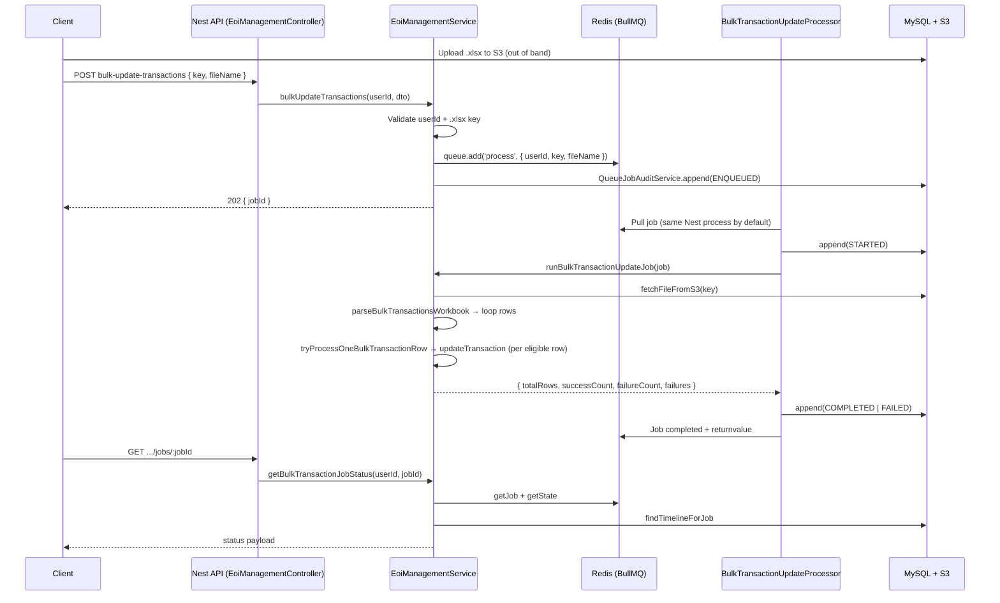

# PE-483 — Bulk transaction upload: API flow (KT)

**Purpose:** End-to-end flow from HTTP to BullMQ worker so anyone can trace **what calls what** without reading the whole service file.  
**Jira:** [PE-483](https://puravankara-iprogrammer.atlassian.net/browse/PE-483)  
**Deeper design (columns, edge cases, volumes):** [PE-483-bulk-update-transactions-implementation.md](./PE-483-bulk-update-transactions-implementation.md)

---

## Prerequisites (ops)

| Requirement | Why |
|-------------|-----|
| **Redis** reachable with same settings as cache (`CACHE_HOST` / `CACHE_PORT`) | BullMQ stores jobs and worker state. `BullModule.forRootAsync` is registered in `src/app.module.ts`. |
| **Migration** `1778200000000-CreateQueueJobAuditLogs` applied | Persists `queue_job_audit_logs` for enqueue/start/complete/fail timeline. |
| **S3** object exists at `dto.key` before `POST` | API does not upload the file; client uploads first, then sends `key` + `fileName`. |

---

## HTTP surface

| Method | Path (under global prefix, e.g. `api` or `api/<NODE_ENV>`) | Role | Response |
|--------|--------------------------------------------------------------|------|----------|
| `POST` | `eoi-management/bulk-update-transactions` | `FINANCE_ADMIN` | **202** + `{ jobId }` — work is **not** done yet. |
| `GET` | `eoi-management/bulk-update-transactions/jobs/:jobId` | `FINANCE_ADMIN` (same user who enqueued) | Bull **state**, **progress**, **returnvalue** / **failedReason**, **auditTimeline**. |

**Guards:** `RmAdminAuthGuard`, `RolesGuard` (same pattern as other EOI finance routes).  
**Body (`POST`):** `BulkUpdateTransactionsDto` — `{ fileName, key }`; `key` must end with `.xlsx`.

---

## Flow (one picture)

---

## Call chain (code order)

1. **`EoiManagementController.bulkUpdateTransactions`** (`eoi_management.controller.ts`)  
   - Injects `userId` from `@User('dbId')`, body as `BulkUpdateTransactionsDto`.  
   - Delegates to **`EoiManagementService.bulkUpdateTransactions`**.

2. **`EoiManagementService.bulkUpdateTransactions`** (`eoi_management.service.ts`)  
   - Ensures `userId` and `.xlsx` extension.  
   - **`bulkTransactionUpdateQueue.add('process', payload, options)`** — queue name from `BULK_TRANSACTION_UPDATE_QUEUE` (`'bulk-transaction-updates'` in `src/config/constants.ts`). Each `add` creates a **new** `job.id`.  
   - **`QueueJobAuditService.append`** — event `ENQUEUED` (module `queue_audit`).  
   - Returns **202** shape with `jobId` string.

3. **BullMQ worker** picks the job (Nest registers **`BulkTransactionUpdateProcessor`** with `@Processor(BULK_TRANSACTION_UPDATE_QUEUE)` in `eoi_management.module.ts`).  
   - **`BulkTransactionUpdateProcessor.process`** (`processors/bulk-transaction-update.processor.ts`): validates payload, **`append(STARTED)`**, then **`EoiManagementService.runBulkTransactionUpdateJob(job)`**.  
   - On success: **`append(COMPLETED)`**; on throw: **`append(FAILED)`** then rethrow (retries depend on job options).

4. **`EoiManagementService.runBulkTransactionUpdateJob`** (`eoi_management.service.ts`)  
   - **`UnrecoverableError`** for bad extension, missing S3 object, or parse failure (no point retrying).  
   - **`awsService.fetchFileFromS3(key)`** → **`parseBulkTransactionsWorkbook`** (`src/helpers/bulk-transaction-upload.helper.ts`).  
   - Sorts rows by payment ref + txn id, then for each row: **`job.updateProgress`**, **`tryProcessOneBulkTransactionRow`**.  
   - **`tryProcessOneBulkTransactionRow`** (private): Excel validation, DB lookup (`findVoucherPaymentForBulkRow`), eligibility (**Pending Reco** / `UNVERIFIED` only), then **`updateTransaction`** for parity with single PATCH. Row failures are collected; the job **completes** with partial success.  
   - Return value becomes Bull **`returnvalue`** (counts + `failures`).

5. **`EoiManagementController.getBulkTransactionJobStatus`** → **`EoiManagementService.getBulkTransactionJobStatus`**  
   - **`bulkTransactionUpdateQueue.getJob(jobId)`**; **403** if `job.data.userId !== requestUserId`.  
   - Merges Bull fields with **`queueJobAuditService.findTimelineForJob`**.

---

## Queue name and Redis

- **Queue constant:** `BULK_TRANSACTION_UPDATE_QUEUE` → Redis keys like `bull:bulk-transaction-updates:*`.  
- **Job options** (on `add`): `attempts`, `backoff` (retry spacing on **failure** only), `removeOnComplete` / `removeOnFail` (trim old job metadata in Redis).

---

## Audit timeline (DB)

Generic table **`queue_job_audit_logs`** — events used here: **ENQUEUED** (API), **STARTED** / **COMPLETED** / **FAILED** (processor).  
Correlate with **`jobId`** + `queueName` = `bulk-transaction-updates`.

---

## Key files (bookmark list)

| Area | File |
|------|------|
| POST/GET routes | `src/modules/eoi_management/eoi_management.controller.ts` |
| Enqueue + worker entry + row loop | `src/modules/eoi_management/eoi_management.service.ts` |
| Bull worker class | `src/modules/eoi_management/processors/bulk-transaction-update.processor.ts` |
| Job payload type | `src/modules/eoi_management/interfaces/bulk-transaction-update-job-payload.interface.ts` |
| POST body DTO | `src/modules/eoi_management/dto/bulk-update-transactions.dto.ts` |
| Excel parse / row validation helpers | `src/helpers/bulk-transaction-upload.helper.ts` |
| Column contract (export) | `src/helpers/voucherEcelBuilder.helper.ts` (`TXN_SHEET_COLS`) |
| Queue registration | `src/modules/eoi_management/eoi_management.module.ts` (`BullModule.registerQueue`) |
| Redis root config | `src/app.module.ts` (`BullModule.forRootAsync` + cache host/port) |
| Audit service | `src/modules/queue_audit/queue-job-audit.service.ts` |

---

*Last aligned with codebase flow: async job + poll; worker runs in the same Nest process unless you deploy dedicated worker instances.*
