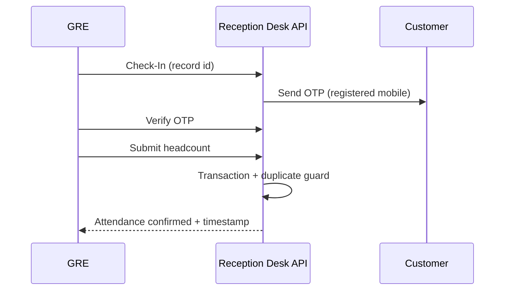

Reading the story-analyzer context pack first, then producing the story specification from it.
Description in the context pack is truncated; checking the same execution folder for the full story text.
Searching narrowly for the full PE-587 story text since the context pack description is truncated.
Prior pipeline runs may have the full story; checking for an existing spec and a fuller context pack.
Reviewing the story attachment for UI context.
# PE-587: Reception Desk Module for GRE — View Records & Customer Check-In Management

## Overview

Deliver production-grade Reception Desk APIs in the existing **Batch Manager** module (NestJS, TypeORM, MySQL) so **GRE** users can manage live customer check-ins during **Unit Allotment** and **Launch** journeys. Endpoints must live in **`slot.controller.ts`** and **`slot.service.ts`**.

GRE visibility and operations are limited to batches/slots in **`OPEN`** or **`ACTIVE`** status. **Locked**, **future**, **completed**, **elapsed**, and **archived** slots must not appear in listings or be actionable.

## Story Metadata

| Field | Value |
|-------|--------|
| Key | PE-587 |
| Title | Reception Desk Module for GRE - View Records & Customer Check-In Management |
| Module | EOI Manager → Batch Manager |
| Primary files | `slot.controller.ts`, `slot.service.ts` |
| Stack | NestJS, TypeORM, MySQL |
| Repository role | Backend API only |

## Goals

1. Enable GRE to list campaign batches, active/open slots, and voucher/customer records for reception operations.
2. Support universal search across key customer and batch identifiers.
3. Provide batch dashboard metrics for live reception monitoring.
4. Implement OTP-gated attendance check-in with duplicate prevention and auditability.
5. Meet performance and concurrency requirements for high-traffic reception desks.

## Personas & Authorization

- **Primary user:** GRE (Guest Relations Executive).
- **Access rule:** GRE may only view and mutate data for slots/batches with status **`OPEN`** or **`ACTIVE`**.
- **Non-visible / non-operable:** Locked, future, completed, elapsed, or archived slots/batches.
- **Security:** Role guards, request validation, audit logging, and timestamps on mutating flows (especially attendance).

## API Surface

All endpoints are implemented under Batch Manager via `slot.controller.ts` / `slot.service.ts`. Exact route paths and DTO names should follow existing Batch Manager conventions during implementation planning.

| # | API | Type | Listing features |
|---|-----|------|------------------|
| 1 | Campaign batch listing | Read | Pagination, filtering, sorting, search |
| 2 | Active/Open slot listing | Read | Pagination, filtering, sorting, search |
| 3 | View records listing | Read | Pagination, filtering, sorting, search |
| 4 | Batch dashboard summary | Read | N/A (aggregate) |
| 5 | Universal search | Read | Pagination, filtering, sorting, search |
| 6 | Send OTP | Write | N/A |
| 7 | Verify OTP | Write | N/A |
| 8 | Resend OTP | Write | N/A |
| 9 | Attendance marking / check-in | Write | N/A |
| 10 | Attendance detail | Read | N/A |

**Listing-only capabilities:** Only APIs marked as listing APIs above support **pagination**, **filtering**, **sorting**, and **search**. Non-listing APIs must not expose full listing semantics.

### 1. Campaign batch listing

- Returns batches/campaigns visible to GRE for reception use.
- Restrict to contexts where related slots are **`OPEN`** or **`ACTIVE`** (per visibility rule).

### 2. Active/Open slot listing

- Returns slots in **`OPEN`** or **`ACTIVE`** status for the GRE reception workflow.
- Excludes locked, future, completed, elapsed, and archived slots.

### 3. View records listing

- Fetches mapped voucher/customer records for a batch/slot context using joins across:
  - `eoi_batch_slots`
  - `eoi_batch_vouchers`
  - `vouchers`
- Response rows must include at minimum:

| Field | Notes |
|-------|--------|
| Payment Reference ID | |
| Voucher ID | |
| Standard EOI ID | |
| Preferential EOI ID | |
| Customer Name | |
| Mobile Number | Registered mobile for OTP |
| Batch/Slot details | Batch number, date, start time, or equivalent slot metadata |
| Attendance Status | e.g. not checked in / checked in |
| Headcount | Current or recorded headcount |
| RM details | Closing RM, sourcing RM, or equivalent |
| Attendance timestamp | When checked in, if applicable |

- Use TypeORM **QueryBuilder** with optimized joins and selective columns; avoid N+1 queries.

### 4. Batch dashboard summary

Returns aggregate metrics for a selected batch (or slot scope as defined during planning):

| Metric | Description |
|--------|-------------|
| Invited vs Attended | Comparison of invited vs attended counts |
| Prorated Invites | Prorated invite metric (business definition to align with existing EOI/batch analytics) |
| Total Headcount | Sum of recorded headcounts |
| Live attendance counters | Real-time or near-real-time counters for active reception |

### 5. Universal search

Cross-field search limited to **`OPEN`** / **`ACTIVE`** reception scope. Supported search dimensions:

- Payment Ref ID
- Voucher ID
- EOI IDs (standard and/or preferential)
- Customer Name
- Mobile Number
- Batch Number

### 6–8. OTP APIs (send, verify, resend)

Support the attendance check-in flow:

- **Send OTP:** Deliver OTP to the customer’s **registered mobile** for the record being checked in.
- **Verify OTP:** Mandatory verification before attendance is finalized.
- **Resend OTP:** Allowed with **expiry** and **resend** handling (rate limits / cooldown per product rules).
- OTP state must be secure, time-bound, and suitable for concurrent reception traffic.

### 9. Attendance marking / check-in

Transactional write flow:

1. GRE initiates **Check-In** on a record.
2. OTP is sent to registered mobile.
3. OTP verification is **mandatory**.
4. GRE submits **headcount**.
5. System marks attendance successfully.
6. Persist **attendance timestamp** and **checked-in-by** (GRE user).
7. **Prevent duplicate attendance** for the same record.
8. **Prevent concurrent duplicate check-ins** (locking/transaction strategy).
9. Use **database transactions** for attendance mutations.

### 10. Attendance detail

- Returns attendance state for a voucher/customer record: status, headcount, timestamp, checked-in-by, and related metadata needed by the reception UI.

## Attendance Flow (End-to-End)

## Data & Query Requirements

- **Tables/entities:** `eoi_batch_slots`, `eoi_batch_vouchers`, `vouchers` (and related batch/slot/attendance entities as needed).
- **Queries:** QueryBuilder for all listing APIs; selective columns; indexed filters where possible.
- **Concurrency:** Transaction boundaries on attendance; guard against duplicate and concurrent check-in.
- **Observability:** Audit logging and timestamps on attendance and OTP-related actions.

## UI Notes (from attachment)

Reference screenshot: `.opencode/executions/exec-f603b6f0-bc0d-4574-8bd7-ddde48fc2c97/attachments/Screenshot_from_2026-05-22_12-44-32.png`

**Navigation:** Batch → **View Records** (active) and **Listing** under Reception Desk.

**View Records screen:**

- Page title: **View Records**
- Universal/local search: placeholder **"Search by..."** (maps to universal search API)
- Table columns (UI reference): Payment Ref ID, Voucher ID, Standard EOI ID, Preferential EOI ID, Customer Name, Batch No., Date, Start Time, Head Count, Closing RM, Sourcing RM, **Attendance** (Check In action per row)
- Pagination: rows per page (e.g. 10), page navigation

Backend listing and search APIs should support the fields shown in the UI even when not every column appeared in the Jira description (e.g. Date, Start Time, Closing RM, Sourcing RM map to Batch/Slot details and RM details).

## Platform Conventions

From selected context map:

| Area | Convention |
|------|----------------|
| API style | REST |
| Global prefix | `api` |
| Non-prod prefix | `api/{NODE_ENV}` |
| Response envelope | `success` / `response` / `errors` pattern |
| Build | `npm run build` |
| Dev | `npm run start:dev` |
| Tests | `npm run test`, `npm run test:cov`, `npm run test:e2e` |
| Lint/format | `npm run lint`, `npm run format` |

## Acceptance Criteria

### Visibility & access

- [ ] GRE-authenticated requests are enforced via role guards on all Reception Desk endpoints.
- [ ] Listings and searches return only batches/slots with status **`OPEN`** or **`ACTIVE`**.
- [ ] Locked, future, completed, elapsed, and archived slots never appear in GRE listings or search results.
- [ ] Attempts to check in or fetch detail for non-eligible slots return appropriate errors (4xx), not partial success.

### Campaign batch & slot listings

- [ ] Campaign batch listing API returns GRE-visible batches with pagination, filtering, sorting, and search.
- [ ] Active/Open slot listing API returns only `OPEN`/`ACTIVE` slots with pagination, filtering, sorting, and search.

### View records

- [ ] View records API joins `eoi_batch_slots`, `eoi_batch_vouchers`, and `vouchers` without N+1 query patterns.
- [ ] Each row includes: Payment Reference ID, Voucher ID, Standard/Preferential EOI IDs, Customer Name, Mobile Number, Batch/Slot details, Attendance Status, Headcount, RM details, Attendance timestamp (when applicable).
- [ ] Listing supports pagination, filtering, sorting, and search.
- [ ] Query implementation uses QueryBuilder with selective columns.

### Universal search

- [ ] Search matches Payment Ref ID, Voucher ID, EOI IDs, Customer Name, Mobile Number, and Batch Number within GRE visibility scope.
- [ ] Supports pagination, filtering, sorting, and search semantics consistent with other listing APIs.

### Dashboard summary

- [ ] Dashboard API returns Invited vs Attended, Prorated Invites, Total Headcount, and live attendance counters for the requested batch/slot scope.
- [ ] Metrics respect `OPEN`/`ACTIVE` visibility rules.

### OTP & attendance

- [ ] Check-in flow sends OTP to the customer’s registered mobile.
- [ ] Attendance cannot complete without successful OTP verification.
- [ ] Resend OTP honors expiry and resend rules.
- [ ] Successful check-in persists headcount, attendance timestamp, and checked-in-by GRE user.
- [ ] Duplicate attendance for the same record is rejected.
- [ ] Concurrent duplicate check-ins are prevented (transactional/locking).
- [ ] Attendance detail API returns current attendance state for a record.

### Non-listing APIs

- [ ] Dashboard, OTP, attendance marking, and attendance detail APIs do not implement full listing pagination/filter/sort unless explicitly required by their contract.

### Quality & operations

- [ ] Attendance mutations run inside transactions.
- [ ] Audit logging and timestamps are recorded for attendance and OTP flows.
- [ ] Implementation is suitable for high concurrent reception load (no obvious N+1 or unbounded scans on listing paths).

## Implementation Notes

- Extend existing Batch Manager module; do not create a separate Nest module unless codebase standards require it.
- Prefer reusing existing OTP/SMS utilities if present in the codebase (confirm during planning).
- Align status enums with existing `SlotStatusEnum` (or equivalent) in batch manager enums.
- Map UI “Check In” to attendance marking API; map “Search by…” to universal search (and/or view-records query params).
- Deleted or soft-deleted vouchers must be excluded from GRE listings if the domain model uses soft delete (confirm entity flags during implementation).
- Deeper domain context may exist in `docs/PE-483-bulk-transaction-api-flow.md` and `README.md` if EOI/voucher flows need clarification.

## Assumptions

- GRE role identifier and guard decorators match existing auth patterns in the API.
- “Campaign batch” maps to existing batch/campaign entities in Batch Manager.
- “Prorated Invites” uses the same business formula as other batch analytics endpoints (to be verified against existing services).
- Registered mobile for OTP comes from voucher/customer data linked via `vouchers`.
- `slot.controller.ts` / `slot.service.ts` may expose a dedicated route prefix (e.g. `/gre` or `/reception-desk`) consistent with module routing; exact paths are left to the implementation planner.
- Attendance state is persisted on an existing or new attendance-related entity tied to batch vouchers.

## Open Questions

1. **Prorated Invites:** Confirm calculation source and whether it is batch-level or slot-level.
2. **Scope parameters:** Whether dashboard, view records, and search are keyed by `batchId`, `slotId`, `campaignId`, or a combination.
3. **OTP provider:** Reuse existing notification/OTP service vs new integration; resend cooldown and expiry durations.
4. **Attendance entity:** Target table/entity for persisting headcount, timestamp, and `checked-in-by`.
5. **RM fields:** Exact mapping for Closing RM vs Sourcing RM from voucher/EOI relations.
6. **Mobile in table:** Jira requires Mobile Number in API payload; UI screenshot omits a Mobile column—include in API regardless for OTP and search.

## References

| Resource | Path |
|----------|------|
| Context pack | `.opencode/executions/exec-f603b6f0-bc0d-4574-8bd7-ddde48fc2c97/context-packs/story_analyzer.md` |
| Full story (execution) | `.opencode/executions/exec-f603b6f0-bc0d-4574-8bd7-ddde48fc2c97/execution.json` |
| UI screenshot | `.opencode/executions/exec-f603b6f0-bc0d-4574-8bd7-ddde48fc2c97/attachments/Screenshot_from_2026-05-22_12-44-32.png` |
| Context map | `docs/ai/context-map.json` |
| Project context (if needed later) | `docs/ai/project-context.md` |
| Bulk EOI flow doc | `docs/PE-483-bulk-transaction-api-flow.md` |
| Target spec output | `docs/ai/stories/PE-587/spec.md` |
