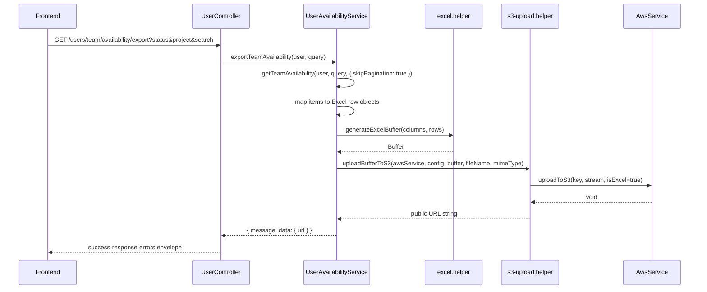

# PN-1 Implementation Plan: Team Availability Excel Export + S3 Upload

## Summary

Add a `CRM_TL`-only export endpoint that reuses the existing team availability query/filters, generates an Excel workbook via a new reusable helper, uploads it to S3, and returns a download URL in JSON (not a binary response).

## Architecture



## Key Design Decisions

| Topic | Decision |
|-------|----------|
| Unpaginated fetch | Extend `getTeamAvailability` with optional `{ skipPagination?: boolean }`; export calls with `skipPagination: true` so filters stay DRY without bypassing DTO validation via `limit=-1`. |
| Field mapping | Map `TeamMemberAvailabilityDto` → Excel row keys per spec (see Step 3). |
| S3 helper | Create thin wrapper around existing `AwsService.uploadToS3` + `CustomConfigService` URL construction; do not duplicate S3 client setup. |
| Excel helper path | Create `src/common/helpers/excel.helper.ts` as specified (new directory; existing Excel code lives under `src/helpers/`). |
| Response shape | Return `{ message, data: { url } }` from service/controller. `ResponseInterceptor` wraps to `{ success: true, response: { statusCode, message, data: { url } } }` — matches project envelope; FE reads `response.data.url`. |
| Timestamp in filename | Use `formatDateUtil(undefined, 'timestamp')` from `src/helpers/date.helper.ts` (same pattern as `admin_reports`, `leaderboard`). Filename: `exports/team-availability-<timestamp>.xlsx`. |
| URL type | Public asset URL via `AWS_S3_ACCESS_URL` + `puravankara/` prefix (matches `AwsService.uploadToS3` key layout). Presigned URL not required unless FE confirms otherwise. |
| Date/time in Excel | Use ISO strings from `unavailableFrom` / `unavailableTo` (same as list API); empty string when `currentStatus === 'AVAILABLE'`. |

## Target Files

| File | Action |
|------|--------|
| `src/common/helpers/excel.helper.ts` | **Create** — reusable `generateExcelBuffer` |
| `src/common/helpers/s3-upload.helper.ts` | **Create** — reusable `uploadBufferToS3` |
| `src/modules/users/services/user-availability.service.ts` | **Edit** — add `skipPagination` option to `getTeamAvailability`; add `exportTeamAvailability` |
| `src/modules/users/user.controller.ts` | **Edit** — add `GET team/availability/export` endpoint |
| `src/modules/users/services/user-availability.service.spec.ts` | **Edit** — add export tests; fix existing `getTeamAvailability` expectations if still asserting array return (service currently returns paginated object) |

**No changes expected:** `user.module.ts` (already provides `AwsService`), `list-team-availability.dto.ts`, `package.json` (`exceljs` already present).

## Context Budget

- Inspect **Target Files** first; do not broad-scan the repo.
- Open non-target files only for direct imports: `AwsService`, `CustomConfigService`, `formatDateUtil`, `TeamMemberAvailabilityDto`, guards/decorators already used on list endpoint.
- Use provider-native edit tools; do not paste full file contents or large diffs in chat.
- Run only validation commands listed below for the changed surface.

## Implementation Steps

### Step 1: Create `excel.helper.ts`

Create `src/common/helpers/excel.helper.ts` with:

```typescript
export async function generateExcelBuffer<T>(
  columns: { header: string; key: string; width?: number }[],
  data: T[],
): Promise<Buffer>
```

Implementation requirements:
- Use `exceljs` (`Workbook`, `addWorksheet`, set `worksheet.columns` from `columns`).
- Add header row (bold font, consistent with `user.service.ts` export ~line 858).
- `worksheet.addRows(data)` or iterate `addRow` using column `key` values.
- Auto-size columns when `width` is omitted (measure header + cell values; cap max width ~50).
- Return `Buffer.from(await workbook.xlsx.writeBuffer())`.
- Worksheet name: `Team Availability` (or `Sheet1` if simpler; not customer-facing).

### Step 2: Create `s3-upload.helper.ts`

Create `src/common/helpers/s3-upload.helper.ts`:

```typescript
export async function uploadBufferToS3(
  awsService: AwsService,
  configService: CustomConfigService,
  buffer: Buffer,
  fileName: string,
  mimeType: string,
): Promise<string>
```

Implementation requirements:
- Import `PassThrough` from `stream`.
- Derive S3 key: pass `fileName` as the key segment (e.g. `exports/team-availability-<timestamp>.xlsx`); `AwsService.uploadToS3` prepends `puravankara/`.
- Set `isExcel=true` when mimeType is `application/vnd.openxmlformats-officedocument.spreadsheetml.sheet`.
- After upload, build URL: `` `${configService.get<string>('AWS_S3_ACCESS_URL')}puravankara/${fileName}` `` (verify base URL trailing-slash behavior against one existing export; adjust join logic if needed).
- Return the URL string.

> **Note:** Spec shows a 3-arg signature; extend with `awsService` + `configService` as required deps (Nest injectables cannot be used inside a pure function without passing them in). Keep the helper stateless and reusable.

### Step 3: Extend `getTeamAvailability` for export

In `user-availability.service.ts`, add optional third parameter:

```typescript
options?: { skipPagination?: boolean }
```

When `skipPagination === true`:
- Skip `qb.skip(skip).take(limit)`.
- Still compute `total` via `getManyAndCount()` (or `getCount()` + `getMany()`).
- Return shape unchanged: `{ items, page: 1, limit: total, total, totalPages: 1 }` so list behavior is unaffected.

When `skipPagination` is false/omitted, preserve current paginated behavior.

### Step 4: Implement `exportTeamAvailability`

Add to `UserAvailabilityService`. Inject `AwsService` and `CustomConfigService` via constructor (module already provides `AwsService`; add `CustomConfigService` if not globally available — check other services in `users` module; `UserService` already uses both).

Flow:
1. `const { items } = await this.getTeamAvailability(loggedInUser, query, { skipPagination: true });`
2. Define column metadata (exact order):

| header | key |
|--------|-----|
| Employee ID | `employeeId` |
| Employee Name | `employeeName` |
| Email ID | `email` |
| Project | `project` |
| IOM Allotted | `iomAllotted` |
| Status | `statusLabel` |
| From Date & Time | `fromDateTime` |
| To Date & Time | `toDateTime` |

3. Map each `TeamMemberAvailabilityDto` to a row:

```typescript
{
  employeeId: item.empId ?? '',
  employeeName: item.name ?? '',
  email: item.email ?? '',
  project: (item.projects ?? []).map(p => p.name).join(', '),
  iomAllotted: item.allocatedIomsCount ?? 0,
  statusLabel: item.statusLabel ?? '',
  fromDateTime: item.currentStatus === 'AVAILABLE' ? '' : (item.unavailableFrom ?? ''),
  toDateTime: item.currentStatus === 'AVAILABLE' ? '' : (item.unavailableTo ?? ''),
}
```

4. `const buffer = await generateExcelBuffer(columns, rows);`
5. `const timestamp = formatDateUtil(undefined, 'timestamp');`
6. `const fileName = \`exports/team-availability-${timestamp}.xlsx\`;`
7. `const url = await uploadBufferToS3(this.awsService, this.configService, buffer, fileName, MIME);`
8. Return `{ message: 'Team availability exported successfully', data: { url } };`
9. Wrap in try/catch with `logger.error` + rethrow `InternalServerErrorException` on failure (match `leaderboard.service.ts` export pattern).

Include users with empty `projects` and no unavailability window (already returned by `getTeamAvailability`).

### Step 5: Add controller endpoint

In `user.controller.ts`, after the existing `GET team/availability` handler (or before — path `team/availability/export` is unambiguous):

```typescript
@Get('team/availability/export')
@UseGuards(RmAdminAuthGuard, RolesGuard)
@Roles(RolesEnum.CRM_TL)
async exportTeamAvailability(
  @User() user: { dbId: number },
  @Query() query: ListTeamAvailabilityDto,
) {
  return this.userAvailabilityService.exportTeamAvailability(user, query);
}
```

Reuse existing imports for guards, roles, DTO, and `@User()` decorator.

### Step 6: Unit tests

In `user-availability.service.spec.ts`:

**Fix existing tests** (if still present): `getTeamAvailability` returns `{ items, page, limit, total, totalPages }`, not a bare array. Update assertions to use `result.items`.

**Add `exportTeamAvailability` describe block:**
- Mock `generateExcelBuffer` and `uploadBufferToS3` (jest.mock the helper modules).
- Mock `AwsService` / `CustomConfigService` on the service instance.
- Verify: calls `getTeamAvailability` with `skipPagination: true`.
- Verify: row mapping for AVAILABLE (empty date fields) and UNAVAILABLE (ISO dates).
- Verify: comma-separated project names.
- Verify: returns `{ message, data: { url } }`.

Optional focused tests for `excel.helper.ts` (buffer non-empty, column count) — only if quick to add.

## Validation Commands

Run from repo root after implementation:

```bash
npm run lint
npm run build
npm run test -- --testPathPattern=user-availability.service.spec
```

Manual smoke test (with valid `CRM_TL` token):

```bash
curl -s -H "Authorization: Bearer $TOKEN" \
  "$BASE/api/users/team/availability/export?status=AVAILABLE" | jq .
```

Confirm:
- HTTP 200, `success: true`, `response.data.url` is a valid S3 URL ending in `.xlsx`.
- Response body is JSON, not binary.
- Filters (`status`, `project`, `search`) match list endpoint behavior.
- Unauthorized role returns 403.

## Risks

| Risk | Mitigation |
|------|------------|
| Large teams → memory pressure loading all rows | Accept for v1 per spec; log row count; future: streaming/chunked export if needed. |
| Existing unit tests out of sync with paginated `getTeamAvailability` | Update assertions when touching spec file. |
| `AWS_S3_ACCESS_URL` URL concatenation (missing/extra slash) | Mirror URL join from an existing working export (e.g. `bookings.helper.ts` or `pdf.service.ts`). |
| Response envelope mismatch with story's top-level `url` | Document final shape for FE: `response.data.url`; escalate only if FE requires top-level `url`. |
| Route ordering | `team/availability/export` is distinct from `team/availability`; no conflict expected. |

## Assumptions

1. `getTeamAvailability` already scopes data to the logged-in TL's CRM direct reports (`u.reporting_to = tlId`, `role.name = CRM`); export inherits this.
2. `ListTeamAvailabilityDto` filters (`status`, `project`, `search`) are sufficient; `page`/`limit` query params on export are ignored via `skipPagination`.
3. `exceljs@^4.4.0` is already installed; no dependency change needed.
4. `CustomConfigService` is injectable in `UserAvailabilityService` (used widely across modules).
5. Frontend will consume `response.data.url` from the standard interceptor envelope.
6. ISO date strings in Excel are acceptable (consistent with list API `unavailableFrom`/`unavailableTo`).
