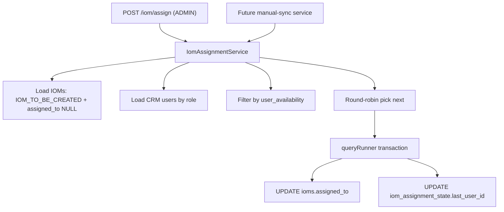

# PN-27: Round Robin IOM Assignment — Implementation Plan

## Overview

Implement backend-only round-robin auto-assignment of eligible IOMs to CRM users. `IomAssignmentService` loads unassigned IOMs in status **`IOM_TO_BE_CREATED`**, selects the next **available** CRM user (skipping `user_availability` windows), sets `assigned_to`, and advances a global cursor in `iom_assignment_state`. Persistence uses TypeORM with explicit `queryRunner` transactions against MySQL.

**Scope change (approved):** Do **not** create `IomAssignmentCron` or any scheduled job. Deliver only:
1. `IomAssignmentService` (callable by other modules on manual sync).
2. One REST endpoint to trigger assignment via API.

> **Status correction:** Use existing `IomStatusCodeEnum.IOM_TO_BE_CREATED` (seeded in `SeedIomStatuses1780669000001`). The story spec's `IOM_TO_BE_GENERATED` does not exist in this codebase.

## Prerequisite Gap

| Spec / story field | Current codebase |
|---|---|
| `assigned_to` | **Missing** from `ioms` table and `Iom` entity — must be added |
| `IOM_TO_BE_CREATED` | **Exists** — `src/modules/iom/enums/iom-status-code.enum.ts` |
| `user_availability` | **Missing** — new table + entity |
| `iom_assignment_state` | **Missing** — new table + entity |

Assignment must **only** update `assigned_to`. Do **not** change `status_id` or call `WorkflowValidationService.validateTransition`. Status stays `IOM_TO_BE_CREATED` until CRM acts via existing workflow endpoints.

---

## Target Files

### Create

| File | Purpose |
|---|---|
| `src/modules/iom/entities/user-availability.entity.ts` | `user_availability` table entity |
| `src/modules/iom/entities/iom-assignment-state.entity.ts` | Singleton round-robin cursor entity |
| `src/modules/iom/services/iom-assignment.service.ts` | Core round-robin + availability logic |
| `src/modules/iom/services/iom-assignment.service.spec.ts` | Unit tests for selection/availability |
| `src/migrations/<timestamp>-AddIomAssignedTo.ts` | Add `assigned_to` column to `ioms` |
| `src/migrations/<timestamp>-CreateUserAvailability.ts` | `user_availability` table |
| `src/migrations/<timestamp>-CreateIomAssignmentState.ts` | `iom_assignment_state` table + seed singleton row |

### Modify

| File | Purpose |
|---|---|
| `src/modules/iom/entities/iom.entity.ts` | Add `assignedTo` column + `ManyToOne` → `Users` |
| `src/modules/iom/services/iom-assignment.service.ts` | (listed above; exported for cross-module use) |
| `src/modules/iom/iom.module.ts` | Register entities + service; add `Users` to `TypeOrmModule.forFeature`; **export** `IomAssignmentService` |
| `src/modules/iom/iom.controller.ts` | Add `POST /iom/assign` endpoint |
| `src/entities/index.ts` | Export new entities |

### Do not create or modify

- `src/modules/crons/iom-assignment.cron.ts` — **out of scope**
- `src/enums/crons.enum.ts` — no cron enum entry
- `src/modules/iom/enums/iom-status-code.enum.ts` — status already exists
- `src/modules/iom/services/iom-crm.service.ts` — workflow logic unchanged
- Frontend / any UI module

---

## Context Budget

- **Inspect target files first:** `iom.entity.ts`, `iom.module.ts`, `iom.controller.ts`, `iom-crm.service.ts` (transaction patterns), `workflow-validation.service.ts` (`getStatusId`), one recent migration under `src/migrations/`.
- **Open non-target files only** for direct imports: `user.entity.ts`, `roles.entity.ts`, `roles.enum.ts`, `status.enum.ts`, `entities/index.ts`.
- **Use provider-native edit tools**; do not paste full file contents or large diffs in chat.
- **Run only validation commands** listed below for the changed surface.

---

## Implementation Steps

### Step 1 — Schema: `assigned_to` on `ioms`

**Migration** (`AddIomAssignedTo`):

1. `ALTER TABLE ioms ADD COLUMN assigned_to BIGINT NULL`.
2. FK: `assigned_to` → `users(id)` (match existing `users.id` type — `INT`).
3. Index: `idx_ioms_assigned_to` on `assigned_to`.

**Entity** (`iom.entity.ts`):

```typescript
@Column({ name: 'assigned_to', type: 'bigint', nullable: true })
assignedTo: number | null;

@ManyToOne(() => Users, { nullable: true })
@JoinColumn({ name: 'assigned_to' })
assignee?: Users;
```

---

### Step 2 — Schema: `user_availability`

**Migration** (`CreateUserAvailability`):

```sql
CREATE TABLE user_availability (
  id BIGINT AUTO_INCREMENT PRIMARY KEY,
  user_id INT NOT NULL,
  unavailable_from DATETIME NOT NULL,
  unavailable_to DATETIME NOT NULL,
  created_at TIMESTAMP DEFAULT CURRENT_TIMESTAMP,
  updated_at TIMESTAMP NULL ON UPDATE CURRENT_TIMESTAMP,
  CONSTRAINT fk_user_availability_user
    FOREIGN KEY (user_id) REFERENCES users(id) ON DELETE CASCADE,
  INDEX idx_user_availability_user (user_id),
  INDEX idx_user_availability_window (user_id, unavailable_from, unavailable_to)
) ENGINE=InnoDB;
```

**Entity** (`user-availability.entity.ts`): standard audit columns; `ManyToOne` → `Users`.

---

### Step 3 — Schema: `iom_assignment_state` (singleton cursor)

**Migration** (`CreateIomAssignmentState`):

```sql
CREATE TABLE iom_assignment_state (
  id INT AUTO_INCREMENT PRIMARY KEY,
  last_user_id INT NULL,
  updated_at TIMESTAMP NULL ON UPDATE CURRENT_TIMESTAMP,
  CONSTRAINT fk_iom_assignment_state_user
    FOREIGN KEY (last_user_id) REFERENCES users(id) ON DELETE SET NULL
) ENGINE=InnoDB;

INSERT INTO iom_assignment_state (id, last_user_id) VALUES (1, NULL);
```

Always read/update `WHERE id = 1`.

**Entity** (`iom-assignment-state.entity.ts`): `id`, `lastUserId`, `updatedAt`.

---

### Step 4 — `IomAssignmentService`

**Location:** `src/modules/iom/services/iom-assignment.service.ts`

**Dependencies:**
- `@InjectDataSource() dataSource: DataSource`
- Repositories: `Iom`, `Users`, `Role`, `UserAvailability`, `IomAssignmentState`
- `WorkflowValidationService` — resolve `IOM_TO_BE_CREATED` status id via `getStatusId()` (same pattern as `iom-crm.service.ts`)

#### Public API

```typescript
async assignEligibleIoms(): Promise<{ assigned: number; skipped: number; errors: number }>
```

Idempotent and safe to call repeatedly (manual sync or API).

#### Algorithm

1. **Resolve status id** for `IomStatusCodeEnum.IOM_TO_BE_CREATED` at run start.
2. **Load eligible IOMs** (read-only, outside per-IOM transaction):
   - `status_id = <IOM_TO_BE_CREATED id>`
   - `assigned_to IS NULL`
   - `deleted_at IS NULL`
   - `ORDER BY id ASC`
   - Optional batch cap via env `IOM_ASSIGNMENT_BATCH_SIZE` (default `50`).
3. **Load CRM user pool** (once per run):
   ```typescript
   // users JOIN roles WHERE roles.name = RolesEnum.CRM
   // AND users.status = StatusEnum.ACTIVE
   // AND users.deleted_at IS NULL
   // ORDER BY users.id ASC
   ```
   Pool is **only** `RolesEnum.CRM` — exclude `CRM_TL`, `CRM_HEAD`.
4. If CRM pool is empty → log warn, return `{ assigned: 0, skipped: 0, errors: 0 }` (no throw).
5. **Preload unavailable user ids** (once per run): `user_availability` where `unavailable_from <= now <= unavailable_to`; store in `Set<number>`. Overlapping windows still mean unavailable.
6. For **each eligible IOM**:
   a. Filter CRM pool to available users (not in unavailable set).
   b. If none available → log info, increment `skipped`, continue.
   c. **Round-robin select** among available users:
      - Read `last_user_id` from `iom_assignment_state` id=1 (inside transaction with row lock).
      - If `last_user_id` is null, not in CRM pool, or not available → pick first available user (lowest id).
      - Else pick next available user after `last_user_id` in id-asc order; wrap to first available at end.
      - Extract pure helper `pickNextAvailableUser(crmUserIds, availableIds, lastUserId)` for unit tests.
   d. **Transaction via `queryRunner`** (story requirement — no `createQueryRunner` precedent exists in repo; implement explicitly):
      ```typescript
      const qr = this.dataSource.createQueryRunner();
      await qr.connect();
      await qr.startTransaction();
      try {
        // SELECT ... FOR UPDATE on iom_assignment_state WHERE id = 1
        // UPDATE ioms SET assigned_to = ? WHERE id = ? AND assigned_to IS NULL AND status_id = ?
        // (if affected rows = 0 → rollback; concurrent assign or status changed)
        // UPDATE iom_assignment_state SET last_user_id = ? WHERE id = 1
        await qr.commitTransaction();
      } catch (e) {
        await qr.rollbackTransaction();
        log error; increment errors; continue
      } finally {
        await qr.release();
      }
   e. On success: increment `assigned`; update in-memory `lastUserId` for subsequent IOMs in same run.

#### Logging

- Use Nest `Logger` (consistent with `iom-crm.service.ts`).
- No available users per IOM: **info**.
- Per-IOM failure: **error** with IOM id; continue batch.

---

### Step 5 — API endpoint (no cron)

**Location:** `src/modules/iom/iom.controller.ts`

Add a static route **before** any `:id` param routes (same placement as `POST generate`):

| Property | Value |
|---|---|
| Method / path | `POST /iom/assign` |
| Guards | `RmAdminAuthGuard`, `RolesGuard` |
| Roles | `RolesEnum.ADMIN` only (internal/manual-sync trigger; matches admin-gated ops in this module) |
| Body | None required |
| Response | `{ data: { assigned, skipped, errors } }` — matches existing `{ data: ... }` envelope |

```typescript
@UseGuards(RmAdminAuthGuard, RolesGuard)
@Roles(RolesEnum.ADMIN)
@Post('assign')
async assignEligibleIoms() {
  const result = await this.assignmentService.assignEligibleIoms();
  return { data: result };
}
```

Wire `IomAssignmentService` into controller constructor.

**Cross-module usage (future manual sync):** Export `IomAssignmentService` from `IomModule.exports`. Downstream service imports `IomModule` and injects `IomAssignmentService.assignEligibleIoms()` — no cron needed.

---

### Step 6 — Module wiring

**`iom.module.ts`:**

```typescript
TypeOrmModule.forFeature([
  // existing...
  UserAvailability,
  IomAssignmentState,
  Users,  // needed for CRM pool query + assignee relation
]),
providers: [..., IomAssignmentService],
exports: [WorkflowValidationService, IomValidationService, IomAssignmentService],
```

No `ScheduleModule` or cron provider changes.

---

### Step 7 — Export entities

Add to `src/entities/index.ts`:

```typescript
export { UserAvailability } from 'src/modules/iom/entities/user-availability.entity';
export { IomAssignmentState } from 'src/modules/iom/entities/iom-assignment-state.entity';
```

---

### Step 8 — Unit tests (`iom-assignment.service.spec.ts`)

Mock repositories / `createQueryRunner`; no DB required.

| Scenario | Expected |
|---|---|
| `lastUserId = null` | First available user (lowest id) |
| `lastUserId = 2`, available `[1,2,3]` | User `3` |
| `lastUserId = 3`, available `[1,2,3]` | Wrap → User `1` |
| `lastUserId = 2`, available `[1,3]` (2 unavailable) | User `3` |
| All users unavailable | `null` → skip |
| Overlapping windows for same user | Still excluded |
| Empty CRM pool | Early return, zero counts |

Optionally verify `assignEligibleIoms` calls `startTransaction` / `commitTransaction` / `release` on mocked `queryRunner`.

Follow mock patterns from `iom-listing.service.spec.ts`.

Controller spec update is **optional** — only if adding a test for `POST assign` route wiring.

---

## Validation Commands

Run from repo root after implementation:

```bash
# 1. Lint
npm run lint

# 2. Unit tests for assignment service
npm run test -- --testPathPattern=iom-assignment

# 3. Build (type-check)
npm run build

# 4. Migrations (dev DB only)
npm run migration:run
```

Do **not** run full `test:cov` or `test:e2e` unless integration tests are added.

---

## Risks

| Risk | Mitigation |
|---|---|
| Missing `assigned_to` column | Step 1 migration is mandatory before service logic |
| Concurrent API / sync calls | `SELECT ... FOR UPDATE` on `iom_assignment_state`; conditional `UPDATE ioms ... AND assigned_to IS NULL` |
| Status id resolution failure | `IOM_TO_BE_CREATED` must remain seeded in `iom_statuses` |
| Timezone ambiguity | Compare windows against `new Date()`; document server-time assumption in service |
| `employee_status` vs `user_availability` | This story uses **only** `user_availability` windows; do not conflate with `users.employee_status` |
| No `createQueryRunner` precedent in repo | Story mandates it; implement explicitly (IOM services otherwise use `dataSource.transaction`) |
| Route ordering | Place `POST assign` before `GET :id` to avoid param capture |
| Re-assignment | Guard `assigned_to IS NULL` in SELECT and UPDATE |

---

## Assumptions

1. Eligible IOMs: `status = IOM_TO_BE_CREATED`, `assigned_to IS NULL`, not soft-deleted.
2. CRM pool = `roles.name = RolesEnum.CRM`, `users.status = active`, not soft-deleted.
3. IOM processing order: `id ASC`.
4. **No cron** in this story; assignment is triggered via API or future service injection on manual sync.
5. API endpoint is `ADMIN`-only; service-to-service callers inject `IomAssignmentService` directly.
6. No available users: skip with info log; return success with counts.
7. Partial batch failure: continue with per-IOM error logging.
8. `user_availability` rows populated externally (entity + migration only here).
9. Round-robin is **global** (not per-project).
10. Assignment updates **only** `assigned_to`; `status_id` unchanged.
11. Existing CRM edit/submit workflow in `iom-crm.service.ts` unchanged.

---

## Architecture



---

## Acceptance Criteria Mapping

| Criterion | How delivered |
|---|---|
| `user_availability` entity + migration | Steps 2, 7 |
| `iom_assignment_state` entity + migration | Steps 3, 7 |
| Eligible IOM selection | Step 4 |
| CRM user pool by role | Step 4 |
| Availability window filtering | Step 4 |
| Round-robin + wrap | Step 4 + unit tests |
| `last_user_id` persistence | Step 4 transaction |
| No available users → skip safely | Step 4 |
| `queryRunner` + transactions | Step 4 |
| **No cron**; service + API trigger | Steps 4, 5, 6 |
| No frontend changes | N/A |
| No workflow changes beyond `assigned_to` | Prerequisite gap note |
| Migrations run | Validation commands |
