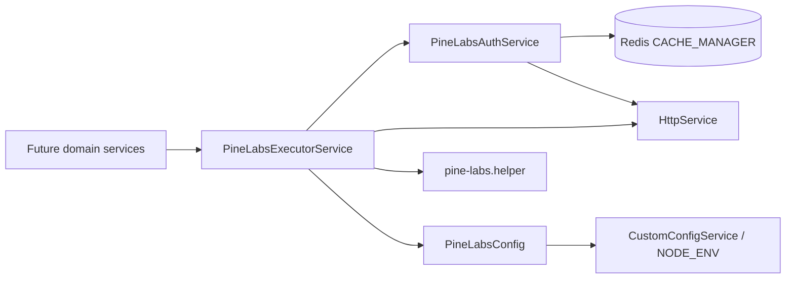

# PN-51 Implementation Plan: Pine Labs Base Integration Layer

## Summary

Create a new internal NestJS module at `src/modules/pine-labs/` that provides cached token authentication, centralized environment-driven API configuration, and a generic config-driven executor for five Pine Labs APIs. Follow existing third-party patterns—especially `SfdcService.getAccessToken()` (Redis-backed `CACHE_MANAGER`) and `HttpModule` + `CustomConfigService`—without adding public REST controllers.

## Architecture



**Responsibility split (R5.3):**

| Layer | Responsibility |
|-------|----------------|
| `PineLabsConfig` | Base URLs (dev/uat/prod), auth settings, per-API paths, HTTP methods, headers, payload field mappings |
| `PineLabsAuthService` | Token get/reuse/refresh, expiry metadata, single-flight on concurrent refresh |
| `PineLabsExecutorService` | Resolve `apiName`, map `data`, attach token/headers, HTTP call, normalize response, 401 retry-once |
| `pine-labs.helper.ts` | Pure functions: payload mapping from config templates, response normalization, log sanitization |

**No controller** — module exports services only (`exports: [PineLabsExecutorService]`).

## Reference Patterns (read only if needed)

- Token cache: `src/modules/sfdc/sfdc.service.ts` (`getAccessToken`, `CACHE_MANAGER`, `cacheKey`, TTL)
- Global Redis cache: `src/app.module.ts` (`CacheModule.registerAsync` with `redisStore`)
- HTTP utilities: `src/utils/http.utils.ts`
- Correlation ID: `src/infra/request-context.ts` (`getRequestContext()?.requestId`) with `crypto.randomUUID()` fallback (see `sfdc-webhook.service.ts`)
- Env selection: `src/enums/node-env.enum.ts` (`dev`, `uat`, `prod`)

## Target Files

### Create

| File | Purpose |
|------|---------|
| `src/modules/pine-labs/pine-labs.module.ts` | Nest module: `HttpModule`, providers, exports |
| `src/modules/pine-labs/pine-labs-auth.service.ts` | Token lifecycle (R1) |
| `src/modules/pine-labs/pine-labs-executor.service.ts` | Generic `(apiName, data)` executor (R3, R4) |
| `src/modules/pine-labs/config/pine-labs.config.ts` | Env-specific base URLs, auth endpoint config |
| `src/modules/pine-labs/config/pine-labs-api.definitions.ts` | Five API definitions: path, method, headers, payload mappings |
| `src/modules/pine-labs/config/pine-labs-config.service.ts` | Resolves active config by `NODE_ENV`; lookup by `apiName` |
| `src/modules/pine-labs/enums/pine-labs-api-name.enum.ts` | Typed `apiName` keys |
| `src/modules/pine-labs/interfaces/pine-labs.interface.ts` | Auth response, executor input/output, API definition types |
| `src/helpers/pine-labs.helper.ts` | `mapPayload()`, `normalizePineLabsResponse()`, `sanitizeForLog()` |
| `src/modules/pine-labs/pine-labs-auth.service.spec.ts` | Unit tests: cache hit/miss/expiry, single-flight |
| `src/modules/pine-labs/pine-labs-executor.service.spec.ts` | Unit tests: routing, mapping, 401 retry, unknown `apiName` |

### Edit

| File | Change |
|------|--------|
| `src/app.module.ts` | Import and register `PineLabsModule` |

### Do not create (out of scope)

- Controllers, DTOs for public REST, migrations/entities, webhook handlers

### Env vars (document in code comments; add to deployment config, not committed secrets)

```
PINE_LABS_BASE_URL_DEV
PINE_LABS_BASE_URL_UAT
PINE_LABS_BASE_URL_PROD
PINE_LABS_AUTH_URL          # or per-env variants if vendor requires
PINE_LABS_CLIENT_ID         # use getDecrypted() if encrypted like SFDC/Decentro
PINE_LABS_CLIENT_SECRET
PINE_LABS_TOKEN_TTL_SECONDS  # optional override; default from auth response
```

## Context Budget

- Inspect **Target Files** and reference patterns (`sfdc.service.ts` token block, `http.utils.ts`) first; do not broad-scan `src/modules/`.
- Open non-target files only for direct imports (`CustomConfigService`, `logger`, `getRequestContext`, `http.utils`, `generateUuid`).
- Use provider-native edit tools; do not paste full file contents or large diffs in chat.
- Run only validation commands listed below for the changed surface.

## Implementation Steps

### Step 1 — Define types and config (R2)

1. Create `PineLabsApiName` enum with keys exactly as specified:
   - `customercreateOrUpdate`, `customerfetch`, `redeemPonts`, `markEligible`, `getUserPoolBalance`
2. Define `PineLabsApiDefinition` interface:
   - `path`, `method` (`GET` | `POST` | `PUT`), `headers` (static + token placeholder), `payloadMapping` (field map: caller key → Pine Labs key, or template object with `{{field}}` placeholders)
3. In `pine-labs.config.ts`:
   - Map `NodeEnv.DEV | UAT | PROD` → base URL from env vars via `CustomConfigService`
   - Define auth config: token URL, credential keys, default TTL buffer (e.g. cache TTL = `expires_in - 60s`)
4. In `pine-labs-api.definitions.ts`:
   - Register all five APIs with **placeholder** paths/methods/mappings until Pine Labs API doc is confirmed
   - Use clearly marked `// TODO(PN-51): confirm with Pine Labs API doc` comments
5. Implement `PineLabsConfigService`:
   - `getBaseUrl(): string` — selects URL by `NODE_ENV`
   - `getAuthConfig()` — returns auth endpoint + credential key names
   - `getApiDefinition(apiName: PineLabsApiName): PineLabsApiDefinition` — throws descriptive error if unknown (R3.7, AC-14)

**Constraint (R2.7, AC-9):** No URLs, paths, or raw payload shapes in auth/executor services—only in config files.

### Step 2 — Auth service with Redis token cache (R1)

1. Inject `HttpService`, `CustomConfigService`, `@Inject(CACHE_MANAGER) cacheService`.
2. Cache key: `pine-labs:access-token` (single token for all five APIs per assumption).
3. Cached value shape: `{ accessToken: string, expiresAt: number }` (epoch ms).
4. `getValidToken(): Promise<string>`:
   - Read cache; if `expiresAt > Date.now() + buffer`, return token (AC-1, AC-4)
   - Else call `refreshToken()`
5. `refreshToken()`:
   - POST to auth URL with credentials from `getDecrypted()` env vars
   - Parse token + expiry from response (field names TBD—use configurable mapping in auth config)
   - `cacheService.set(key, payload, ttlMs)`
   - Return token (AC-2, AC-3)
6. **Single-flight (R1.5):** Use an in-memory `refreshPromise` mutex so concurrent callers await one refresh instead of stampeding auth.
7. `invalidateToken()`: `cacheService.del(key)` — called before 401 retry.

Mirror `SfdcService.getAccessToken()` structure; improve with explicit expiry check instead of blind TTL-only if auth response provides `expires_in`.

### Step 3 — Payload mapping helper (R2.4, R3.3)

In `pine-labs.helper.ts`:

1. `mapPayload(definition, data: Record<string, unknown>): unknown`
   - Apply per-API mapping rules from config (simple key rename and/or nested object build)
   - Reject missing required mapped fields with clear error before HTTP call
2. `normalizePineLabsResponse(raw, apiName): PineLabsExecutorResult`
   - Uniform shape, e.g. `{ success: boolean, data?: unknown, error?: { code?, message, statusCode? }, apiName, correlationId }`
   - Reuse parsing ideas from `normalizeProviderResponse` if responses are stringified JSON
3. `sanitizeForLog(body): unknown` — strip tokens, secrets, PII fields

### Step 4 — Generic executor (R3, R4)

`PineLabsExecutorService.execute(apiName, data, options?)`:

**Signature:**
```typescript
execute(
  apiName: PineLabsApiName,
  data: Record<string, unknown>,
  options?: { correlationId?: string },
): Promise<PineLabsExecutorResult>
```

**Flow:**
1. Resolve `correlationId` = `options.correlationId ?? getRequestContext()?.requestId ?? randomUUID()`
2. Resolve API definition; fail fast on unknown `apiName`
3. `token = await authService.getValidToken()`
4. `body = mapPayload(definition, data)`
5. `url = baseUrl + definition.path`
6. Build headers: global config headers + `Authorization: Bearer ${token}` + optional `X-Correlation-Id` if vendor supports
7. Execute HTTP via `HttpService` (use `httpPost`/`httpGet` from `http.utils.ts` where method matches)
8. Normalize success response → return (AC-10–13, AC-15)
9. On HTTP **401** (and only first attempt):
   - Log warning with `apiName`, `correlationId`
   - `authService.invalidateToken()`
   - `token = await authService.refreshToken()`
   - Replay **same url, body, headers** with new token (AC-16; assumption #9)
   - If second attempt fails → normalized error + error log (AC-17)
10. On other errors: log with `apiName`, `correlationId`, sanitized status/body (AC-18, R4.4); return normalized failure (R4.5)

Use a private `isRetry` flag to enforce exactly one retry (R4.3).

### Step 5 — Module wiring

`pine-labs.module.ts`:
```typescript
@Module({
  imports: [HttpModule],
  providers: [PineLabsConfigService, PineLabsAuthService, PineLabsExecutorService],
  exports: [PineLabsExecutorService],
})
export class PineLabsModule {}
```

Register in `app.module.ts` imports array (near `DecentroModule` / `SfdcModule`).

### Step 6 — Unit tests

**`pine-labs-auth.service.spec.ts`:**
- Mock `CACHE_MANAGER`, `HttpService`, `CustomConfigService`
- AC-1: valid cached token → no HTTP auth call
- AC-2: empty cache → auth HTTP called, token stored
- AC-3: expired token → refresh called
- Concurrent refresh: two parallel `getValidToken()` → single auth HTTP call

**`pine-labs-executor.service.spec.ts`:**
- Each `apiName` resolves correct URL/path (mock config)
- `data` mapped via config (AC-11)
- 401 on first call → invalidate + refresh + one retry with same body
- 401 on retry → normalized error, no third attempt
- Unknown `apiName` → clear error
- Logs include `apiName` and `correlationId` (spy on `logger`)

Mock HTTP with `of()` / `throwError()` from rxjs; do not hit live Pine Labs.

### Step 7 — Placeholder API definitions (blocked on open questions)

Until Pine Labs API documentation is available, use structurally correct config with placeholder values:

| `apiName` | Placeholder path (update when doc available) | Likely method |
|-----------|-----------------------------------------------|---------------|
| `customercreateOrUpdate` | `/customer/createOrUpdate` | POST |
| `customerfetch` | `/customer/fetch` | POST |
| `redeemPonts` | `/points/redeem` | POST |
| `markEligible` | `/customer/markEligible` | POST |
| `getUserPoolBalance` | `/balance/userPool` | POST |

Payload mappings: define minimal field maps based on story intent; mark TBD fields in comments. Implementer must replace placeholders when product supplies API spec.

## Validation Commands

Run from repo root after implementation:

```bash
# Typecheck + build
npm run build

# Lint changed files
npm run lint

# Unit tests for new module only (faster than full suite)
npm run test -- --testPathPattern=pine-labs

# Optional: full test suite before PR
npm run test
```

**Manual acceptance checks (no live API required):**
```bash
# AC-9: no hardcoded URLs/payloads in services
rg -n "https?://|/customer/|/points/" src/modules/pine-labs --glob '!**/config/**'
# Should return no matches in auth/executor services

# All five api names registered
rg "customercreateOrUpdate|customerfetch|redeemPonts|markEligible|getUserPoolBalance" src/modules/pine-labs/config/
```

## Risks

| Risk | Mitigation |
|------|------------|
| Pine Labs API doc not available (OQ 1–5) | Ship config-driven skeleton with TBD placeholders; executor/auth flow fully testable with mocks; block prod deploy until URLs/schemas confirmed |
| Auth response shape unknown (OQ 2) | Make token field names configurable in `pine-labs.config.ts` (`tokenResponseMapping`) |
| `redeemPonts` spelling mismatch (OQ 7) | Use story spelling as enum key; add optional alias map in config if vendor differs |
| Token stampede under load (R1.5) | Single-flight `refreshPromise` in auth service |
| 401 causes infinite retry | Hard-cap at one retry via `isRetry` flag |
| Secrets in logs (R4.4) | `sanitizeForLog()` on all error paths |
| Wrong env base URL | Resolve URL only in `PineLabsConfigService.getBaseUrl()` from `NODE_ENV`; unit test each env branch |

## Assumptions

1. **Internal module only** — no new public REST routes (per spec).
2. **Token storage** — Redis via global `CACHE_MANAGER` (same as SFDC); no new DB tables (OQ 6 resolved by existing pattern).
3. **Single bearer token** shared across all five APIs.
4. **Config keys** use story spelling including `redeemPonts`.
5. **Correlation ID** — optional caller override; default from `getRequestContext()` or UUID (OQ 8).
6. **401 retry** replays identical request after token refresh (OQ 9).
7. **Error mapping** — normalized internal DTO only; no app-level error enum mapping yet (OQ 10).
8. **Pine Labs credentials** delivered via encrypted env vars using `getDecrypted()` where applicable.
9. **HTTP client** — existing `@nestjs/axios` `HttpService`; no new dependencies.
10. Placeholder endpoint paths/methods will be updated in config only when API documentation is provided—no executor changes required (AC-21).

## Open Questions for Product / Integrations Team

Resolve before production deployment (implementation can proceed with mocks/placeholders):

1. Official Pine Labs API documentation (auth, endpoints, schemas)
2. Exact dev/uat/prod base URLs and auth endpoint
3. Token grant type, request/response fields, TTL
4. HTTP method and full path per API
5. Required/optional payload fields per API
6. Confirm `redeemPonts` vs `redeemPoints` vendor identifier

## Definition of Done

- [ ] `PineLabsModule` registered in `app.module.ts`
- [ ] Auth: cache hit, miss, expiry, single-flight covered by tests (AC-1–4)
- [ ] Config: dev/uat/prod URLs, five APIs, mappings, headers (AC-5–9)
- [ ] Executor: generic `(apiName, data)`, normalization, unknown api error (AC-10–14)
- [ ] 401 retry-once with logging (AC-15–18)
- [ ] Auth/config/executor in separate files, no circular deps (AC-19–21)
- [ ] `npm run build`, `npm run lint`, `npm run test -- --testPathPattern=pine-labs` pass
