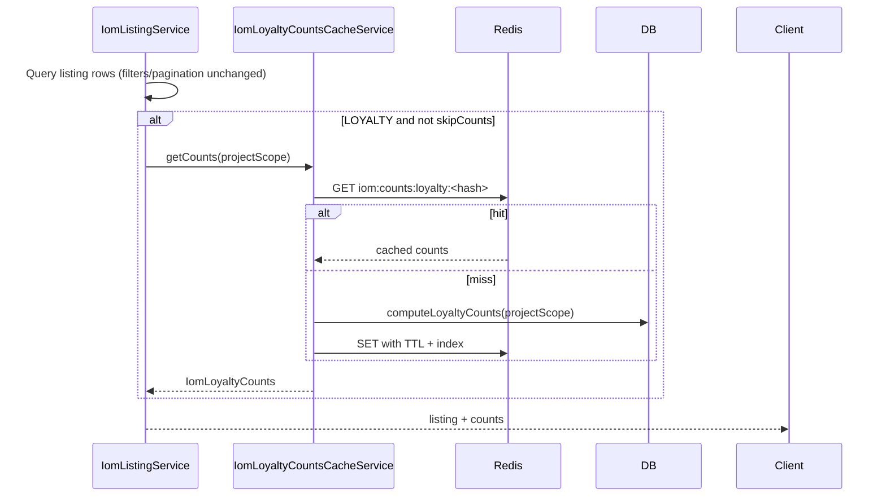

# PN-51_2 Implementation Plan: Redis-Cached LOYALTY IOM Tab Counts

## Overview

Add Redis-backed caching for LOYALTY-role IOM listing tab counts (`iomRequestInvoice`, `pendingSubmission`, `submittedInvoice`) on `GET /iom/listing`. Reuse the existing global `CacheModule` (Redis via `cache-manager-ioredis-yet` in `src/app.module.ts`). Keep listing row queries unchanged; only the count path is cached. Invalidate on IOM mutations via the existing `IOM_HISTORY_EVENT` pipeline.

## Current State (from codebase)

| Area | Location | Notes |
|------|----------|-------|
| Listing endpoint | `src/modules/iom/iom.controller.ts` → `IomListingService.findIoms` | LOYALTY users receive `counts` on paginated listing |
| Count computation | `IomListingService.computeLoyaltyCounts` | Single DB aggregate via `buildLoyaltyCountsSelect()` |
| Count scope | `resolveLoyaltyProjectScope` | Uses all authorized projects, or intersects with explicit `projects` filter |
| Tab/list filters | `applyLoyaltyTabFilter`, `applyListingFilters` | Applied only to listing rows, not count SQL today |
| Export | `IomExportService` → `findIoms(..., { skipPagination: true })` | Uses only `items`; counts are computed but discarded |
| Redis infra | `CacheModule.registerAsync` in `src/app.module.ts` | Global; inject `@Inject(CACHE_MANAGER) private cache: Cache` |
| Mutation events | `IOM_HISTORY_EVENT` from approve/reject/cancel/crm services | Event has `iomId` but not `projectId` |
| Invoice writes | None in `src/modules/iom/` yet | Entity exists; invalidation must be forward-compatible |

**Naming note:** Spec Redis example uses `submitted`; the API contract uses `submittedInvoice` (`IomLoyaltyCounts`). Store and return `submittedInvoice` to match the existing response shape.

---

## Target Files

### Create

- `src/modules/iom/services/iom-loyalty-counts-cache.service.ts` — cache read/write/invalidate helpers
- `src/modules/iom/services/iom-loyalty-counts-cache.listener.ts` — `@OnEvent(IOM_HISTORY_EVENT)` invalidation handler
- `src/modules/iom/utils/iom-loyalty-counts-cache.util.ts` — key builder, `projectScopeHash`, JSON parse/serialize
- `src/modules/iom/services/iom-loyalty-counts-cache.service.spec.ts` — unit tests for cache service
- `src/modules/iom/services/iom-loyalty-counts-cache.listener.spec.ts` — unit tests for listener (optional but recommended)

### Modify

- `src/modules/iom/services/iom-listing.service.ts` — integrate cache on LOYALTY count path; add `skipCounts` option
- `src/modules/iom/iom.module.ts` — register new providers
- `src/modules/iom/constants.ts` — cache key prefix, TTL constant, loyalty-relevant status set (if needed)
- `src/modules/iom/services/iom-listing.service.spec.ts` — cache hit/miss/fallback tests
- `src/modules/iom/services/iom-export.service.ts` — pass `skipCounts: true` through listing call (behavior unchanged, avoids wasted work)

### Do not modify

- `src/modules/iom/iom.controller.ts` (unless wiring is needed — prefer keeping logic in services)
- Export column/format logic
- Non-LOYALTY listing behavior

---

## Context Budget

- Inspect **Target Files** first; do not scan the full repo.
- Open non-target files only for: `Cache` usage patterns (`src/modules/google/google.service.ts`), `IOM_HISTORY_EVENT` emit sites, and `jest` mock patterns in existing IOM specs.
- Use native edit tools; do not paste full file contents or large diffs in chat.
- Run only validation commands listed below for the changed surface.

---

## Design

### Cache key and value

```
Key:   iom:counts:loyalty:<projectScopeHash>
Value: { "iomRequestInvoice": number, "pendingSubmission": number, "submittedInvoice": number }
TTL:   600_000 ms (10 minutes) — define as `IOM_LOYALTY_COUNTS_CACHE_TTL_MS` in `src/modules/iom/constants.ts`
```

### `projectScopeHash`

Deterministic SHA-256 hex digest of **sorted ascending** project IDs in the count scope:

```typescript
createHash('sha256').update([...projectScope].sort((a, b) => a - b).join(',')).digest('hex')
```

Count scope = existing `resolveLoyaltyProjectScope(filters, authorizedProjects)` output (preserve current behavior and existing spec tests around project filtering).

### Read flow (`IomListingService.findIoms`)



Steps:

1. Keep existing listing query path unchanged.
2. Gate cache logic: `user.role === RolesEnum.LOYALTY && !options?.skipCounts`.
3. Extract `computeLoyaltyCounts` call into cache service wrapper:
   - Try `cache.get(key)`
   - On miss: call existing DB logic (move or inject `IomListingService.computeLoyaltyCounts` into cache service, or pass a callback — prefer extracting count query to a package-private method both can call)
   - On hit: parse JSON, validate three numeric fields
4. **Redis failure:** catch errors, log, fall back to DB `computeLoyaltyCounts` (per spec assumption #4 / implementation note #6). Do not fail the listing request.
5. **Export path:** extend `FindIomsOptions` with `skipCounts?: boolean`; set `skipCounts: true` in `findAllForExport`. Export output must remain identical.

### Invalidation flow

Hook a new listener on `IOM_HISTORY_EVENT` (same pattern as `iom-history.listener.ts`):

1. Load IOM by `event.iomId` to get `projectId` (minimal select: `id`, `projectId`, `statusId`).
2. Call `IomLoyaltyCountsCacheService.invalidateForProject(projectId)`.
3. Swallow/log invalidation errors — must not break the originating mutation (mirror history listener behavior).

**Project-scoped invalidation index** (required because keys are hashed scopes):

- On **SET** count cache key `K` for scope `[p1, p2, ...]`:
  - For each `projectId` in scope: `SADD iom:counts:loyalty:idx:<projectId> K`
  - Set TTL on index keys ≥ count TTL (or refresh on each write)
- On **invalidateForProject(P)**:
  - `SMEMBERS iom:counts:loyalty:idx:P`
  - `DEL` each count key
  - `DEL iom:counts:loyalty:idx:P`

Access Redis set commands via the underlying ioredis client from the cache store (common with `cache-manager-ioredis-yet`), or a thin helper using the same `CACHE_HOST`/`CACHE_PORT` config. Do not add a second Redis connection unless store access is unavailable.

**Mutation coverage today (via `IOM_HISTORY_EVENT`):**

- `IomApproveService.approveIom` — includes finance approval → points stages
- `IomRejectService.rejectIom` — invoice approval/rejection transitions
- `IomCancelService.deleteIom` — IOM closed/deleted
- `IomCrmService` — submit/resubmit/edit status transitions

**Future invoice endpoints:** No invoice write services exist yet. When invoice create/submit handlers are added (PN-51 or follow-up), they must call `invalidateForProject(iom.projectId)` directly if they do not emit `IOM_HISTORY_EVENT`.

**Do not invalidate** on `GET /iom/listing` or other read paths.

---

## Implementation Steps

### Step 1 — Utilities and constants

1. Add to `src/modules/iom/constants.ts`:
   - `IOM_LOYALTY_COUNTS_CACHE_PREFIX = 'iom:counts:loyalty'`
   - `IOM_LOYALTY_COUNTS_CACHE_INDEX_PREFIX = 'iom:counts:loyalty:idx'`
   - `IOM_LOYALTY_COUNTS_CACHE_TTL_MS = 10 * 60 * 1000`
2. Create `iom-loyalty-counts-cache.util.ts` with:
   - `buildLoyaltyCountsCacheKey(projectScope: number[]): string`
   - `buildProjectIndexKey(projectId: number): string`
   - `parseCachedLoyaltyCounts(raw: unknown): IomLoyaltyCounts | null`

### Step 2 — Cache service

Create `IomLoyaltyCountsCacheService`:

```typescript
// Public API (illustrative)
getCounts(projectScope: number[], compute: () => Promise<IomLoyaltyCounts>): Promise<IomLoyaltyCounts>
invalidateForProject(projectId: number): Promise<void>
```

- Inject `CACHE_MANAGER`.
- `getCounts`: get → validate → return; miss → compute → set with TTL → update project index → return.
- `invalidateForProject`: index lookup + delete (best-effort, logged on failure).

### Step 3 — Wire listing service

In `iom-listing.service.ts`:

1. Inject `IomLoyaltyCountsCacheService`.
2. Replace direct `computeLoyaltyCounts` calls with cache service when LOYALTY && !skipCounts.
3. Keep `zeroLoyaltyCounts` / early-return paths unchanged (no cache read when scope is empty).
4. Add `skipCounts?: boolean` to `FindIomsOptions`.

In `iom-export.service.ts`:

```typescript
await this.iomListingService.findIoms(user, filters, {
  skipPagination: true,
  skipCounts: true,
});
```

### Step 4 — Invalidation listener

Create `IomLoyaltyCountsCacheListener`:

- `@OnEvent(IOM_HISTORY_EVENT, { async: true })`
- Load `projectId` from IOM repo
- Call `invalidateForProject(projectId)`

Register in `iom.module.ts` alongside existing providers.

### Step 5 — Module registration

Update `iom.module.ts` providers array with cache service + listener. No new imports module needed (`CacheModule` is global).

### Step 6 — Unit tests

**`iom-loyalty-counts-cache.service.spec.ts`:**

- Cache hit returns parsed counts without calling compute
- Cache miss calls compute, sets Redis with correct key/TTL, registers index
- Redis get throws → falls back to compute
- `invalidateForProject` deletes indexed keys

**`iom-listing.service.spec.ts` (extend LOYALTY describe block):**

- Mock `IomLoyaltyCountsCacheService`
- Verify cache service called for LOYALTY listing
- Verify cache service **not** called for CRM user
- Verify cache service **not** called when `skipCounts: true`
- Verify listing filters still applied to listing QB independently of counts

**Optional listener spec:**

- On history event, loads IOM and calls `invalidateForProject`
- Errors in invalidation do not throw

---

## Validation Commands

Run from repo root:

```bash
npm run test -- src/modules/iom/services/iom-loyalty-counts-cache.service.spec.ts
npm run test -- src/modules/iom/services/iom-listing.service.spec.ts
npm run test -- src/modules/iom/iom.controller.spec.ts
npm run lint
npm run build
```

Manual smoke (if Redis available locally):

1. LOYALTY user calls `GET /api/iom/listing` twice — second response should not trigger DB count query (observe logs or Redis `GET iom:counts:loyalty:*`).
2. Apply `listType`, `search`, pagination — tab counts stay stable; only `items`/`total` change.
3. Approve/reject/close an IOM — next listing call repopulates cache (counts reflect mutation).
4. CRM user listing — no `counts` field, no Redis keys written.
5. Export — same Excel output as before.

---

## Risks and Mitigations

| Risk | Mitigation |
|------|------------|
| Hashed scope keys hard to invalidate | Maintain per-project Redis index sets on write |
| `cache-manager` lacks `SADD`/`SMEMBERS` | Access underlying ioredis client from store, or minimal Redis helper using existing `CACHE_HOST`/`CACHE_PORT` |
| Spec `submitted` vs API `submittedInvoice` | Use `submittedInvoice` everywhere in code/Redis JSON |
| Invoice mutation endpoints not implemented | Document forward-compat: future writers must call invalidation |
| Export accidentally changes | Only add `skipCounts`; do not alter export filters/columns |
| Project filter vs AC3 "unfiltered counts" | Preserve current `resolveLoyaltyProjectScope` behavior and existing tests; project filter still narrows counts today |
| Global `CACHE_TTL` config differs from 10 min | Pass explicit TTL on `cache.set()` (same pattern as `google.service.ts`) |

---

## Assumptions

1. **TTL:** 600 seconds (10 minutes), hardcoded constant unless product confirms env configurability (open question #1).
2. **Count scope:** Same as today — `resolveLoyaltyProjectScope` output, not further narrowed by `listType`/search/status/pagination (already true).
3. **Hash input:** Sorted project ID list only (no user ID in key — scope is project-set based; open question #2).
4. **Redis down:** Fall back to DB counts for LOYALTY; listing succeeds (open question #4 — default to degraded mode).
5. **PN-51 parent work:** Count fields already wired on listing API; this story changes fetch mechanism only (open question #5 — confirmed by existing `computeLoyaltyCounts` usage).
6. **Invalidation breadth:** Any `IOM_HISTORY_EVENT` for an IOM invalidates all cached scopes indexed under that IOM's `projectId` (acceptable over-invalidation vs stale counts).
7. **Same Redis instance** used by `CacheModule` and websocket publishers (`CACHE_HOST`/`CACHE_PORT`).
