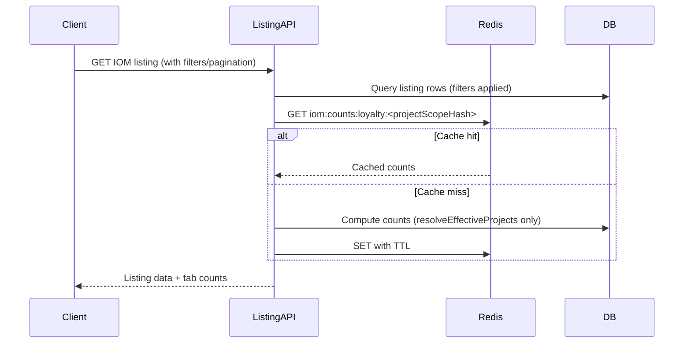
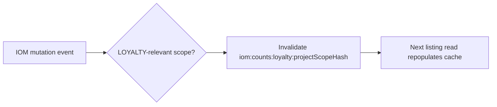

# PN-51_2: Using Redis for IOM Count

## Story Metadata

| Field | Value |
|-------|-------|
| **Key** | PN-51_2 |
| **Title** | Using redis for IOM count |
| **Branch** | `feature/PN-51` |
| **Repository role** | Backend API only (NestJS REST, `api` global prefix) |

## Summary

Optimize LOYALTY-role IOM listing tab counts (`iomRequestInvoice`, `pendingSubmission`, `submitted`) by caching them in Redis instead of recomputing on every listing API call. Counts are independent of UI filters and pagination but must respect project scope via `resolveEffectiveProjects`. Cache entries are invalidated on IOM state mutations and expire after a safety TTL.

## Problem Statement

- IOM tab counts do not depend on UI filters or pagination.
- Recomputing these counts on every listing API call is inefficient and adds unnecessary database load.

## Goals

1. Serve LOYALTY tab counts from Redis on listing API reads.
2. Compute counts from the database only on cache miss.
3. Invalidate cache entries when IOM-related data changes.
4. Preserve existing behavior for non-LOYALTY roles and export flows.

## Scope

### In Scope

- Redis caching for three LOYALTY tab counts on the IOM listing API response.
- Cache key design scoped by `projectScopeHash`.
- Cache miss fallback: DB computation with `resolveEffectiveProjects` only.
- Event-driven cache invalidation on IOM state mutations.
- Configurable safety TTL (e.g., 10 minutes).

### Out of Scope

- Caching or count calculation for non-LOYALTY roles.
- Changes to export functionality.
- Applying listing UI filters to cached counts.
- Invalidation on read-only operations.

## Requirements

### Functional

1. **LOYALTY-only caching**  
   When the authenticated user has the LOYALTY role, the IOM listing API must return tab counts sourced from Redis when available.

2. **Cached counts**  
   Cache and return exactly these three counts:
   - `iomRequestInvoice`
   - `pendingSubmission`
   - `submitted`

3. **Listing data vs. counts separation**  
   - Apply listing filters (search, status, pagination, etc.) **only** to the listing data query.
   - Tab counts must **not** be affected by UI filters or pagination.

4. **Project scope**  
   Counts must respect effective project scope via `resolveEffectiveProjects` (applied during DB computation on cache miss and reflected in the cache key scope).

5. **Cache miss behavior**  
   On cache miss:
   - Compute counts from the database.
   - Apply **only** `resolveEffectiveProjects` (no UI filters).
   - Store the result in Redis.
   - Return counts in the listing API response.

6. **Cache invalidation**  
   Invalidate the relevant Redis key(s) on any IOM state mutation, including:
   - IOM status update
   - Invoice created
   - Invoice submitted
   - Invoice approval / rejection
   - IOM closed  
   Do **not** invalidate on read operations.

7. **Safety TTL**  
   Set a TTL on cached entries (e.g., 10 minutes) to limit staleness in edge cases where invalidation may be missed.

8. **Non-LOYALTY roles**  
   For users without the LOYALTY role:
   - Do not use Redis for counts.
   - Do not calculate or return these tab counts.
   - Preserve existing API behavior with no functional change.

9. **Export**  
   Export functionality must remain unchanged and must not be affected by Redis caching logic.

### Non-Functional

1. Cache read path should add minimal latency compared to per-request DB count queries.
2. Invalidation must be reliable enough that TTL is a safety net, not the primary freshness mechanism.
3. Follow existing repository patterns for Redis integration, dependency injection, and API response envelopes (`success-response-errors`).

## Acceptance Criteria

- [ ] **AC1 — LOYALTY listing uses Redis**  
  Given a LOYALTY user calls the IOM listing API, when a valid cache entry exists for their `projectScopeHash`, then tab counts are returned from Redis without a DB count query.

- [ ] **AC2 — Cache miss computes and stores**  
  Given a LOYALTY user calls the IOM listing API, when no cache entry exists, then counts are computed from the DB using only `resolveEffectiveProjects`, stored in Redis under `iom:counts:loyalty:<projectScopeHash>`, and returned in the response.

- [ ] **AC3 — Counts ignore UI filters**  
  Given a LOYALTY user applies listing filters (search, status, pagination, etc.), when the API responds, then tab counts remain unchanged from the unfiltered scope-based counts (only listing rows are filtered).

- [ ] **AC4 — Counts respect project scope**  
  Given different effective project scopes (different `projectScopeHash` values), when counts are cached and retrieved, then each scope receives counts computed only for its resolved projects.

- [ ] **AC5 — Correct cached shape**  
  Redis value for each key is a JSON object:
  ```json
  {
    "iomRequestInvoice": <number>,
    "pendingSubmission": <number>,
    "submitted": <number>
  }
  ```

- [ ] **AC6 — Invalidation on mutations**  
  Given a cached LOYALTY count entry exists, when any of the following occur — IOM status update, invoice created, invoice submitted, invoice approval/rejection, IOM closed — then the affected `iom:counts:loyalty:<projectScopeHash>` key is invalidated (deleted or otherwise made stale before next read).

- [ ] **AC7 — No invalidation on read**  
  Given a LOYALTY user performs read-only listing or detail fetches, when no mutating IOM event occurs, then Redis cache entries are not invalidated.

- [ ] **AC8 — TTL safety net**  
  Given a cache entry is written, when no invalidation occurs, then the entry expires automatically after the configured TTL (default expectation: ~10 minutes).

- [ ] **AC9 — Non-LOYALTY unchanged**  
  Given a non-LOYALTY user calls IOM APIs, when the request is processed, then no Redis count logic runs, no tab counts are calculated, and response behavior matches pre-change behavior.

- [ ] **AC10 — Export unaffected**  
  Given a user triggers IOM export, when export runs, then behavior and output are identical to pre-change behavior regardless of Redis cache state.

## Technical Design

### Redis Key Format

```
iom:counts:loyalty:<projectScopeHash>
```

- `projectScopeHash`: deterministic hash derived from the effective project scope produced by `resolveEffectiveProjects` for the requesting user/context.
- One key per distinct project scope for LOYALTY users.

### Redis Value

```json
{
  "iomRequestInvoice": number,
  "pendingSubmission": number,
  "submitted": number
}
```

### Read Flow (Listing API — LOYALTY only)



### Invalidation Flow



Invalidate on:
- IOM status update
- Invoice created
- Invoice submitted
- Invoice approval / rejection
- IOM closed

Do not invalidate on read paths.

## Implementation Notes

1. **Identify integration points** during planning:
   - IOM listing API handler/service (read path).
   - Existing count computation logic (reuse for cache miss).
   - `resolveEffectiveProjects` helper (scope + hash input).
   - Mutation handlers/services for each invalidation trigger listed above.

2. **Reuse existing Redis infrastructure** if present in the codebase (module, client wrapper, config). If none exists, add minimal Redis client integration consistent with project conventions.

3. **Hash stability**: `projectScopeHash` must be stable for the same resolved project set and change when effective scope changes.

4. **Invalidation granularity**: Prefer invalidating the specific scope key affected by a mutation. If a mutation spans multiple scopes, invalidate all affected keys.

5. **Role gating**: Guard all Redis read/write/invalidate logic behind LOYALTY role checks early to avoid impacting other roles.

6. **Error handling**: On Redis unavailability, fall back to DB count computation for LOYALTY users (degraded but functional) unless existing project standards dictate otherwise.

7. **Response contract**: Attach counts to the existing listing API response shape without breaking the `success-response-errors` envelope.

8. **No export changes**: Ensure export code paths do not import or call the new caching layer.

## UI Notes

No UI changes required. This is a backend performance optimization. The frontend continues to consume tab counts from the listing API response; counts should remain stable when users change filters or pages.

## Assumptions

1. Redis is available (or can be configured) in target environments for this API service.
2. `resolveEffectiveProjects` already exists and defines the correct project scope for LOYALTY count computation.
3. Existing count definitions for `iomRequestInvoice`, `pendingSubmission`, and `submitted` are correct; this story changes **how** counts are fetched, not **what** they measure.
4. `projectScopeHash` can be derived deterministically from the resolved project scope (sorted project IDs or equivalent).
5. A TTL of approximately 10 minutes is acceptable unless product specifies otherwise.
6. Parent story PN-51 may cover related IOM work on the same branch; this story is limited to Redis-backed LOYALTY tab counts.

## Open Questions

1. **Exact TTL value** — Story suggests "e.g. 10 minutes." Confirm whether 600 seconds is the required default or should be environment-configurable.
2. **`projectScopeHash` algorithm** — Confirm canonical inputs (sorted project ID list, user ID, org context, etc.) to avoid duplicate keys or missed invalidations.
3. **Invalidation scope on multi-project mutations** — When a mutation affects IOMs across multiple project scopes, should all related keys be invalidated or is a broader pattern (e.g., prefix flush) preferred?
4. **Redis failure mode** — Should listing fail, or silently fall back to DB counts, when Redis is down?
5. **Existing PN-51 work** — Confirm whether PN-51 (parent) already introduced count fields on the listing API or if this story also wires count attachment for the first time.

## References

- Story execution input: `execution.json` (PN-51_2, branch `feature/PN-51`)
- Target spec path: `docs/ai/stories/PN-51_2/spec.md`
- Context map: `docs/ai/context-map.json` (API conventions, commands)
- Deeper docs (if needed during implementation): `docs/PE-483-bulk-transaction-api-flow.md`
