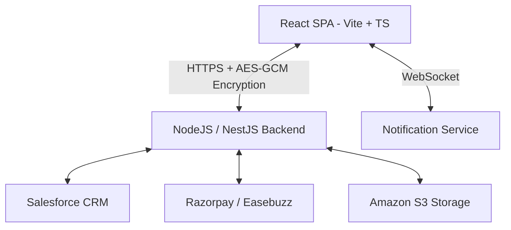
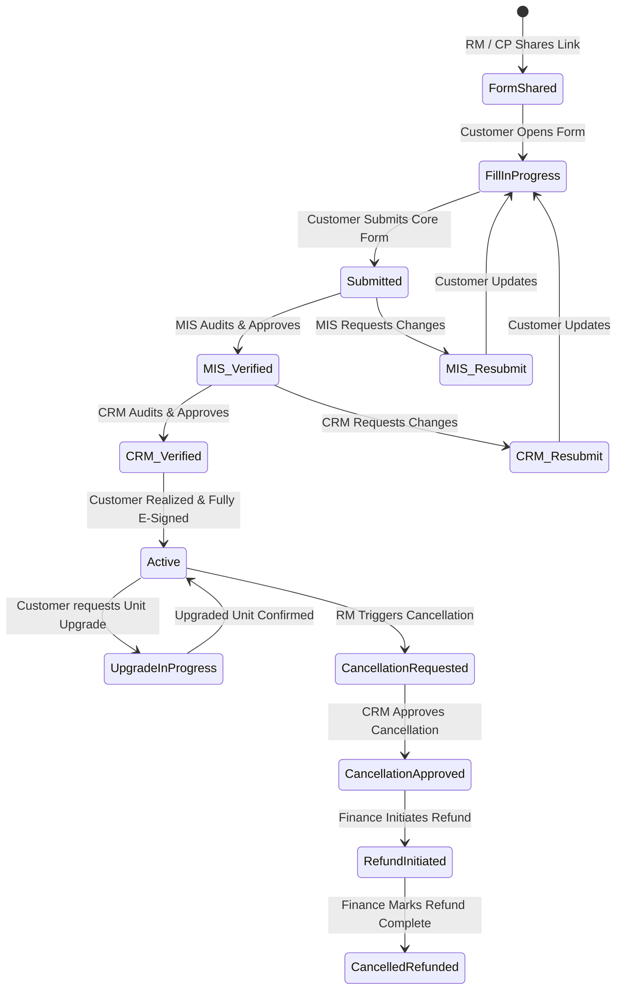

# Puravankara Portal: Project Architecture & Development Guide

Welcome to the **Puravankara Portal** codebase. This document serves as a comprehensive, deep-dive architectural and functional overview of the frontend application. It is designed to get any new developer up to speed on the system's design, technology stack, directory layout, role-based workflows, state management, security policies, and integration points with absolute accuracy and evidence from the actual codebase.

---

## 1. Project Overview

### Purpose of the Application
The **Puravankara Portal** is a high-performance, responsive enterprise web portal developed for **Puravankara Limited** (including its sub-brands **Provident Housing** and **Purva Land**). The portal coordinates and digitizes real estate transactions, customer interactions, lead handling, unit booking, inventory control, and sales incentives. 

### High-Level Business Domain
The core business domain is **Real Estate Transactions & Sales Operations**. Key operational phases managed by this platform include:
1. **Site Visits & Pre-Sales**: GRE (Guest Relations Executive) logs and schedules walks/site-visits for prospective buyers.
2. **Expression of Interest (EOI)**: Digital creation, verification, and collection of deposits (standard and preferential EOIs) for upcoming projects and launches.
3. **Unit Booking & Allotment**: The RM (Relationship Manager) assigns, blocks, and releases inventory units, bridging the gap between digital EOIs and physical apartment allocations.
4. **E-Signatures & Document Verifications**: Customers digitally sign booking sheets and RMs upload physical copies for compliance.
5. **Incentives & Performance (Gamification)**: Sales Teams (TLs, RSHs, BHs, and RMs) receive real-time rewards, target tracking, leaderboard standing, and booster payouts.
6. **Support & Operations**: MIS (Management Information Systems), CRM (Customer Relationship Management), and Finance Admins verify transactions, confirm bank realizations, process cancellations, and manage payroll.

### Overall Architecture Summary

The application is structured as a **Single Page Application (SPA)** using **React 18**, **Vite** as the bundler, and **TypeScript** for strict static typing. The UI is built entirely using **Material-UI (MUI v5)**, utilizing dynamic theme configurations and glassmorphic micro-animations. It communicates with a backend REST API via customized, encrypted Axios channels, and integrates real-time notifications via WebSockets.

---

## 2. Tech Stack Analysis

| Technology / Component | Library & Version | Purpose & Implementation Details |
| :--- | :--- | :--- |
| **UI Framework & Core** | React `^18.3.1` / React DOM `^18.3.1` | Concurrent rendering, virtual DOM state, hook-driven architecture. |
| **Build & Bundling** | Vite `^5.3.0` | Ultra-fast HMR, ES Modules compilation, manual chunk-splitting configurations. |
| **Compiler** | SWC (`@vitejs/plugin-react-swc`) | Rust-based compiler for superfast React builds. |
| **Language** | TypeScript `^5.4.5` | Strict type safety, clean interface declarations. |
| **State Management** | Redux Toolkit `^2.11.2` / React Redux `^9.2.0` | Global central store with slice-based dispatch and selector structure. |
| **Routing** | React Router DOM `^6.23.1` | Lazy-loaded routes segmented by user roles, route guards (`AuthGuard`, `GuestGuard`). |
| **API Client** | Axios `^1.13.2` | Interceptor-wrapped instances featuring dynamic body/payload cryptography. |
| **Form Management** | `react-hook-form` `^7.51.5` / `formik` `^2.4.9` | Hybrid strategy: RHF for administrative/creation forms; Formik for post-booking forms. |
| **Validation** | `yup` `^1.6.1` / `zod` `^3.23.8` | Yup handles Formik document validations; Zod validates RHF fields. |
| **UI Kit & Components**| `@mui/material` `^5.16.14` / `@mui/x-data-grid` `^7.7.0` | Premium data grids, date-pickers, tree views, and custom themed components. |
| **Styling** | Emotion React/Styled, Vanilla CSS, Sass | Emotion-based MUI theme overlays combined with local layout styles (`global.css`). |
| **Authentication** | Custom JWT Token Auth | Access & refresh token mechanics with local/cookie cache and automated refresh triggers. |
| **Security** | Turnstile, AES-GCM Encryption, CSP | Cloudflare Turnstile on login; Web Crypto API AES-GCM on request/response; custom build-time CSP injector. |
| **Monitoring** | `@sentry/react` `^10.32.1` | Production exception tracing and log capturing. |
| **Testing** | Vitest `^3.0.5` / Testing Library | Speed-optimized replacement for Jest, using jsdom environment. |

---

## 3. Folder Structure Explanation

```
/puravankara-portal
├── .env.example              # Template configuration variables
├── csp/                      # Content Security Policy (CSP) JSON configs
│   ├── buildCSP.js
│   ├── csp.development.json
│   ├── csp.staging.json
│   └── csp.production.json
├── vite-plugin-csp.ts        # Custom Vite build-time CSP injector
├── vite.config.ts            # Vite configuration with code splitting rules
├── tsconfig.json             # TypeScript configuration with base URL mapping
└── src/                      # Application Source Code
    ├── main.tsx              # App bootstrap, Sentry init, and providers mounting
    ├── app.tsx               # Main component wrapped in Store, Auth, and Theme Providers
    ├── config-global.ts      # Global environment exports, Sentry DSN, maps, API hosts
    ├── global.css            # Root stylesheet (contains layout and typography definitions)
    ├── auth/                 # Authentication contexts and route guards
    │   ├── context/          # Context definitions for JWT authentication
    │   ├── guard/            # Guards (AuthGuard, GuestGuard)
    │   └── hooks/            # useAuthContext react hook
    ├── components/           # Core reusable UI elements (Snackbar, Animate, Scroll)
    ├── hooks/                # Custom React/Redux hooks (use-redux, use-set-state)
    ├── layouts/              # Theme page shells (DashboardLayout, AuthSplitLayout)
    ├── locales/              # Multi-lingual configurations (LocalizationProvider)
    ├── pages/                # Lazy-loaded page route declarations mapped by roles
    ├── redux/                # Redux Toolkit actions, slices, and global store config
    │   ├── store.ts          # Root Redux store configuration
    │   ├── store-provider.tsx# Store injection component
    │   ├── slices/           # State slices (auth, userList, projects, eoi, etc.)
    │   └── actions/          # Asynchronous thunks for API transactions
    ├── routes/               # Declarative client-side paths and section routing
    │   ├── paths.ts          # Registry of URL constants for all platforms
    │   └── sections/         # Sub-route routers mapped dynamically by user role
    ├── sections/             # Core UI components containing feature-rich dashboards
    │   ├── common-module/    # Shared sub-modules (inventory, bank details, EOI)
    │   ├── admin/            # Administrative tables and dashboard charts
    │   ├── rm-panel/         # Relationship manager specific layouts and post-booking forms
    │   └── gre-panel/        # Reception and site-visit registrations
    ├── services/             # Endpoint definitions and primary Axios instances
    │   ├── apiRoutes.ts      # Merged list of backend service URLs
    │   ├── axiosInstance.ts  # Exported GET, POST, PUT, DELETE, PATCH services
    │   └── axiosInterceptors.ts # Request encryption & Response decryption interceptors
    ├── theme/                # Custom MUI palette, design tokens, and CSS overrides
    ├── types/                # Strict TypeScript interface declarations
    └── utils/                # Utility toolbelt (encryption, time, formatting, constants)
        ├── constant.ts       # Shared Enums (ROLES, EOIFormStatus, UnitBlockingStatus)
        ├── encryption.ts     # AES-GCM encryption/decryption routines using Web Crypto API
        ├── useEasebuzzPayment.ts # Hook wrapping script load & configuration of Easebuzz SDK
        └── useRazorpayPayment.ts # Hook wrapping script load & configuration of Razorpay SDK
```

---

## 4. Role-Based System Analysis

The system implements a robust, dynamic **Role-Based Routing** system. Access control is enforced at compile-time via route configurations, and at runtime via Redux state checking.

### System User Roles & Permissions
1. **Super Admin**: Full platform access. Manages users, projects, master configurations, brand templates, Sfdc synchronization logs, and incentives.
2. **Admin (Super User BI Team)**: Has almost parallel capabilities to the Super Admin, managing masters, booster/incentive policy definitions, leaderboard summaries, and global project structures.
3. **BIS (Business Information Systems)**: Read-heavy auditor/management role. Accesses masters, incentives dashboards, leaderboards, unit inventories, and campaign records, but does not execute booking modifications.
4. **RM (Relationship Manager)**: Core customer-facing role. Starts digital bookings, records offline/online customer transactions, blocks inventory units, triggers digital E-Signs, uploads customer KYC files, and tracks personal incentive progress.
5. **Sales TL (Team Lead)**: Sales manager. Oversees assigned team RMs, approves EOI drafts, views inventory status, and checks team leaderboard structures.
6. **Sales RSH (Regional Sales Head)**: Oversees regions. Tracks performance logs, processes regional batches, accesses EOI stats, and reviews CP lists.
7. **Sales BH (Business Head)**: Top tier sales executive. Read-only review of regional EOI metrics, campaign realizations, and leaderboards.
8. **CRM (Customer Relationship Management)**: Verification officer. Reviewer/Checker for EOI forms. Moves EOI status to CRM Verified,CRM-Updated, active or cancellation workflows. Triggers customer e-sign invites.
9. **MIS (Management Information Systems)**: Financial and data integrity check. Performs first-level EOI audits, updates primary source assignments, manages inventories, and maps tower/unit values.
10. **Finance Admin (Support Department Case User)**: Audits salary structures, processes bulk excel realization uploads, confirms bank remittance details, sets verified/rejected/refund status, and runs bulk transaction uploads.
11. **GRE (Guest Relations Executive)**: Front-desk team. Captures walk-ins, records direct lead logs, handles Batch reception checking, and logs Site Visits.
12. **Project Head**: Tracks project-specific EOI counts, checks tower inventories, and reviews localized project bank parameters.

### Role-Wise Access Matrix

| Feature Area | Super Admin | Admin | BIS | RM | Sales TL | CRM | MIS | Finance | GRE | Project Head |
| :--- | :---: | :---: | :---: | :---: | :---: | :---: | :---: | :---: | :---: | :---: |
| **Manage Users** | ✔ | ✔ | ✔ (View) | ❌ | ❌ | ❌ | ❌ | ❌ | ❌ | ❌ |
| **Configure Masters** | ✔ | ✔ | ✔ (View) | ❌ | ❌ | ❌ | ❌ | ❌ | ❌ | ❌ |
| **Define Incentives** | ✔ | ✔ | ✔ (View) | ❌ | ❌ | ❌ | ❌ | ❌ | ❌ | ❌ |
| **Block / Release Units**| ✔ | ✔ | ❌ | ✔ | ✔ | ❌ | ✔ | ❌ | ❌ | ❌ |
| **Create EOI / Voucher** | ❌ | ❌ | ❌ | ✔ | ✔ | ❌ | ❌ | ❌ | ❌ | ❌ |
| **Verify EOI (MIS)** | ✔ (View) | ✔ (View) | ❌ | ❌ | ❌ | ❌ | ✔ | ❌ | ❌ | ❌ |
| **Verify EOI (CRM)** | ✔ (View) | ✔ (View) | ❌ | ❌ | ❌ | ✔ | ❌ | ❌ | ❌ | ❌ |
| **Confirm Payments** | ❌ | ❌ | ❌ | ❌ | ❌ | ❌ | ❌ | ✔ | ❌ | ❌ |
| **Register Walkins** | ❌ | ❌ | ❌ | ❌ | ❌ | ❌ | ❌ | ❌ | ✔ | ❌ |
| **Batch Management** | ✔ | ✔ | ✔ | ✔ (View) | ❌ | ✔ | ✔ | ❌ | ✔ | ❌ |
| **Export SFDC Logs** | ✔ | ❌ | ❌ | ❌ | ❌ | ❌ | ❌ | ❌ | ❌ | ❌ |

---

## 5. User Journey Analysis



### Dynamic Verification Workflow Paths
The business domain mandates rigorous validation checkpoints. A typical transaction lifecycle undergoes the following transitions:
1. **Initiation**: The customer or RM fills in the basic fields. The EOI is in `1-Form Link Shared` (`CREATED`) state. 
2. **First Audit Stage**: Once submitted, it enters `3-Form Submitted` (`UNVERIFIED`). The **MIS User** runs a validation check. If details are clean, they trigger the API to advance the state to `4-MIS Verified`. If details are erroneous, they flag it as `5-MIS-Resubmission requested`, forcing the RM/Customer to fix it, shifting status to `6-Updated as per MIS` upon correction.
3. **Second Audit Stage**: A **CRM User** performs a second-level check on the MIS-verified form. They verify secondary applicants and signatures. They promote it to `7-CRM Verified` or request changes (`8-CRM-Resubmission requested`).
4. **Activation**: Upon CRM approval and banking realization, the state is locked to `10-Active`.
5. **Cancellations**: RMs can trigger cancellation workflows. The flow progresses: `15-Cancellation Requested by RM` $\rightarrow$ `16-Cancellation Request Accepted` $\rightarrow$ `17-Cancellation – In Progress by CRM` $\rightarrow$ `18-Refund Initiated` $\rightarrow$ `19-Cancellation – Complete & Refunded`.

---

## 6. Routing & Navigation Analysis

Client-side routes are configured in `src/routes/sections/index.tsx`. The portal uses the `useRoutes` hook of `react-router-dom` to build the routing tree. 

### Role-Based Route Guards
Routes are grouped in files representing specific roles (e.g., `admin-routes.tsx`, `rm-panel-routes.tsx`, `bis-routes.tsx`). During runtime initialization, the `Router` component accesses the logged-in user profile from Redux state:

```typescript
// src/routes/sections/index.tsx (Simplified Snippet)
export function Router() {
  const { user } = useAppSelector((state) => state.auth);
  const { authenticated } = useAuthContext();
  let activeRoutes: any = [];

  switch (user?.role) {
    case ROLES.SuperAdmin:
      activeRoutes = [superAdminRoutes, sharedRoutes, notFound];
      break;
    case ROLES.RM:
      activeRoutes = [rmPanelRoutes, sharedRoutes, notFound];
      break;
    case ROLES.FinanceAdmin:
      activeRoutes = [financeAdminRoutes, notFound];
      break;
    // ... remaining roles ...
    default:
      activeRoutes = !authenticated
        ? [ superAdminRoutes, adminRoutes, rmPanelRoutes, ...notFound ] // Guest access
        : [];
  }

  return useRoutes([...defaultRoutes, ...activeRoutes]);
}
```

### Lazy Loading Strategy
All page components are imported dynamically using React's `lazy` function (e.g., `const EditUserPage = lazy(() => import('src/pages/admin/user/edit'))`). Route matching renders these components inside a `<Suspense>` wrapper utilizing a localized `<LoadingScreen />` fallback to optimize initial load times.

---

## 7. API Integration Analysis

### Custom Axios Setup with Request/Response Payload Cryptography
The application communicates with a backend REST server utilizing a customized client configuration defined in `src/services/axiosInterceptors.ts`.

#### Encryption/Decryption Handshake
To prevent data tampering, all data modifications (POST, PUT, DELETE, PATCH) are automatically encrypted on the client side, and incoming payloads are decrypted in real-time.

```typescript
// src/services/axiosInterceptors.ts (Simplified Logic)
Axios.interceptors.request.use(
  async (config) => {
    const token = localStorage.getItem(STORAGE_KEY);
    if (token) {
      config.headers.Authorization = `Bearer ${token}`;
    }

    const method = (config.method || 'get').toLowerCase();
    const hasBody = ['post', 'put', 'patch', 'delete'].includes(method);
    const body = config.data;

    // Encrypt request body if encryption is globally enabled
    if (enableEncryption && hasBody && body != null && !(body instanceof FormData)) {
      const encrypted = await encryptText(JSON.stringify(body));
      config.data = { payload: encrypted }; // Replaces raw JSON with an encrypted package
    }
    return config;
  }
);

Axios.interceptors.response.use(
  async (response) => {
    const data = response?.data;
    
    // Case 1: Decrypt primary level payload
    if (enableEncryption && typeof data?.payload === 'string') {
      const decrypted = await decryptText(data.payload);
      response.data = JSON.parse(decrypted);
      return response;
    }
    
    // Case 2: Decrypt nested response structures
    if (enableEncryption && typeof data?.response?.data === 'string') {
      const decrypted = await decryptText(data.response.data);
      response.data.response.data = JSON.parse(decrypted);
      return response;
    }
    return response;
  }
);
```

### Frontend Screen $\rightarrow$ API Route $\rightarrow$ Backend Mapping (Examples)

| Frontend View / Action | Redux Action / Trigger | Backend Endpoint Route |
| :--- | :--- | :--- |
| **Admin User List** | `getUserList` | `GET /users` |
| **Confirm SSO Verification** | `verifyOtp` | `POST /sso/verify-otp` |
| **Save EOI Voucher** | `createVoucherEOI` | `POST /eoi-management/create-voucher-form` |
| **RM Block Unit** | `blockInventoryUnit` | `POST /inventory-unit/block-inventory-unit` |
| **CRM Approve EOI Cancel** | `approveCancellation` | `POST /eoi-management/approve-cancel-request` |
| **Finance Realize Payments**| `saveFinanceTxnDocument` | `POST /eoi-management/bulk-update-transactions` |
| **Upload Reception site walk**| `patchVisit` | `PATCH /site-visit-form/updateForm` |
| **Create Group Booking** | `createMultiUnits` | `POST /sales/create-booking-group` |

---

## 8. State Management Analysis

### Global Redux Tree Structure
The global Redux store (`src/redux/store.ts`) acts as the single source of truth for the frontend application. It contains distinct slices, isolating states by domain/feature area:
* `auth`: Active user session parameters, logged-in status, access levels, permissions.
* `dashboard`: Opportunity assignment maps, RM post-booking entries, document collections.
* `expressonOfInterest`: Detailed EOI records, filters, transaction list maps, check statuses.
* `unitInventory`: Blocked unit state, tower coordinates, launch filters.
* `batchManager`: Reception logs, slot sizes, check-in histories.
* `incentiveDashboard`: Active RM target values, booster reward counters, dynamic KPI graphs.

### Caching Strategy
Redux state is volatile, but critical state structures (such as session tokens) are persistent. The token expiration mechanism `tokenExpired(exp)` checks validity against locally stored JWT parameters:
1. `localStorage.getItem('accessToken')` reads cached tokens.
2. If token expiration is impending, the client dispatches a payload to `POST /sso/refresh-token` (`refreshTokenAPI()`) to obtain a new, valid token.
3. On application exit, `signOut()` executes a clean teardown, performing `Cookies.remove('accessToken')`, clearing `localStorage`, and resetting the global Redux state.

---

## 9. Form System Analysis

The system employs a **hybrid form architecture** designed to balance flexibility in user-facing workflows with schema strictness in financial/booking data.

### 1. React Hook Form (RHF)
* **Usage**: Used in admin configurations, brand adjustments, user profile updates, EOI campaigns, and EOI creations (`EOIManagerForm.tsx`, `create-eoi-view.tsx`).
* **Why**: RHF provides low-overhead, fast re-renders, and is ideal for highly dynamic layouts that toggle fields on and off.
* **Validation**: Driven by **Zod Schema Resolvers**, enabling field-level checks on inputs.

### 2. Formik & Yup Validation
* **Usage**: Used in heavy post-booking pages, applicant updates, and document verification grids (`post-booking-form.tsx`, `agreement-eSignature-edit.tsx`).
* **Why**: Formik provides structured management for complex multi-step object mappings and array fields.
* **Validation**: Governed by massive **Yup Schema validations** that feature extensive conditional checks:

```typescript
// Example from src/sections/rm-panel/post-booking-form/post-booking-form.tsx
applicant1pan: yup
  .string()
  .matches(/^[A-Za-z]{5}\d{4}[A-Za-z]$/, 'PAN format error')
  .when('isPhysicalApplicant1Pan', ([isPhysical], schema) =>
    isPhysical === true ? schema.required('PAN is required') : schema.notRequired()
  )
```
These conditional validation rules handle complex edge cases, such as adjusting input validation dynamically based on whether a document was handed over physically or uploaded as a digital image.

---

## 10. Component Architecture Analysis

The frontend layout follows a clean, component-driven design system.

```
                  [ Store / Auth / Theme Providers ]
                                   │
                           [ Main layout ]
                                   │
                    ┌──────────────┴──────────────┐
             [ Smart Container ]           [ Smart Container ]
                    │                             │
             ┌──────┴──────┐               ┌──────┴──────┐
        [Dumb UI]     [Dumb UI]       [Dumb UI]     [Dumb UI]
```

### Smart vs. Dumb Component Strategy
* **Smart Components (Containers)**: Files situated directly inside `/sections` or `/pages` (e.g., `expression-of-interest-table-view.tsx`). They subscribe to the Redux store using `useAppSelector`, trigger business API requests using `useAppDispatch`, handle route transitions, and control state overlays.
* **Dumb Components (UI Presets)**: Reusable components located inside `/components` (e.g., `AnimateLogo`, `FormikAutocomplete`, `FilledButton`). They accept standard properties (props), render layout, and emit changes via callback functions, remaining decoupled from application business logic.

### Modals & Dialog Architecture
Modals are managed programmatically via declarative states. For instance, `dynamic-transaction-dialog.tsx` accepts an `open` boolean and an `onClose` callback from its parent component. Dynamic content is rendered using lazy-loaded children inside standard MUI `<Dialog>` containers.

### Tables & Grids Implementation
The portal utilizes the advanced **MUI Data Grid** (`@mui/x-data-grid`). Tables feature customized search toolbars (`eoi-table-toolbar.tsx`), column filters, and server-side pagination maps to handle large datasets efficiently.

---

## 11. Business Logic Analysis

The core business logic of the portal revolves around the **EOI and Unit Booking Life Cycle**.

### Core Workflows & Calculations

#### 1. Payment Integrations & Gateway Flow
Payments are captured via online integration hooks (`useEasebuzzPayment.ts`, `useRazorpayPayment.ts`). The payment sequence is managed securely:
1. The frontend dispatches a payload to `/payments/create-rm-order` to generate a secure transaction key.
2. The payment hook dynamically loads the required payment gateway SDK at runtime using `loadScript()`.
3. Once loaded, it initiates the secure checkout frame overlay, applying custom style overrides to ensure the checkout iframe matches the portal's brand aesthetics.
4. On transaction completion, the checkout handler captures the gateway payload and dispatches a verification request to `/payments/verify` to complete the allotment.

```
[Portal UI] ──(1. Get Token)──> [Backend API]
    │                                │
(2. Load SDK Script)            (3. Create Gateway Order)
    │                                │
    ▼                                ▼
[Populate Frame] ──(4. Pay)──> [Gateway Engine] ──(5. Verify Pay)──> [Realize Unit]
```

#### 2. Unit Swapping & Swapping Constraints
Implemented under `unit-swapping-service.ts`. RMs swap units for active customers by sending current allocation matrices to `/sales/unit-swapping`. The backend checks dependencies to ensure:
* The target apartment unit is currently marked `Available` in the tower grid.
* The customer's realized payment values meet the threshold requirements for the new unit.

#### 3. Site Visits Site-Form Registrations
Handled by the GRE panel using `site-visit-form/updateForm`. GREs record customer information, group sizes, interest thresholds, and assign a Sales RM based on availability patterns.

---

## 12. Authentication & Security

### Secure Login & Turnstile Verification
Users log in using their corporate credentials. If Turnstile is enabled (`VITE_APP_TURNSTILE_ENABLED=true`), a Cloudflare Turnstile verification challenge is rendered. The client must supply a valid `turnstileToken` to the API to execute the authentication sequence:

```typescript
// src/sections/auth/jwt/jwt-otp-sign-in-view.tsx (Conceptual Flow)
const onSubmit = async (data: FormValues) => {
  try {
    const payload = {
      email: data.email,
      otp: data.otp,
      ...(CONFIG.turnstile.enabled && { turnstileToken }), // Included conditionally
    };
    await verifySSOUser(payload);
  } catch (err) {
    showToastError(err);
  }
};
```

### Encrypted Secure Storage
Access and refresh tokens are stored in secure cookies (`js-cookie`) and `localStorage` using the system's AES-GCM encryption helper (`encryption.ts`). If session hijacking is suspected (e.g., mismatching refresh payloads), the Axios response interceptor intercepts the failure and forces a complete session clearout, redirecting the client to the sign-in page.

### Dynamic Content Security Policy (CSP) Injection
A custom Vite plugin (`vite-plugin-csp.ts`) secures built assets. During production compilation (`npm run build:prod`), the plugin reads the JSON definitions matching the environment (e.g., `csp.production.json`) and injects strict, minified `<meta http-equiv="Content-Security-Policy">` security tags directly into the header of the compiled `index.html` file.

---

## 13. Performance & Optimization

### Code Splitting & Manual Rollup Bundling
Production builds are heavily optimized inside `vite.config.ts` via dedicated manual chunking parameters:

```typescript
// vite.config.ts (Rollup build optimization rules)
output: {
  manualChunks: {
    vendor: ['react', 'react-dom'],
    mui: ['@mui/material', '@mui/icons-material'],
    redux: ['@reduxjs/toolkit', 'react-redux'],
  }
}
```
This forces Vite to isolate core frameworks into separate cached files, preventing massive single bundle assets and improving browser load speeds.

### Memoization Usage
Large dashboards utilize React's `useMemo` and `useCallback` hooks (e.g., `memoizedValue` inside `auth-provider.tsx`) to prevent redundant component re-renders when navigating complex data grids.

### Virtualization
The portal uses `@mui/x-data-grid` for large record lists, which implements row and column virtualization out-of-the-box. This ensures the browser only renders elements currently in the viewport, maintaining a smooth 60fps frame rate even when displaying thousands of inventory records.

---

## 14. Error Handling Strategy

### 1. API Error Interception & Automatic Logout
In `axiosInterceptors.ts`, the response interceptor catches all incoming HTTP status errors. If a `401 Unauthorized` is captured (and is not an OTP login attempt), the system invokes the `logoutUser()` helper, which clears `localStorage`, removes headers, and redirects the user to `/auth/jwt/sign-in`.

### 2. Sentry Global Captures
Production bugs are reported automatically to Sentry in `src/main.tsx`:
* `Sentry.browserTracingIntegration()` tracks frontend performance anomalies.
* `Sentry.captureConsoleIntegration()` intercepts and forwards standard console log levels (`log`, `warn`, `error`) based on production rules.

### 3. Toast Notifications
User-facing errors are caught in `try-catch` blocks and presented using `sonner` Toast configurations (`Snackbar` in `app.tsx`), displaying clean, user-friendly error messages instead of technical system details.

---

## 15. Environment & Configuration

The application uses Vite's `import.meta.env` system for environment variables, loaded dynamically based on the current build mode.

| Variable Name | Typical Value | Purpose / Description |
| :--- | :--- | :--- |
| `VITE_APP_ENV` | `production` / `staging` / `development` | Identifies active portal environments. |
| `VITE_SERVER_URL` | `https://api.puravankara.com/api` | Base HTTP host for REST operations. |
| `VITE_S3_BASE_URL`| `https://s3.ap-south-1.amazonaws.com/...` | Storage host for S3 uploads and pre-signed assets. |
| `VITE_APP_TURNSTILE_ENABLED` | `true` / `false` | Toggles Cloudflare spam verification gates. |
| `VITE_APP_ENCRYPTION_KEY` | Hexadecimal string (32 bytes) | Raw AES key used by the client for cryptographic operations. |
| `VITE_APP_ENABLE_ENCRYPTION` | `true` / `false` | Controls whether payload encryption is enabled. |

### Build Commands per Environment
* **Local Development**: `npm run dev:local` (runs Vite dev server against local API configurations).
* **Development Build**: `npm run build:dev` (runs `buildCSP.js` for development and builds the app in development mode).
* **Staging Build**: `npm run build:stage` (compiles and packages staging features with a staging CSP policy).
* **Production Release**: `npm run build:prod` (applies production optimization, strict CSP tags, and full bundle compression).

---

## 16. Important Reusable Modules

The portal's shared business features are isolated within `src/sections/common-module/`. These modular components are imported and reused across different dashboards depending on user roles:

### 1. `expression-of-interest`
* **Why it's important**: Central module handling EOI captures, customer details editing, and mapping.
* **Architecture**: Implements multi-step forms using React Hook Form, incorporating custom payment gateway triggers and real-time validation schemas.

### 2. `inventory`
* **Why it's important**: Grid representations of complex tower structures.
* **Architecture**: Displays interactive, color-coded apartment blocks matching standard statuses (`Available`, `Blocked`, `Pending`). RMs click to hold, block, or release units.

### 3. `batch-manager`
* **Why it's important**: Coordinates launch slots and customer groupings.
* **Architecture**: Consists of configuration form builders (`batch-manager-configuration-form.tsx`) and Slot grids that allow managers to group customers and allot booking queue priorities.

---

## 17. Dependency Analysis

### Critical Core Dependencies
* **Material-UI (MUI)**: The visual foundation of the app. Upgrading MUI requires caution as many custom components rely on specific MUI theme overrides.
* **Redux Toolkit**: The data foundation of the app. Used extensively to synchronize states between different panels (e.g., GRE logs updating RM booking opportunities).
* **Axios**: The network client, highly customized with cryptographic interceptors.

### Potential Architecture Coupling Risks
* **Tight Coupling to Backend Cryptography**: Because payload encryption (`AES-GCM`) is enforced globally in the Axios interceptors, the frontend is tightly coupled to the backend's decryption layers. If the backend modifies its key derivation or algorithm, all write operations on the frontend will fail. Always coordinate changes to encryption layers between the frontend and backend teams.
* **Shared Form Behaviors**: Multiple roles share common form views under `sections/common-module/`. Modifying a form field's layout for one role (e.g., RM) can affect another role (e.g., MIS) that reuse the same component. Ensure changes are properly scoped or role-conditional.

---

## 18. Technical Debt & Risk Areas

### 1. Large Components / Monolithic Files
* **`post-booking-form.tsx`**: At nearly ~1,000 lines of code, this file handles document uploads, payment checks, and physical receipt flags for four applicants. 
  > [!TIP]
  > *Refactoring Recommendation*: Extract individual applicant panels into separate sub-components (e.g., `ApplicantDocSection.tsx`) to improve readability and maintainability.

### 2. Dual Form Handling Frameworks
* The coexistence of both `Formik` and `react-hook-form` across the codebase increases cognitive load for developers and increases the production bundle size.
  > [!NOTE]
  > *Migration Strategy*: When implementing new features, prioritize using `react-hook-form` to align with the application's modern form handling patterns.

### 3. Hex Space in Filenames
* Utilities like `src/utils/ useEasebuzzPayment.ts` contain leading whitespaces in their filenames. While resolved by standard loaders, this can cause cross-platform paths/OS compilation errors during shell deployment scripts.

---

## 19. New Developer Onboarding Guide

To get up and running on the Puravankara Portal, follow this structured onboarding path:

### Step 1: Local Installation
1. Ensure you have **Node.js (v18 or newer)** installed on your machine.
2. Clone the repository and install dependencies using npm:
   ```bash
   npm install
   ```
3. Copy the environment template file:
   ```bash
   cp .env.example .env.local
   ```
4. Update the values in `.env.local`, ensuring `VITE_SERVER_URL` points to your active backend server instance.

### Step 2: Running the Application
* To start the local development server:
  ```bash
   npm run dev:local
  ```
  The app will start at `http://localhost:8081`.

### Step 3: Recommended Reading Order
To understand the codebase quickly, read the files in the following order:
1. `src/config-global.ts`: Understand the environment configuration.
2. `src/routes/sections/index.tsx`: Review how routes are distributed based on user roles.
3. `src/services/axiosInterceptors.ts`: Understand how requests are encrypted and responses decrypted.
4. `src/utils/constant.ts`: Review the system's status enums and core role definitions.
5. `src/redux/store.ts`: Analyze the global Redux state slices.

---

## 20. Change Impact Guidance

To safely implement changes and prevent regressions in this enterprise application, follow these guidelines:

### Sensitive Areas Requiring Extra Caution
* **Axios Interceptors (`axiosInterceptors.ts`)**: Do not modify request or response interceptors without extensive end-to-end testing, as they govern payload cryptography for all write operations.
* **Role Routing (`sections/index.tsx`)**: Ensure changes to the switch-case statement do not unintentionally expose protected routes to unauthorized roles.
* **Yup Validation Schemas (`post-booking-form.tsx`)**: Carefully test conditional validation logic when modifying document validation rules to avoid breaking the digital/physical document submission flow.

### Pre-PR Verification Checklist
Before submitting a Pull Request, run the following verification checks:
1. **Lint Checks**: Ensure your code meets ESLint standards.
   ```bash
   npm run lint
   ```
2. **TypeScript Compilation**: Verify there are no static type errors.
   ```bash
   npm run type-check
   ```
3. **Unit Tests**: Run the Vitest test suite to ensure all unit tests pass.
   ```bash
   npm run test:run
   ```
4. **Build Verification**: Run a local production build to confirm the build processes and dynamic CSP injections succeed without errors.
   ```bash
   npm run build:prod
   ```

---

## 21. Architectural Summary & Suggested Learning Path

```mermaid
learningPath
  title Puravankara Portal Learning Path
  section 1. Foundation
    Configuration & Variables: active, 2026-05-27, 1d
    Role Routing Layout: active, after config, 2d
  section 2. Security & Integration
    Axios Interceptors & Cryptography: active, 2026-05-30, 2d
    Payment Gateway Handshakes: after axios, 2d
  section 3. State & Views
    Redux Slice Architecture: active, 2026-06-03, 2d
    Formik vs RHF Forms: after redux, 3d
```

### Suggested Learning Path
1. **Understand Configurations & Routing First**: Explore how global variables direct user-role panels.
2. **Master the Security Handshake**: Review how payload encryption works in the Axios interceptors.
3. **Analyze Redux & Slices**: Understand how states are shared across different views and panels.
4. **Implement UI Changes Carefully**: When editing forms or dashboards, verify that shared components inside `sections/common-module/` do not cause unintended side effects across different user roles.
