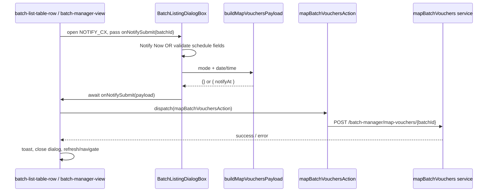

# PUK-2 — Implementation Plan

**Story:** Integrate Map User API in Batch Manager Components  
**Spec:** [spec.md](./spec.md)  
**Handoff:** Story analyzer complete; scope locked in spec.

---

## Goal

Wire the existing `NOTIFY_CX` dialog to `POST /batch-manager/map-vouchers/{batchId}` with correct payload (`{}` for Notify Now; `{ notifyAt: ISO UTC }` when scheduled), following existing batch-manager service/Redux/toast/loader patterns.

---

## Decisions (resolve open questions for implementer)

| # | Question | Plan decision |
|---|----------|---------------|
| Q1 | Should `notifyCx` call `map-vouchers`? | **Yes** — same dialog and submit path as Map EOIs; both are “notify customers” flows. Use identical API + payload rules. |
| Q2 | Preferential listing `batchId`? | **Defer row-level API wiring** in this story unless parent already has batch id. Route `preferential-cust-list/:id` uses `:id` as **slot** (`excludeSlotId` in `batch-preferential-cust-list-view.tsx`), and `batchId` is still **hardcoded** in that view. Wire listing + batch-manager-view first; add preferential only after `batchId` is passed from route/context (see Step 6). |
| Q3 | Post-success navigation in `batch-manager-view`? | Replace hardcoded `/admin/batch/listing` with `generateRoleBasedRoute(userRole, 'batch/listing')` (matches `batch-list-table-row.tsx`). |
| Q4 | Notify-now body | Send **`{}`** via `POST(url, {})` — do **not** send `notifyAt: null` or omit body if axios layer requires an object. |
| Q5 | Timezone | Combine date + time with **dayjs** in local picker values, then **`.toISOString()`** for UTC `Z` suffix (API example format). |
| Q6 | UI copy | **No renames** — keep `mapEois` / `notifyCx` labels from `common.json`. |

---

## Architecture (layering)



---

## Files to touch

| Priority | File | Change |
|----------|------|--------|
| P0 | `src/services/apiRoutes.ts` | Add `BATCH_MANAGER_MAP_VOUCHERS: '/batch-manager/map-vouchers'` |
| P0 | `src/services/common-module/batch-manager-services.ts` | Add `mapBatchVouchers(batchId, body?)` |
| P0 | `src/redux/actions/common-module/batch-manager-actions.ts` | Add `mapBatchVouchersAction` thunk; export from imports |
| P0 | `src/sections/common-module/batch-manager/utils/build-map-vouchers-payload.ts` | **New** pure helper + types |
| P0 | `src/sections/common-module/batch-manager/utils/build-map-vouchers-payload.test.ts` | **New** unit tests |
| P0 | `src/sections/common-module/batch-manager/components/batch-listing-dialog-box.tsx` | Fix NOTIFY_CX submit flow, validation, loading, async close |
| P0 | `src/sections/common-module/batch-manager/components/batch-listing/batch-list-table-row.tsx` | Wire `mapEois` + `notifyCx` + real submit |
| P0 | `src/sections/common-module/batch-manager/batch-manager-view.tsx` | Wire `handleNotifyCxSubmit` with `id \|\| sessionBatchId` |
| P2 | `src/sections/common-module/batch-manager/components/batch-preferential-cust-listing/batch-preferential-cust-list-row.tsx` | Only if `batchId` available from parent |
| P2 | `src/sections/common-module/batch-manager/components/batch-preferential-cust-listing/batch-preferential-cust-list-view.tsx` | Pass `batchId` to rows when known (may be out of scope) |
| Optional | `src/sections/common-module/batch-manager/components/batch-listing-dialog-box.test.tsx` | RTL test for schedule validation if selectors stable |

**Do not change:** `role-based-permissions.ts`, locale copy (except if adding a generic fallback toast string), MOVE/DELETE/LOCK dialogs, preferential Move stub, dummy preferential data.

---

## Step-by-step implementation

### Step 1 — API route and service

**`apiRoutes.ts`** (near other `BATCH_MANAGER_*` keys):

```ts
BATCH_MANAGER_MAP_VOUCHERS: '/batch-manager/map-vouchers',
```

**`batch-manager-services.ts`** — mirror `deleteBatch` / `createBatchManager`:

```ts
export type MapBatchVouchersBody = { notifyAt?: string };

export const mapBatchVouchers = async (
  batchId: string,
  body: MapBatchVouchersBody = {}
) => {
  const url = `${route.BATCH_MANAGER_MAP_VOUCHERS}/${batchId}`;
  try {
    const response = await POST(url, body);
    if (response?.status === 200 || response?.status === 201) {
      return {
        message:
          response?.response?.message ||
          response?.response?.response?.message ||
          'Customers notified successfully',
      };
    }
    throw new Error('Failed to map vouchers');
  } catch (error: any) {
    const message =
      error?.response?.data?.errors?.message ||
      error?.message ||
      'Error while mapping vouchers';
    throw new Error(message);
  }
};
```

Adjust `message` path after first real response if nested shape differs (same exploration as `createBatchManager`).

---

### Step 2 — Redux thunk

**`batch-manager-actions.ts`:**

- Import `mapBatchVouchers`.
- Add:

```ts
export const mapBatchVouchersAction = createAsyncThunk<
  { message: string },
  { batchId: string; body?: MapBatchVouchersBody },
  { rejectValue: string }
>('mapBatchVouchersAction', async ({ batchId, body }, { rejectWithValue }) => {
  try {
    return await mapBatchVouchers(batchId, body);
  } catch (error: any) {
    return rejectWithValue(error.message || 'Error mapping vouchers');
  }
});
```

No slice changes required unless existing patterns store loading in slice (these flows use local `isSubmitting` in parents/dialog).

---

### Step 3 — Payload helper (unit-tested)

**New:** `src/sections/common-module/batch-manager/utils/build-map-vouchers-payload.ts`

```ts
export type MapVouchersNotifyMode = 'now' | 'scheduled';

export function buildMapVouchersPayload(input: {
  mode: MapVouchersNotifyMode;
  date?: string | null;
  time?: string | null;
}): Record<string, never> | { notifyAt: string } {
  if (input.mode === 'now') return {};

  if (!input.date || !input.time) {
    throw new Error('Date and time are required for scheduled notification');
  }

  const datePart = dayjs(input.date);
  const timePart = dayjs(input.time); // Field.Time value — parse like batch-preview helpers if string

  const combined = datePart
    .hour(timePart.hour())
    .minute(timePart.minute())
    .second(0)
    .millisecond(0);

  if (!combined.isValid()) {
    throw new Error('Invalid date or time');
  }

  return { notifyAt: combined.toISOString() };
}
```

**Tests** (`build-map-vouchers-payload.test.ts`):

| Case | Expect |
|------|--------|
| `mode: 'now'` | `{}` (no `notifyAt` key) |
| valid date + time | `{ notifyAt }` matching `/\d{4}-\d{2}-\d{2}T\d{2}:\d{2}:\d{2}\.\d{3}Z/` |
| `mode: 'scheduled'`, missing time | throws |
| `mode: 'scheduled'`, missing date | throws |

Use fixed `vi.setSystemTime` if needed for deterministic “today” tests.

**Note:** Inspect actual `Field.Date` / `Field.Time` stored values (Dayjs vs string) in dialog RHF state; normalize with `dayjs()` before merge. Reuse `parseScheduleHm` from `batch-preview-build-rows.ts` only if time strings match that format.

---

### Step 4 — Refactor `BatchListingDialogBox` (NOTIFY_CX)

**Current bug** (`batch-listing-dialog-box.tsx` ~L326–331): `onSubmit?.()` then **always** closes dialog — no schedule validation, no await, no loading.

**Props to extend:**

```ts
type NotifySubmitPayload =
  | { mode: 'now' }
  | { mode: 'scheduled'; date: string; time: string };

type BatchListingDialogBoxProps = {
  // ...existing
  onSubmit?: (values?: { firstBatch: string; secondBatch: string }) => void; // MOVE only
  onNotifySubmit?: (payload: NotifySubmitPayload) => Promise<void> | void;
  isNotifySubmitting?: boolean; // optional: parent-controlled
};
```

**Behaviour:**

1. **Notify Now** (`!showScheduleFields`, primary click):
   - Call `await onNotifySubmit?.({ mode: 'now' })`.
   - Close + reset schedule state **only on success** (parent resolves without throw).

2. **Schedule for later** (cancel on first step): keep `setShowScheduleFields(true)` — unchanged.

3. **Submit** (`showScheduleFields`, primary click):
   - Validate via existing RHF + Formik sync (`rhfMethods.trigger(['date', 'time'])` or formik `validateForm` on date/time only).
   - If invalid: do not call API; show field errors (already wired on `Field.Date` / `Field.Time`).
   - If valid: `await onNotifySubmit?.({ mode: 'scheduled', date, time })`.

4. **Cancel on schedule step**: reset fields + `showScheduleFields = false` — unchanged.

5. **Loading:** Replace primary `Button` with `LoadingButton` from `@mui/lab` when `type === 'NOTIFY_CX'`, `loading={isNotifySubmitting}`, `disabled` while loading.

6. **Reset on close:** When `dialog` becomes false, reset `showScheduleFields`, date/time form state (avoid stale schedule on reopen).

7. **MOVE / other types:** Unchanged; keep `onSubmit` for MOVE only.

**Do not** call `onSubmit` for NOTIFY_CX anymore — use `onNotifySubmit` only to avoid ambiguous signatures.

---

### Step 5 — Shared submit handler pattern (parents)

Create a small hook or inline factory used by listing row and view (optional file `use-map-vouchers-notify.ts` in `batch-manager/` — only if it avoids duplication):

```ts
async function submitMapVouchers(
  dispatch,
  batchId: string,
  payload: NotifySubmitPayload,
  { onSuccess }: { onSuccess?: () => void }
) {
  const body = buildMapVouchersPayload(
    payload.mode === 'now'
      ? { mode: 'now' }
      : { mode: 'scheduled', date: payload.date, time: payload.time }
  );
  const result = await dispatch(
    mapBatchVouchersAction({ batchId: String(batchId), body })
  ).unwrap();
  toast.success(result.message || 'Success');
  onSuccess?.();
}
```

On error: `toast.error(error)` (unwrap throws string from `rejectWithValue`); **rethrow** or return `false` so dialog stays open.

---

### Step 6 — Wire entry points

#### 6a `batch-list-table-row.tsx`

| Handler | Action |
|---------|--------|
| `handleMapEois` | Open `NOTIFY_CX` dialog (same as `handleNotifyCx`) — **remove `console.log`** |
| `handleNotifyCx` | Unchanged open flow |
| Submit | Both use `row.id` as `batchId` |

```ts
const [isNotifySubmitting, setIsNotifySubmitting] = useState(false);

const openNotifyDialog = () => {
  setDialogType('NOTIFY_CX');
  setDialog(true);
};

const handleMapEois = () => openNotifyDialog();
const handleNotifyCx = () => openNotifyDialog();

const handleNotifySubmit = async (payload: NotifySubmitPayload) => {
  setIsNotifySubmitting(true);
  try {
    await submitMapVouchers(dispatch, String(row.id), payload, {
      onSuccess: () => {
        setDialog(false);
        onRefresh?.();
      },
    });
  } catch {
    // toast already shown
  } finally {
    setIsNotifySubmitting(false);
  }
};
```

Pass to dialog: `onNotifySubmit={handleNotifySubmit}`, `isNotifySubmitting`.

#### 6b `batch-manager-view.tsx`

- Replace `handleNotifyCxSubmit` stub with same pattern using `const batchId = id || sessionBatchId`.
- Guard: if no `batchId`, `toast.error` and return before API.
- On success: `setDialog(false)` + `router.push(generateRoleBasedRoute(userRole, 'batch/listing'))`.
- `handleGenerateBatches` already calls `handleNotifyCx()` after save — no change to that sequence beyond real submit.

#### 6c Preferential row (P2 / conditional)

- **Skip** unless `batch-preferential-cust-list-view.tsx` exposes real `batchId` (not hardcoded UUID).
- If implementing: `useParams()` in **view**, pass `batchId` prop to `BatchPreferentialCustListRow`, wire `notifyCx` like listing row.

---

### Step 7 — Tests

| File | Coverage |
|------|----------|
| `build-map-vouchers-payload.test.ts` | AC-7 payload cases (required) |
| Optional RTL | Open dialog, click Schedule, submit empty → no `mapBatchVouchers` call (mock dispatch) |

Follow colocated Vitest style in `utils/batch-preview-build-rows.test.ts`.

---

### Step 8 — Quality gates

From `docs/ai/context-map.json`:

```bash
yarn type-check
yarn lint
yarn fm:check
yarn test:run
```

Manual checks from spec Test Plan: Map EOIs → dialog → Notify Now / Schedule paths, generate-batches flow, delete batch regression.

---

## Risks and mitigations

| Risk | Impact | Mitigation |
|------|--------|------------|
| Dialog closes before API completes | Lost errors, double submit | Await `onNotifySubmit`; close only on success (Step 4) |
| Formik validation schema applies to MOVE fields on NOTIFY_CX | False validation errors | Use conditional validation or separate submit path for NOTIFY_CX (validate only date/time in schedule step) |
| `Field.Time` value shape unknown | Wrong `notifyAt` | Log once in dev if needed; align parser with `parseScheduleHm` |
| `BatchListData.id` typed `number` but API expects UUID string | 404 | `String(row.id)` consistently |
| Preferential route lacks `batchId` | Wrong endpoint id | Defer (Q2); do not use slot `:id` as batchId |
| Dual form libraries (Formik + RHF) in dialog | Sync bugs | Keep existing sync `useEffect`s; trigger RHF validation on schedule submit |
| `batch-manager-view` hardcoded admin route | Wrong role navigation | Use `generateRoleBasedRoute` (Q3) |

---

## Acceptance criteria mapping

| AC | Verification |
|----|----------------|
| AC-1 | Route + service + thunk exist; only `axiosInstance` POST |
| AC-2 | Map EOIs opens dialog; generate-batches → dialog → real API |
| AC-3 | Network body `{}` or no `notifyAt` key for Notify Now |
| AC-4 | Schedule shows fields; valid submit sends ISO UTC `notifyAt`; invalid shows validation, no POST |
| AC-5 | LoadingButton/disabled during request; sonner success/error |
| AC-6 | Other dialog types manual smoke test |
| AC-7 | `build-map-vouchers-payload.test.ts` green |

---

## Suggested PR commit structure (for implementer)

1. `feat(batch-manager): add map-vouchers API route, service, and thunk`
2. `feat(batch-manager): add buildMapVouchersPayload helper and tests`
3. `feat(batch-manager): wire NOTIFY_CX dialog to map-vouchers API`
4. `test(batch-manager): cover map vouchers payload edge cases` (if not in commit 2)

Single commit is acceptable if small.

---

## Out of scope (do not implement)

- Preferential **Move** dialog API
- Replacing dummy preferential listing data
- Backend contract / env changes
- Dialog copy or layout redesign
- Renaming `mapEois` / `notifyCx` menu labels
