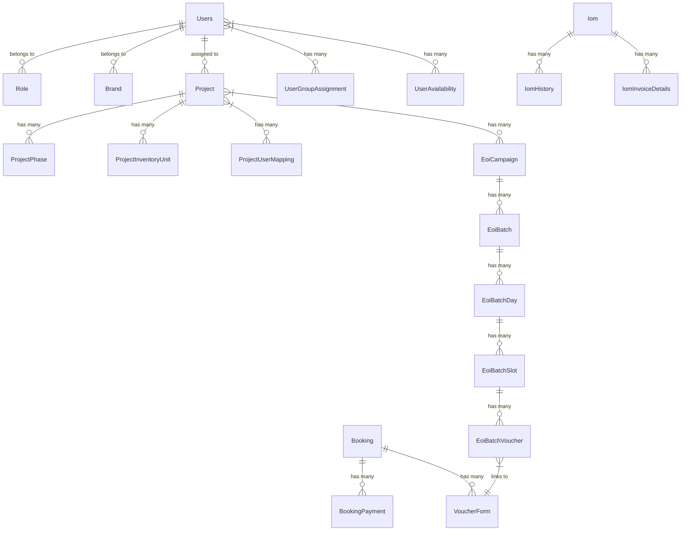

# Database Analysis

## Database Configuration

**Type**: MySQL 8.0+ (via `mysql2` driver)
**ORM**: TypeORM 0.3.28
**Connection Pool**: Configurable via `DB_CONNECTION_POOL` (default 100)

```typescript
// src/config/typeorm.config.ts
{
  type: 'mysql',
  host: configService.getDecrypted('DB_HOST'),
  port: configService.get<number>('DB_PORT'),
  username: configService.getDecrypted('DB_USERNAME'),
  password: configService.getDecrypted('DB_PASSWORD'),
  database: configService.getDecrypted('DB_DATABASE'),
  entities: Entities,  // 73 entities from barrel export
  synchronize: false,  // Migrations only
  timezone: 'Z',       // UTC
  extra: { connectionLimit: 100 }
}
```

## Entity Overview (73 Entities)

### Core User & Access Management (6 entities)

| Entity | Table | Purpose |
|--------|-------|---------|
| `Users` | `users` | Main user table with role, brand, project, group relations |
| `Role` | `roles` | 20 system roles (SUPER_ADMIN, RM, CRM, etc.) |
| `Group` | `groups` | Project groups (NRI, GCC, Closing RM, etc.) |
| `Department` | `departments` | Organizational departments |
| `UserGroupAssignment` | `user_group_assignments` | Time-bound user-group mappings |
| `UserAvailability` | `user_availability` | CRM TL team availability scheduling |

### Project & Inventory Hierarchy (8 entities)

| Entity | Table | Purpose |
|--------|-------|---------|
| `Projects` | `projects` | Master projects with brand, city, pricing, gateways |
| `ProjectPhase` | `project_phases` | Project phases with possession dates |
| `ProjectInventoryUnit` | `project_inventory_units` | Individual inventory units |
| `VoucherUnitMapping` | `voucher_unit_mappings` | Voucher to unit assignments |
| `VoucherUnitBlocking` | `voucher_unit_blockings` | Temporary unit holds |
| `ProjectUserMapping` | `project_user_mapping` | User-project-role assignments |
| `ProjectTerm` | `project_terms` | Project-specific terms & conditions |
| `BillingEntity` | `billing_entities` | Billing entity master |

### Booking & Sales (12 entities)

| Entity | Table | Purpose |
|--------|-------|---------|
| `Booking` | `bookings` | Core booking records (linked to SFDC Opportunity) |
| `BookingPayment` | `booking_payments` | Payment schedules & transactions |
| `BookingOfficeUse` | `booking_office_use` | Office use tracking |
| `BookingDocument` | `booking_documents` | Document management |
| `MultiBooking` | `multi_bookings` | Group bookings |
| `GroupBookingMapping` | `group_booking_mappings` | Group booking member mapping |
| `Referral` | `referrals` | Referral tracking |
| `FormAmendmentRequest` | `form_amendment_requests` | Booking amendment requests |
| `AgreementSignature` | `agreement_signatures` | E-signature records |
| `PaymentTransaction` | `payment_transactions` | Gateway transaction logs |
| `ChannelPartner` | `channel_partners` | Channel partner master |
| `SfdcProjectListing` | `sfdc_project_listings` | SFDC project sync |

### EOI & Voucher Management (14 entities)

| Entity | Table | Purpose |
|--------|-------|---------|
| `EoiCampaign` | `eoi_campaigns` | Expression of Interest campaigns |
| `EoiBatch` | `eoi_batches` | Campaign batches |
| `EoiBatchDay` | `eoi_batch_days` | Batch days |
| `EoiBatchSlot` | `eoi_batch_slots` | Time slots |
| `EoiBatchVoucher` | `eoi_batch_vouchers` | Batch voucher allocations |
| `VoucherForm` | `voucher_forms` | Voucher applications |
| `VoucherPayment` | `voucher_payments` | Voucher payments |
| `VoucherChangeRequest` | `voucher_change_requests` | Source change requests |
| `SfdcVoucherChangeRequest` | `sfdc_voucher_change_requests` | SFDC sync for changes |
| `InventoryType` | `inventory_types` | Inventory type master |
| `DevelopmentType` | `development_types` | Development type master |
| `EoiLeaderboardExport` | (helper) | Export utility |
| `BatchSlotExport` | (helper) | Export utility |
| `CpListingExport` | (helper) | Export utility |

### Incentives & Finance (10 entities)

| Entity | Table | Purpose |
|--------|-------|---------|
| `IncentiveBooking` | `incentive_bookings` | Booking incentive calculations |
| `IncentivePolicy` | `incentive_policies` | Incentive policy rules |
| `IncentiveSlab` | `incentive_slabs` | Slab-based incentives |
| `Boosters` | `boosters` | Booster incentives |
| `BoosterIncentiveSlabs` | `booster_incentive_slabs` | Booster slabs |
| `IncentiveBookingOverride` | `incentive_booking_overrides` | Manual overrides |
| `UserIncentivePayout` | `user_incentive_payouts` | Calculated payouts |
| `UserMonthlyGrossTotal` | `user_monthly_gross_totals` | Monthly aggregates |
| `IncentiveDeltaHistory` | `incentive_delta_history` | Change tracking |
| `BulkPayoutLog` | `bulk_payout_logs` | Bulk payout audit |

### IOM (Income Operations Management) (6 entities)

| Entity | Table | Purpose |
|--------|-------|---------|
| `Iom` | `iom` | Income operations records |
| `IomStatus` | `iom_status` | IOM status master |
| `IomTransition` | `iom_transitions` | Status transition rules |
| `IomHistory` | `iom_history` | Audit trail |
| `IomInvoiceDetails` | `iom_invoice_details` | Invoice breakdown |
| `IomAssignmentState` | `iom_assignment_state` | Assignment workflow state |

### Master Data (7 entities)

| Entity | Table | Purpose |
|--------|-------|---------|
| `Brands` | `brands` | Brand master (Puravankara, Provident, etc.) |
| `CityMaster` | `city_master` | Cities |
| `CompanyMaster` | `company_master` | Company entities |
| `CountryMaster` | `country_master` | Countries |
| `Regions` | `regions` | Geographic regions |
| `EmailTemplate` | `email_templates` | Notification templates |
| `DecentroLogs` | `decentro_logs` | Banking API logs |

### System & Audit (10 entities)

| Entity | Table | Purpose |
|--------|-------|---------|
| `Notifications` | `notifications` | User notifications |
| `UserActivityLog` | `user_activity_logs` | User action audit |
| `UserRequest` | `user_requests` | HTTP request logs |
| `SfdcLogs` | `sfdc_logs` | SFDC sync audit |
| `CronLog` | `cron_logs` | Scheduled job logs |
| `FileUploadLogs` | `file_upload_logs` | Salary upload logs |
| `QueueJobAuditLog` | `queue_job_audit_logs` | BullMQ job audit |
| `IntegrationClient` | `integration_clients` | Webhook client credentials |
| `PinelabCustomer` | `pinelab_customers` | Pine Labs customer data |
| `SiteVisitForm` | `site_visit_forms` | Site visit records |

## Key Relationships

### User Hierarchy
```
Users
├── belongs to Role (role_id)
├── belongs to Brand (brand_id)
├── belongs to Project (project_id)
├── belongs to Group (group_id) - current assignment
├── belongs to Department (department_id)
├── has many UserGroupAssignment (historical)
├── has many UserAvailability (for CRM TL)
├── has many Notifications
├── has many IncentiveBooking
├── has many UserFinances
├── has many UserIncentivePayout
├── has many FileUploadLogs
└── reports to Users (reporting_to)
```

### Project Hierarchy
```
Projects
├── belongs to Brand (brand_id)
├── belongs to City (city_id)
├── belongs to Company (company_id)
├── has many ProjectPhase
├── has many ProjectInventoryUnit
├── has many ProjectUserMapping
├── has many Users (assigned)
├── has many Boosters (many-to-many)
└── has many EoiCampaign
```

### Booking Hierarchy
```
Booking (oppId from SFDC)
├── has many BookingPayment
├── has many BookingOfficeUse
├── has many BookingDocument
├── has many AgreementSignature
├── has many FormAmendmentRequest
├── has many VoucherForm (via voucherId)
├── has many PaymentTransaction
└── belongs to Users (creator/assignee)
```

### EOI Hierarchy
```
EoiCampaign
├── has many EoiBatch
    ├── has many EoiBatchDay
    │   └── has many EoiBatchSlot
    │       └── has many EoiBatchVoucher
    │           └── links to VoucherForm
└── has many VoucherForm (direct)
```

## Common Column Patterns

### Audit Columns (All Entities)
```typescript
@CreateDateColumn({ name: 'created_at' })
createdAt: Date;

@UpdateDateColumn({ name: 'updated_at' })
updatedAt: Date;

@DeleteDateColumn({ name: 'deleted_at', nullable: true })
deletedAt: Date;  // Soft delete
```

### Primary Keys
- **Auto-increment integer**: Most entities (`@PrimaryGeneratedColumn()`)
- **UUID**: `ProjectUserMapping`, `Iom` (`@PrimaryGeneratedColumn('uuid')`)

### JSON Columns (Flexible Attributes)
```typescript
// Users
@Column({ name: 'region_ids', type: 'json', nullable: true })
regionIds: number[];

@Column({ name: 'crm_projects', type: 'json', nullable: true })
crmProjects: number[];

// Projects
@Column({ name: 'inventory_options', type: 'json', nullable: true })
inventoryOptions: string[];

@Column({ name: 'price_range', type: 'json', nullable: false })
priceRange: { min: number; max: number }[];

@Column({ name: 'available_gateways', type: 'json', nullable: false })
availableGateways: PaymentGatewayEnum[];

@Column({ name: 'codename', type: 'json', nullable: true })
codename: string[];

// ProjectUserMapping
@Column({ name: 'buddy_rms', nullable: true, type: 'json' })
buddyRMs?: number[];
```

### Status Fields
```typescript
@Column({
  type: 'enum',
  enum: StatusEnum,
  default: StatusEnum.ACTIVE,
})
status: StatusEnum;  // ACTIVE | INACTIVE
```

### Decimal Precision (Financial)
```typescript
@Column({
  type: 'decimal',
  precision: 10,
  scale: 2,
  default: 0.0,
  transformer: {
    to: (value: number) => value,
    from: (value: string) => parseFloat(parseFloat(value).toFixed(2)),
  },
})
accruals: number;
```

## Migration Analysis

### Migration Count: 190+ files
**Location**: `src/migrations/`

### Naming Pattern
```
TIMESTAMP-Description.ts
```
Examples:
- `1772440730858-InsertVoucherChangeApprovedEmailTemplate.ts`
- `1773665952798-CreateProjectUserMapping.ts`
- `1766077734191-addQueueIdTimeColumns.ts`
- `1756799880570-UpdateEoiCampaignDateColumnsToTimestamp.ts`

### Migration Categories

| Category | Count | Examples |
|----------|-------|----------|
| **Schema Evolution** | ~50 | Column type changes, nullable adjustments |
| **New Features** | ~60 | New tables for EOI, IOM, Vouchers, Inventory |
| **Data Seeding** | ~15 | Email templates, master data, transitions |
| **Index/Constraint** | ~10 | Unique constraints, foreign keys |
| **Refactoring** | ~20 | Table renames, column moves, normalization |
| **Bug Fixes** | ~15 | Data corrections, constraint fixes |

### Recent Major Migrations (2024-2025)

| Migration | Purpose |
|-----------|---------|
| `1773665952798-CreateProjectUserMapping.ts` | User-project-role mapping table |
| `1772089501357-createProjectInventoryUnitTable.ts` | Inventory unit management |
| `1775000000002-CreateVoucherUnitBlockingsTable.ts` | Unit blocking for vouchers |
| `1780668460799-CreateIomHistory.ts` | IOM audit trail |
| `1780669000002-SeedIomTransitions.ts` | IOM workflow states |
| `1782600000000-CreatePinelabCustomers.ts` | Pine Labs integration |

### Migration Commands
```bash
npm run migration:create    # Create new migration
npm run migration:run       # Apply pending
npm run migration:revert    # Rollback last
```

## Index Strategy

### Primary Indexes
- All PKs automatically indexed
- FK columns indexed via `@JoinColumn` / `@ManyToOne`

### Common Query Patterns Requiring Indexes
```sql
-- User lookups
users.userName (UNIQUE)
users.email
users.emp_code
users.status + users.role_id

-- Booking queries
bookings.oppId (from SFDC)
bookings.status + bookings.createdAt

-- Project queries
projects.brand_id + projects.status

-- Voucher queries
voucher_forms.campaign_id + voucher_forms.status
voucher_payments.voucher_form_id

-- IOM queries
iom.project_id + iom.status
iom.user_id + iom.createdAt
```

## Soft Delete Pattern

All entities use `@DeleteDateColumn`:
```typescript
// TypeORM automatically adds: WHERE deleted_at IS NULL
// To include deleted: .withDeleted()
// To only deleted: .where('deleted_at IS NOT NULL')
```

## Timezone Handling

- **Database**: UTC (`timezone: 'Z'`)
- **Application**: IST (Asia/Kolkata) via `date-fns-tz`
- **Storage**: All timestamps in UTC
- **Display**: Converted to IST in services/helpers

## Connection Pooling

```typescript
extra: {
  connectionLimit: configService.get<number>('DB_CONNECTION_POOL'), // default 100
}
```

## Encryption at Rest

- **Secrets**: DB credentials encrypted in config, decrypted at runtime via `CustomConfigService`
- **Sensitive Columns**: No column-level encryption observed (razorpay_secret, easebuzz keys stored plaintext in projects table)
- **PII**: Email, phone, PAN, Aadhaar stored plaintext

## Backup & Recovery

**Not configured in codebase**. Assumed external:
- Automated MySQL backups (daily/weekly)
- Point-in-time recovery via binlogs
- Cross-region replication for DR

## Performance Considerations

| Area | Current | Recommendation |
|------|---------|----------------|
| **Query Building** | QueryBuilder + Repository | Add query result caching for master data |
| **Relations** | Eager loading in some services | Use `select` to limit columns |
| **Pagination** | Offset-based (`skip/take`) | Consider cursor-based for large datasets |
| **JSON Columns** | Queried via `->>` | Add generated columns + indexes for frequent filters |
| **Soft Deletes** | Global scope | Monitor `deleted_at` index usage |
| **Connection Pool** | 100 connections | Tune based on PM2 instances × max connections |

## Data Volume Estimates (Based on Entity Design)

| Table | Est. Rows | Growth |
|-------|-----------|--------|
| `users` | 5,000-10,000 | Low |
| `bookings` | 50,000-100,000 | Medium |
| `booking_payments` | 200,000+ | High |
| `voucher_forms` | 10,000-50,000 | Medium |
| `user_activity_logs` | 1,000,000+ | Very High |
| `notifications` | 500,000+ | High |
| `cron_logs` | 100,000+ | Medium |
| `queue_job_audit_logs` | 1,000,000+ | Very High |

## Schema Visualization (Key Tables)

